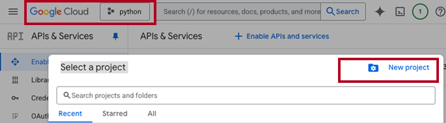
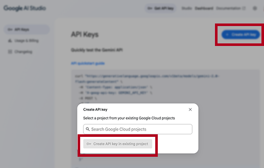
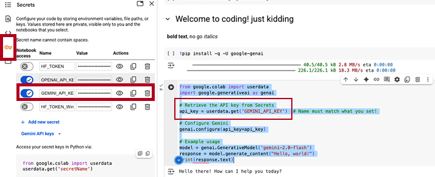

# 🌐 Gemini API Setup Guide (Non-Technical)

This guide walks you through how to **activate and use the Gemini Pro API** from Google.  
No coding experience required — perfect for workshop participants, research assistants, or clients.

---

## ✅ What You’ll Need

| Requirement       | Description                                              |
|-------------------|----------------------------------------------------------|
| Google Account    | Use any Gmail or institutional Google account            |
| Browser           | Chrome, Safari, Firefox — anything modern will work      |
| Email Access      | You may receive a confirmation or billing notice         |

---

There are 3 major steps to set up your Gemini API in Google Colab:

- Setup your Project in Google Cloud
- Create Gemini API key in Google AI Studio
- Add Gemini API key in Google Colab Secret Manager
- 
## 🚀 Step 1: Google Cloud setup

- Go to Google [Cloud Console](https://console.cloud.google.com/)
- Sign in with your Google account.
- Use the existing project or create a new one (no credit card needed for the free tier).
- 



## 🚀 Step 2: Google AI Studio setup

- Go to: [https://makersuite.google.com/app/apikey](https://makersuite.google.com/app/apikey)
- Log in with your Google account (if prompted)
- Click the **“Create API Key”** button
- Copy the key — it looks like:  
   `AIzaSyXXXX...`
- **Save this key** in a secure place (Notion, Password Manager, etc.)



> 🛑 Never share this key publicly. It gives access to your Gemini quota.

## 🚀 Step 3: Google Colab setup

- Open the Secrets Manager
In your Colab notebook, click the "Key" icon in the left sidebar (or go to Tools > Secrets).

This opens the Secrets Manager.

2. Add Your Gemini API Key
Click "Add new secret".

In the "Name" field, enter GEMINI_API_KEY (or any name you prefer).

In the "Value" field, paste your actual Gemini API key.

Click "Save".

[Google Colab setup](https://ai.google.dev/gemini-api/docs/quickstart?lang=python)


---

## 🧪 Test Your Key (Optional)

Paste the following into a Python notebook or script:

Install google-genai library

```python
!pip install -q -U google-genai
```

The defail API call is 

```python

ifrom google.colab import userdata
import google.generativeai as genai

# Retrieve the API key from Secrets
api_key = userdata.get('GEMINI_API_KEY')  # Name must match what you set!

# Configure Gemini
genai.configure(api_key=api_key)

# Example usage
model = genai.GenerativeModel('gemini-2.0-flash')
response = model.generate_content("Hello, world!")
print(response.text)

```

If successful, Gemini will return a paragraph.

Before making the API call you can check the latest documentation to see available models and functions 

[Gemini API doc](https://ai.google.dev/gemini-api/docs/quickstart?lang=python)
---

## 💰 Check Free Tier

Google’s **free usage tier** gives you:

- Limited free generations per month (e.g. 60–100)
- Access to `gemini-pro` model
- No credit card required for initial use

> For advanced usage (batch processing, analytics), you may upgrade to a paid tier later.

---

## 💡 Pro Tips

| Tip | Why It Helps |
|-----|--------------|
| Save your key in `.env` or notebook variables | Prevents leaks in shared files |
| Use Gemini in qualitative workflows | Interpret surveys, check framing, explain similarity |
| Combine with HF or OpenAI | Great for hybrid audits or mixed-methods pipelines |

---

## 🧱 Related Modules

| Module                      | Description                                 |
|-----------------------------|---------------------------------------------|
| `embed_text_gemini.md`      | Uses your Gemini key to embed or explain    |
| `compare_gemini_vs_hf.md`   | Benchmarks Gemini vs Hugging Face models    |
| `semantic_drift_detector.ipynb` | Uses Gemini to explain tone/framing shifts |


