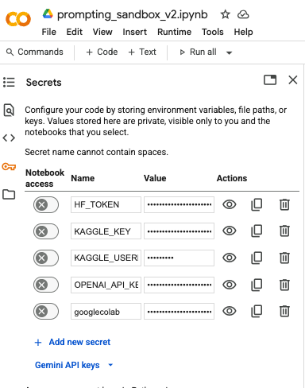

---

---

# 🔐 Secure API Key Setup in Google Colab (Recommended Method)

Colab now supports **per-user, per-notebook secrets**, allowing you to safely store and use API keys like `OPENAI_API_KEY`, `HF_TOKEN`, or `GEMINI_API_KEY` without exposing them in code.

This is the **recommended setup for ACSPRI participants** and anyone running shared notebooks.

---

## ✅ Why This Works

Colab’s **Secrets Manager** is linked to your Google account. Keys are:

- 🔒 Only visible to you
- 🔁 Automatically loaded each session (if the notebook is reused)
- ❌ Not embedded in shared `.ipynb` files

They can be accessed in code via the special `userdata.get('SECRET_NAME')` method.

This is a secure wrapper built into Colab that behaves like a temporary encrypted store.

---

## 🪄 How to Set It Up

1. Click the **🔐 “Secrets”** icon in the right sidebar (⚙️ icon → “Secrets” tab).
2. Click **“Add new secret”**
3. Add your keys:
   - `OPENAI_API_KEY`
   - `HF_TOKEN`
   - `GEMINI_API_KEY`



**Example:**

```plaintext
Name: OPENAI_API_KEY
Value: sk-xxxxxxxxxxxxxxxx
```

Repeat for each service you're using.

---

## 🧪 Use in Your Notebook

```python
from google.colab import userdata
import os

# Load from Secrets tab → into environment
os.environ["OPENAI_API_KEY"] = userdata.get("OPENAI_API_KEY")
os.environ["HF_API_TOKEN"] = userdata.get("HF_TOKEN")
os.environ["GEMINI_API_KEY"] = userdata.get("GEMINI_API_KEY")
```

This makes your keys available to libraries like `openai`, `transformers`, and `langchain`, which all use `os.environ["..."]` internally to fetch authentication credentials.

---

## 🤖 Why Use `os.environ`?

- It mimics how APIs are authenticated in production systems
- Keeps your credentials **centralized** and avoids repetition
- Allows libraries like OpenAI SDK or Hugging Face Hub to **auto-detect credentials**

Most LLM libraries look for environment variables like `OPENAI_API_KEY` — so setting them this way is the most compatible method.

---

## ❌ What You Should NOT Do

- ❌ Never paste API keys directly in notebook cells
- ❌ Don’t save `.env` files in shared notebooks
- ❌ Avoid `print()` statements that expose keys

---

## ✅ Summary

| Method                              | Secure | Persistent (per user) | Recommended Use           |
| ----------------------------------- | ------ | --------------------- | ------------------------- |
| 🔐 Colab Secrets + `userdata.get()` | ✅      | ✅                     | Teaching, demos, research |

This is now the **default configuration** for the ACSPRI Prompting Sandbox and all Colab-based demos.

---

📎 [Prompting Sandbox Notebook →](prompting_sandbox_v2.ipynb)\
📎 [Prompt Evaluation →](prompt_evaluation.md)

