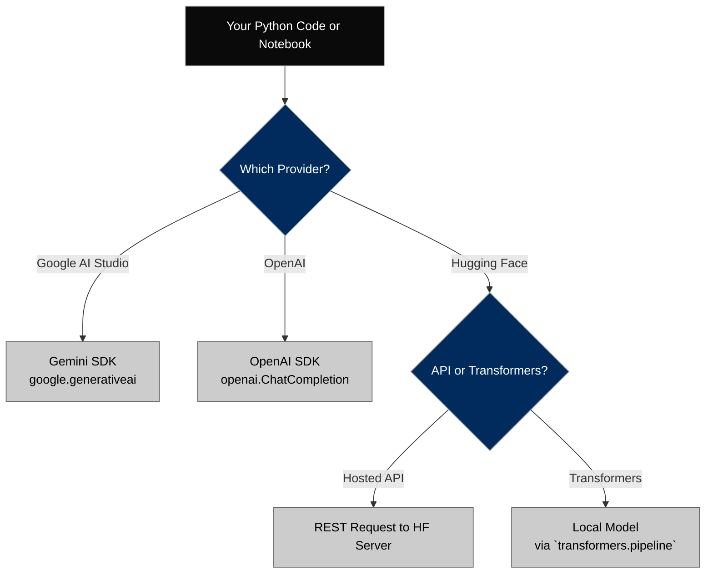
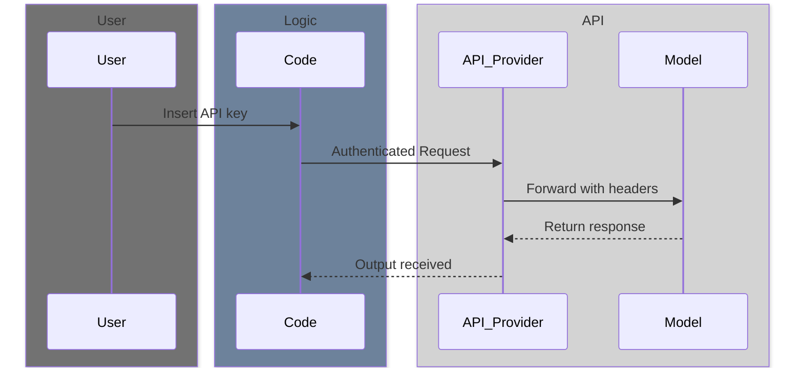
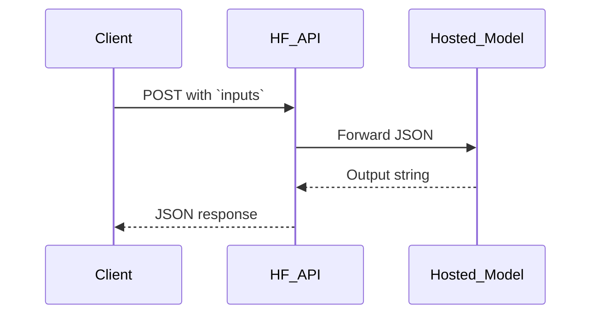

# 🚀 API Inference Quickstart – Gemini, OpenAI, Hugging Face

This module gives you **hands-on Python examples** for making LLM inference calls via three major providers:
- 🧠 Google AI (Gemini SDK)
- 🧠 OpenAI (`openai.ChatCompletion`)
- 🧠 Hugging Face (Inference API + Transformers)

Use these examples in Colab, VS Code, or your preferred Python environment.


---

## ⚙️ Prerequisites

1. Install required libraries:
```bash
pip install openai google-generativeai transformers
```

2. Create API keys from each provider:
- [OpenAI](https://platform.openai.com/account/api-keys)
- [Google AI](https://aistudio.google.com/app/apikey)
- [Hugging Face](https://huggingface.co/settings/tokens)

3. Store your keys securely:
- NEVER hardcode in production
- Use `.env` or secret manager in real applications


---

## 🧪 1. Gemini API Example (Google AI Studio)

Google’s Gemini models are accessed via the `google.generativeai` SDK. Below is a basic example for text inference.

```python
import google.generativeai as genai

# Configure API
genai.configure(api_key="YOUR_GEMINI_API_KEY")

# Load model
model = genai.GenerativeModel("gemini-1.5-pro")

# Prompt input
response = model.generate_content("Summarize this article in 2 bullet points.")
print(response.text)
```

### Notes:
- `"gemini-1.5-pro"` and `"gemini-1.5-flash"` are common model names.
- `generate_content()` is used for simple prompts.
- Gemini supports **multimodal** inputs: images + text.

📘 Want file input? Use:
```python
from google.generativeai.types import content_types

file = content_types.FileData(mime_type="text/plain", data=b"Hello world.")
response = model.generate_content(["Summarize this", file])
```

---

## 🧠 2. OpenAI API Example

OpenAI’s GPT models use `openai.ChatCompletion.create()` for chat-style prompting.

```python
import openai

openai.api_key = "YOUR_OPENAI_API_KEY"

response = openai.ChatCompletion.create(
  model="gpt-4",
  messages=[
    {"role": "system", "content": "You are a helpful assistant."},
    {"role": "user", "content": "List 3 ways AI can improve healthcare."}
  ],
  temperature=0.7,
  max_tokens=200
)

print(response['choices'][0]['message']['content'])
```

### Notes:
- Models: `"gpt-4"`, `"gpt-3.5-turbo"`, `"gpt-4-1106-preview"`
- Structure requires system/user/assistant roles
- Return is a nested dictionary

---

## 🤖 3. Hugging Face Inference API (Hosted)

If you want zero infrastructure, call hosted models via the Hugging Face REST API.

```python
import requests

API_URL = "https://api-inference.huggingface.co/models/google/flan-t5-small"
headers = {"Authorization": "Bearer YOUR_HF_API_TOKEN"}

response = requests.post(API_URL, headers=headers, json={"inputs": "Translate English to French: The weather is nice"})
print(response.json())
```

### Notes:
- This is a **hosted** model, not local
- Some models (like `meta-llama`, `mistral`, etc.) may require join request
- JSON format is consistent: `{"inputs": "...", "parameters": {...}}`

This comparison shows the tradeoffs between hosted vs local models in Hugging Face. Choose hosted for speed and simplicity, and local for flexibility and research.

| Feature              | Hosted API (Inference Endpoint) | Local Transformers (pipeline) |
|----------------------|-------------------------------|------------------------------|
| Setup               | None – remote call             | Requires download            |
| Execution           | Server-side                    | Local machine                |
| Model choice        | Must be hosted by HF           | Any supported Transformers model |
| Latency             | Variable (cold starts)         | Fast after initial load      |
| Customization       | Limited                        | Full control over model config |
| Use case            | Quick demos, zero-setup        | Research, fine-tuning, offline |

---

## 🧰 4. Hugging Face Transformers (Local or Colab)

Use this method to load and run models **locally** (or via GPU-backed Colab).

```python
from transformers import pipeline

pipe = pipeline("text-generation", model="gpt2")
output = pipe("Once upon a time,", max_new_tokens=30)
print(output[0]['generated_text'])
```

### Notes:
- This **downloads** models into your system
- Supports offline use (ideal for research or controlled experiments)
- Works with dozens of tasks: `summarization`, `classification`, `NER`, etc.



---

## 🛠️ Tips for Troubleshooting

| Error                          | Likely Cause                         | Fix                                         |
|-------------------------------|--------------------------------------|---------------------------------------------|
| Authentication failed         | Invalid or missing API key           | Double-check and refresh key                |
| Model not found               | Model name typo or access blocked    | Check spelling and model access rights      |
| Output is too short/truncated | `max_tokens` too low                 | Increase `max_tokens` or reduce temperature |
| Timeout                       | Model not ready / cold start         | Retry or switch to smaller model            |
| 429 / Rate limit exceeded     | Too many requests                    | Add delay or upgrade account                |

---

## 🔗 Related Modules

| File                                | Purpose                                  |
|-------------------------------------|-------------------------------------------|
| `api_key_setup.md`                  | Step-by-step API key generation           |
| `compare_gemini_vs_hf.md`           | Gemini vs HF comparison                   |
| `openai_api_basic_call.md`          | Python wrapper for OpenAI chat completions |
| `gemini_api_basic_call.md`          | Gemini Pro code wrapper                   |
| `hf_inference_api_call.md`          | REST API function for hosted HF models    |

---