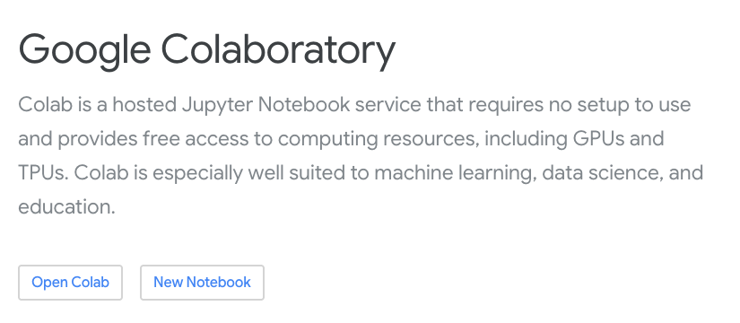
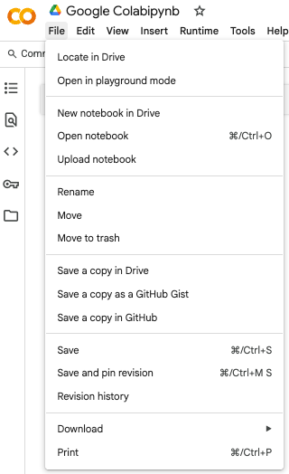

# 🚀 Google Colab Foundations & Setup

This module introduces **Google Colab**, a powerful browser-based platform that enables anyone to write and run Python code, including LLM workflows, without needing to install anything locally.

---

## 🧠 What is Google Colab?

Google Colab is a **cloud-based Jupyter notebook environment** provided by Google. It is:

- ✅ Free to use (requires a Google account)
- ✅ Pre-installed with many Python packages
- ✅ Hardware-accelerated (GPU/TPU available on request)
- ✅ Perfect for running LLM demos, data science workflows, and teaching

👉 Think of it as your **virtual coding lab** — all you need is a browser and internet access.



---

## 🔧 Step 1: Getting Started with Colab

1. **Go to**: [https://colab.research.google.com](https://colab.research.google.com)
2. **Sign in** with your Google account
3. **Create a new notebook**: Click “File → New Notebook”
4. **Rename it** (e.g., `llm_gemini_setup.ipynb`)
5. ✅ Ready to code!


---

## 🛠️ Step 2: Installing Packages

Most required packages are already installed, but you can install new ones using `!pip install`:

```python
# Example: install the Google Generative AI SDK
!pip install -q google-generativeai
```

📎 **Tip**: Use `-q` (quiet) to reduce output noise in classroom settings.

---

## 🔑 Step 3: Configure Gemini in Colab

We'll use Gemini (Google's LLM family) via the `google-generativeai` package.

```python
import os
import google.generativeai as genai

# Store your API key securely
os.environ['GOOGLE_API_KEY'] = "your_api_key_here"

# Configure the API key
genai.configure(api_key=os.environ['GOOGLE_API_KEY'])
```

You can obtain your Gemini API key at: [https://makersuite.google.com/app/apikey](https://makersuite.google.com/app/apikey) 

> ⚠️ Never share your API key publicly! You are responsible for your quota and billing.

---

## 🧪 Step 4: Simple Gemini Call

```python
model = genai.GenerativeModel("gemini-pro")
response = model.generate_content("Summarise the key points of the Paris Agreement in 3 bullet points.")
print(response.text)
```

This confirms that your key works and Gemini is active in your notebook.

---

## 📁 Working with Files in Colab

To upload data (CSV, PDFs, transcripts, etc.):

```python
from google.colab import files
uploaded = files.upload()
```

You can also mount Google Drive:

```python
from google.colab import drive
drive.mount('/content/drive')
```

---

## 🧼 Resetting Runtime (if needed)

Sometimes you may want to **reset the environment** (e.g., re-install libraries or clear memory):

```bash
# Menu: Runtime → Restart runtime
```

This clears variables, files, and sessions.

---

## 📌 Summary

| What                | Why it Matters                          |
|---------------------|------------------------------------------|
| Free cloud coding   | No setup required, easy access          |
| API ready           | Run Gemini, OpenAI, Hugging Face        |
| Classroom safe      | Preconfigured, minimal install hassle   |
| Real-time demos     | Great for step-by-step LLM exploration  |

---

## 📚 Further Reading

- [Google Colab FAQ](https://research.google.com/colaboratory/faq.html)
- [Gemini Developer Guide](https://ai.google.dev/)

---

Ready to go? Try your first notebook:  

👉 **[Open in Colab](https://colab.research.google.com/)** and paste your code!
