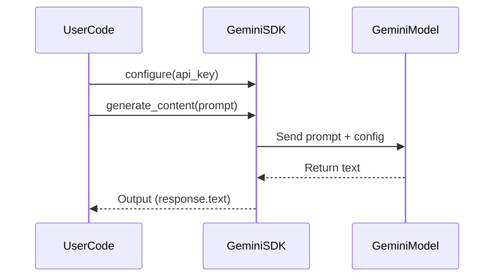
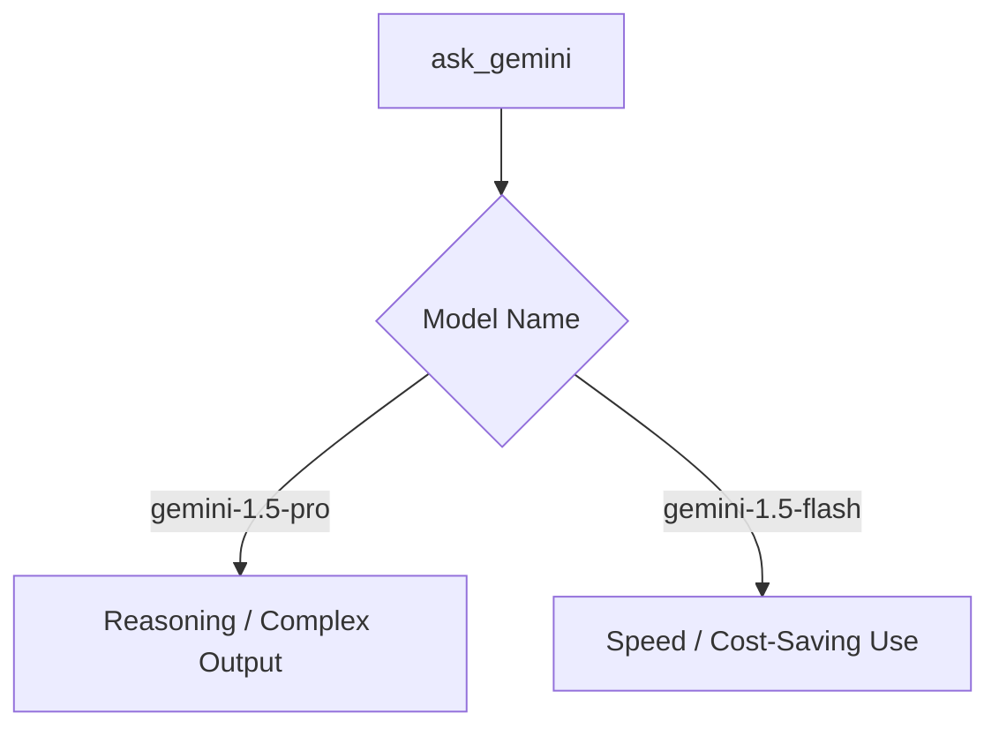
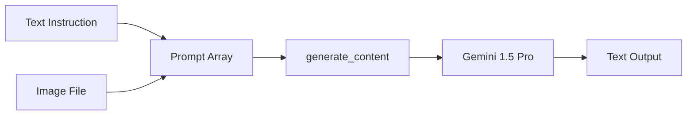

# 🔮 Gemini API – Basic Completion Call (Google AI SDK)

This module defines a **reusable wrapper function** for Gemini 1.5 Pro and Flash models via Google AI SDK.

Use it for:
- Prompt completion (text only or multimodal)
- Structured inputs (JSON-style formatting)
- Fast integration in classification, RAG, and agent pipelines

---

## 🔐 Requirements

```bash
pip install google-generativeai
```

---

## 📦 Function: `ask_gemini`

```python
import google.generativeai as genai

def ask_gemini(prompt, model_name="gemini-1.5-pro", api_key=None, temperature=0.7, max_tokens=400):
    """Send prompt to Gemini model via Google Generative AI SDK."""
    if not api_key:
        raise ValueError("❌ Gemini API key is required")

    genai.configure(api_key=api_key)
    model = genai.GenerativeModel(model_name)

    response = model.generate_content(
        prompt,
        generation_config={
            "temperature": temperature,
            "max_output_tokens": max_tokens,
        }
    )

    return response.text
```



This shows how your wrapper function communicates with the Gemini model through the SDK. The generate_content() call passes your prompt + config to the model and returns .text.

---

## ✅ Example Usage

```python
reply = ask_gemini(
    prompt="List 3 recent breakthroughs in AI safety research.",
    model_name="gemini-1.5-pro",
    api_key="your-gemini-api-key"
)
print(reply)
```

---

## 💡 Notes

- `gemini-1.5-pro` is the default; use `gemini-1.5-flash` for lightweight queries.
- The wrapper supports structured prompts, instruction + few-shot.
- Can be extended for streaming, multimodal inputs, or custom config blocks.
- Wrap with `try/except` for production.



You can switch between Gemini Pro and Flash by setting the model_name parameter. This gives you precise control over performance vs. cost.

---

## 🔁 Advanced Use (Multimodal Input)

```python
response = model.generate_content(
    ["Summarize this image and comment on the text:", image_data],
    generation_config={ "temperature": 0.5 }
)
```


Gemini can accept both text and image input in a single list prompt. This enables image captioning, visual Q&A, or document summary with illustration.
---

## 🔗 Related Modules

| File                                | Purpose                                      |
|-------------------------------------|-----------------------------------------------|
| `api_key_setup.md`                  | Step-by-step Gemini key setup                 |
| `llm_api_test_gemini.ipynb`         | Notebook for Gemini testing and examples      |
| `semantic_drift_pipeline.md`        | Downstream use case (drift tracking)          |
| `day1_llm_platforms_main.md`        | Overview linking all Gemini assets            |

---