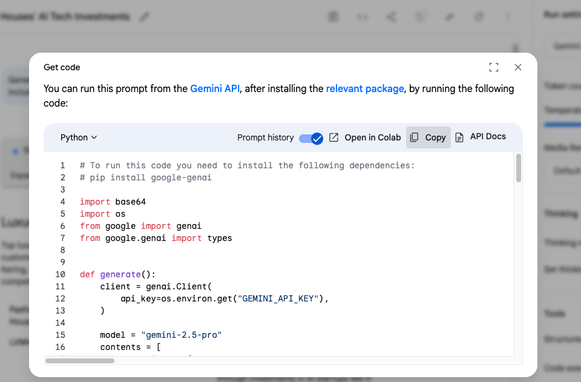

# 🧠 Google AI Studio Walkthrough – Prompting, Extensions, and SDK Use

This module provides a comprehensive walkthrough of **Google AI Studio**, Google's web-based integrated development environment (IDE) for prototyping and building applications with generative AI models. It offers a user-friendly interface for developers and enthusiasts to experiment with Google's latest models, most notably the Gemini family, through prompt engineering, parameter tuning, and API key generation.

---

## 1️⃣ What Is Google AI Studio?

**Google AI Studio** is a browser-based platform that allows users to interact with Google's Gemini models. It serves as a bridge between simple consumer-facing chatbots and full-scale cloud platforms, enabling users to:

- Test prompts without writing code
- Adjust parameters like temperature and top_p
- Prototype few-shot prompts
- Inspect token usage
- Export settings to code (Python, Node.js, etc.)

🔗 Access: [https://aistudio.google.com/](https://aistudio.google.com/)

---

## 2️⃣ Why Use Google AI Studio?

| Feature                 | Why It Matters                                                     |
|------------------------|---------------------------------------------------------------------|
| 🧪 UI-based Prompting   | Test prompts without writing code                                   |
| 🔄 Code Export         | One-click export to Python (via Gemini SDK)                         |
| 🔍 Prompt Templates     | Quickly reuse prompt setups with history tracking                   |
| 🧩 Extensions           | Browse YouTube, read files, access Google Sheets directly           |
| 🧠 Multimodal Input     | Drag-and-drop images + text into the same prompt                    |
| 📚 Contextual Memory    | Gemini 1.5 Pro can hold extended documents in memory                |

---

## 3️⃣ Choosing a Model: Pro vs Flash

In the top left dropdown, you can select your preferred model:
- **Gemini 2.5 Pro** → Best for deep reasoning, multimodal input, and context windows
- **Gemini 2.5 Flash** → Optimized for speed and lower cost, suitable for lightweight tasks


---

## 4️⃣ Writing Your First Prompt

The central input box supports:
- Plain text instructions
- Image uploads (drag-and-drop or “+ Add”)
- File uploads (PDFs, Docs, CSVs)

Example prompt:

```
Summarize the key findings in this uploaded policy PDF. Then generate a 3-sentence email summary.
```


---

## 5️⃣ Output View & Features

Once submitted, Google AI Studio will:
- Render the completion output on the right
- Show **code view** (click the </> icon)
- Enable response regeneration

📸 Insert Screenshot: Output with "View Code" icon highlighted

---

## 6️⃣ Code Export to Python

Google AI Studio allows exporting your exact session as Python code.

Click “View Code” → copy code snippet like:

```
import google.generativeai as genai

genai.configure(api_key="YOUR_API_KEY")
model = genai.GenerativeModel("gemini-2.5-pro")

response = model.generate_content("Summarize this article...")
print(response.text)
```



---

## 7️⃣ Extensions Panel

Extensions let Google AI Studio access external data sources like:
- 📺 **YouTube**: summarize transcripts
- 📄 **Files**: extract text from uploaded PDFs or docs
- 🔎 **Browser**: retrieve real-time information
- 📊 **Google Sheets**: run calculations or extract ranges

You can toggle Extensions under the right-hand “⚙️ Settings” panel.


---

## 8️⃣ Google AI Studio Prompting Best Practices

| Tip                               | Why It Works                                             |
|----------------------------------|----------------------------------------------------------|
| Use delimiters (e.g., triple quotes or XML tags) | Separates prompt sections for clarity                    |
| Add output format instructions   | e.g., “Respond in bullet points” or “Wrap in HTML table” |
| Chunk documents into parts       | Avoids hitting context limit in one go                   |
| Use one-shot examples            | Teaching Gemini how to reply works well with Pro         |
| Combine text + image             | Gemini handles multimodal prompts natively               |

---

## 9️⃣ Known Limitations

| Issue                              | Explanation                              | Workaround                            |
|------------------------------------|------------------------------------------|----------------------------------------|
| Response truncation               | Still possible despite long context      | Use `continue` in follow-up            |
| Image output (charts, etc.)       | Not supported yet                        | Generate text-based descriptions       |
| Extension errors                  | Based on real-time availability          | Retry or remove conflicting extension  |

---

## 🔟 Free Tier Details

Google AI Studio offers a **generous free tier**, allowing users to:
- Access core functionalities without any cost
- Experiment with Gemini models
- Utilize multimodal inputs
- Export code for integration

This makes it an excellent choice for individuals, hobbyists, and small teams looking to explore AI capabilities without financial commitment.

---

## 🔁 Google AI Studio vs. OpenAI Playground

| Feature                         | Google AI Studio                               | OpenAI Playground                         |
|---------------------------------|------------------------------------------------|-------------------------------------------|
| **Multimodal Input**            | Yes (text, image, files)                       | Limited (primarily text)                  |
| **Extensions**                  | Yes (YouTube, Google Sheets, etc.)             | No                                        |
| **Context Window**              | Up to 1 million tokens                         | Up to 128K tokens                         |
| **Free Tier**                   | Generous free access                           | Limited free access                       |
| **Code Export**                 | Yes (Python, Node.js, etc.)                    | Yes (Python, Node.js, curl, etc.)         |
| **Model Customization**         | Available through Vertex AI integration        | Available through OpenAI's fine-tuning    |
| **Integration with Other Tools**| Seamless with Google Cloud services            | Requires additional setup                 |

---

## 🔗 Related Modules

| File                                | Purpose                                      |
|-------------------------------------|-----------------------------------------------|
| `api_key_setup.md`                  | API key setup for Google AI Studio            |
| `gemini_api_basic_call.md`          | Codebook logic for Gemini SDK use             |
| `compare_gemini_vs_hf.md`           | Interpretability and output behavior          |
| `day1_llm_platforms_main.md`        | Main session file linking this walkthrough    |

---