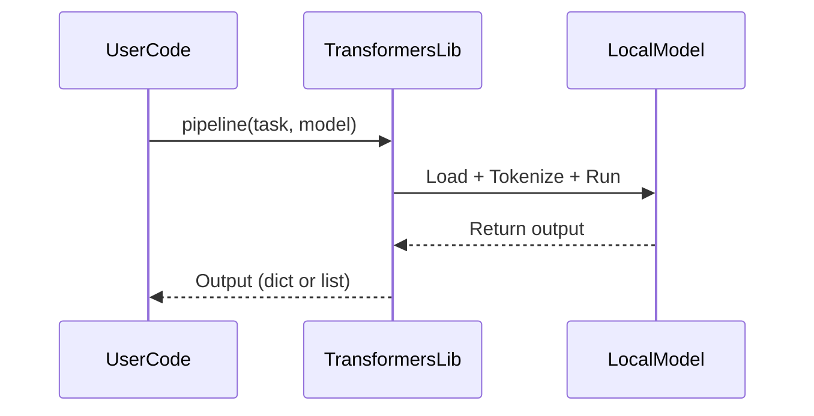
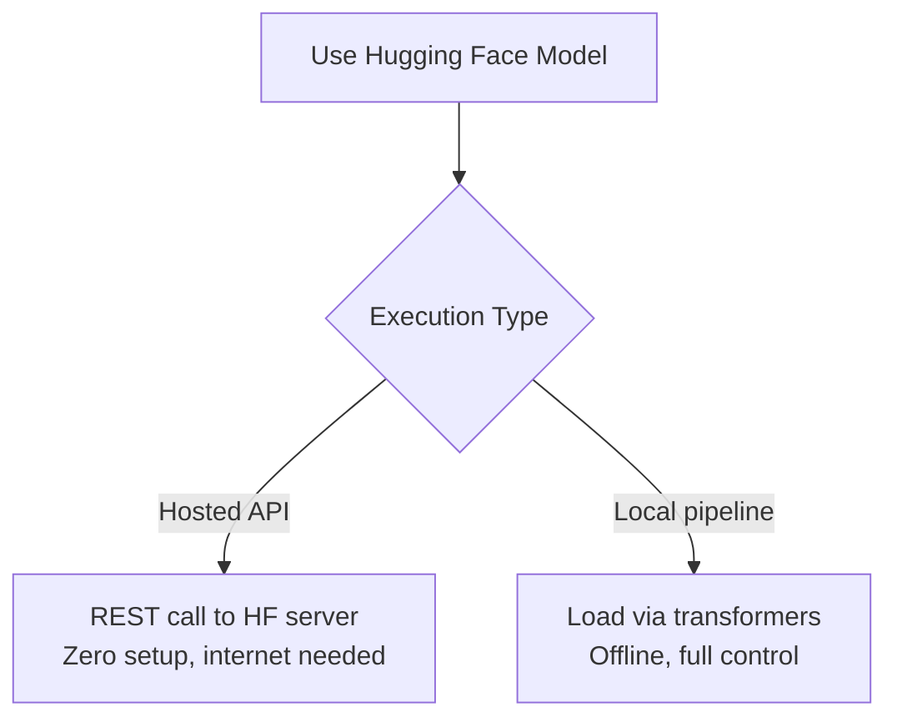

# 🧠 Hugging Face Transformers – Local Pipeline Wrapper

This module provides a simple wrapper around the `transformers.pipeline()` interface for **local model inference**.

Use it for:
- Running small models offline (T5, GPT-2, BERT)
- Testing multiple task types: summarization, generation, sentiment
- Research workflows and prototyping

---

## 🔐 Requirements

```bash
pip install transformers torch
```

---

## 📦 Function: `run_local_pipeline`

```python
from transformers import pipeline

def run_local_pipeline(prompt, task="text-generation", model_name="gpt2", **kwargs):
    """Run local HF model pipeline with specified task and model."""
    pipe = pipeline(task, model=model_name)
    result = pipe(prompt, **kwargs)

    # Most tasks return list of dicts
    return result[0]
```



This diagram shows how pipeline() loads a local model, runs the prompt through tokenization and generation, and returns the output in dictionary format.

---

## ✅ Example Usage

```python
output = run_local_pipeline(
    prompt="Translate English to German: I love machine learning.",
    task="translation_en_to_de",
    model_name="Helsinki-NLP/opus-mt-en-de",
    max_length=40
)

print(output)
```

---

## 💡 Notes

- First run will **download model** from Hugging Face hub to `~/.cache/huggingface`
- Use `model_name` explicitly to test different architectures
- Can be extended to include `device`, tokenizer tweaks, etc.
- Ideal for **air-gapped environments**, notebooks, or local dev.



This comparison helps participants decide whether to use hosted or local models. Hosted models are easier to start with, but local models offer more privacy, control, and customization.

---

## 🧪 Supported Tasks (by pipeline)

| Task                | Example Model                          |
|---------------------|-----------------------------------------|
| text-generation     | `gpt2`, `tiiuae/falcon-rw-1b`           |
| text2text-generation| `t5-small`, `google/flan-t5-base`       |
| summarization       | `facebook/bart-large-cnn`              |
| translation         | `Helsinki-NLP/opus-mt-en-de`           |
| sentiment-analysis  | `distilbert-base-uncased-finetuned-sst-2-english` |


---

## 🔗 Related Modules

| File                                | Purpose                                      |
|-------------------------------------|-----------------------------------------------|
| `hf_inference_api_call.md`          | REST call for hosted models                   |
| `compare_gemini_vs_hf.md`           | Performance and interface comparison          |
| `semantic_drift_pipeline.md`        | Uses this locally for stance detection        |

---