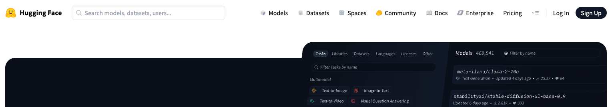
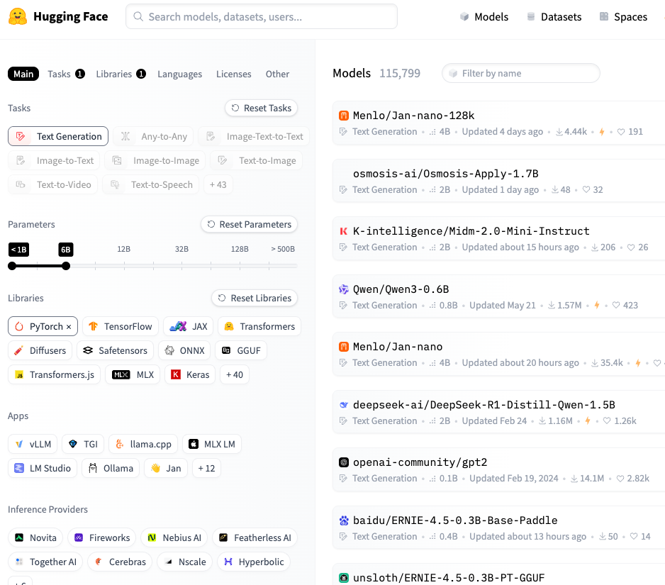
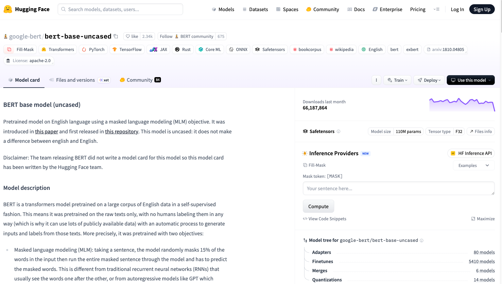
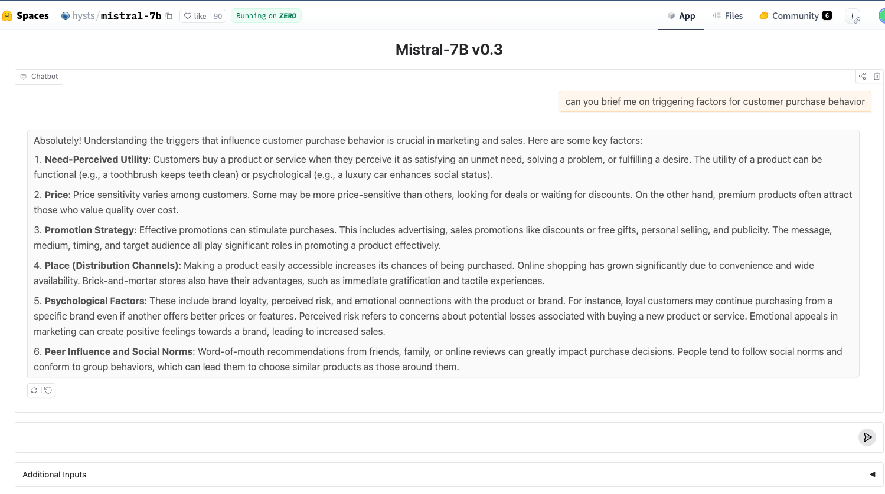
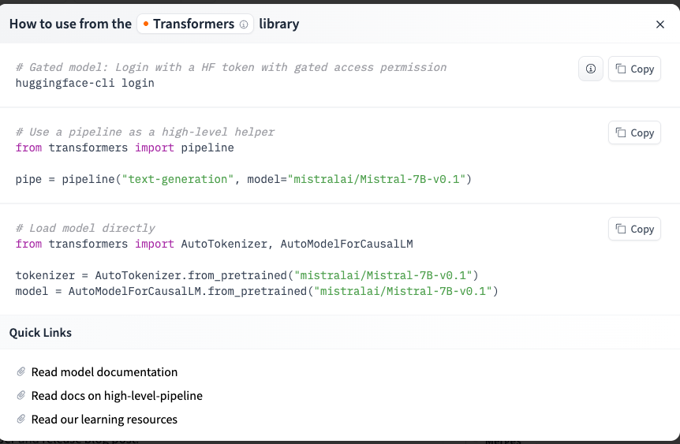
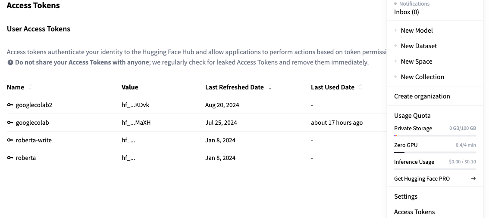
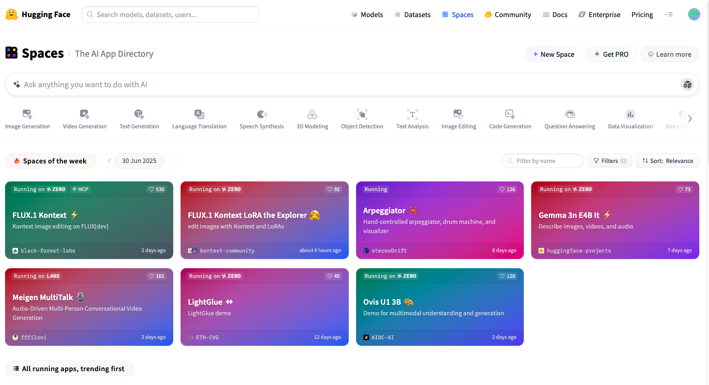

# 🤗 Hugging Face Walkthrough – Models, Spaces, Inference API

This page provides an in-depth walkthrough of the Hugging Face platform. Hugging Face is central to open-source LLM workflows, providing access to thousands of models, community-built applications, datasets, and no-code tools for running AI models in the browser.

---

##  Platform Overview

Hugging Face offers a public platform to:
- Explore and compare open-source models (LLaMA, Falcon, Mistral, Zephyr, etc.)
- Run models directly in the browser
- Access APIs for production deployment
- Host full demo applications via **Spaces**
- Train, fine-tune, and publish models using `transformers` and `datasets`

🔗 URL: [https://huggingface.co](https://huggingface.co)



---

## Key Components

| Component         | Purpose                                                           |
|------------------|-------------------------------------------------------------------|
| 🧠 Model Hub      | Searchable library of public models (text, vision, audio, etc.)   |
| 🔁 Inference API  | Hosted interface to run models via HTTP                           |
| 🧪 Spaces          | Zero-code demos and full applications using Gradio/Streamlit     |
| 📊 Datasets Hub   | Ready-to-use public datasets for training/testing                 |
| 🧰 `transformers` SDK | Python/JS libraries to run and fine-tune models locally or remotely |

---

## 3️⃣ Exploring the Model Hub

### 📌 Access
Go to: [https://huggingface.co/models](https://huggingface.co/models)

- Filter by task (text-generation, summarization, sentiment)
- Filter by architecture (Mistral, GPT2, T5, BERT)
- View usage stats and model licenses



Hugging Face offers powerful filtering capabilities that help you find the right model quickly — crucial when you're navigating 100K+ models.

### 🔍 Filters You Can Use:

- **Task:** text-generation, summarization, classification, question-answering, etc.
- **Library:** `transformers`, `diffusers`, `sentence-transformers`, etc.
- **Language:** English, Multilingual, Arabic, Chinese, etc.
- **License Type:** Apache 2.0, MIT, OpenRAIL-M, non-commercial
- **Model Size/Downloads:** Filter by number of downloads or stars

### 🧾 Model Card Example

Every model page (aka "Model Card") includes rich metadata. Here's how to read it like a pro:

| Section          | What It Tells You                                             | Why It Matters                        |
|------------------|---------------------------------------------------------------|----------------------------------------|
| 🏷️ Tags          | Intended task, domain, tokenizer info                         | Helps filter model relevance           |
| 📊 Metrics       | Performance on benchmarks (e.g., BLEU, Rouge, perplexity)     | Compare model quality objectively      |
| 📁 Files         | Includes `config.json`, `tokenizer`, PyTorch weights          | Required for offline or custom use     |
| 🧪 Usage Example | How to load the model using `transformers` or curl            | Get started quickly                    |
| 📚 Training Data | (If available) Shows what data it was trained on              | Understand potential biases            |



---

##  Running a Model in the Browser

Many models include a live widget for testing prompts directly.

**Steps**:

1. Go to a model page with hosted inference (e.g., [Mistral-7B ](https://huggingface.co/mistralai/Mistral-7B-v0.1)
2. Scroll to the **Spaces using this model** 
3. https://huggingface.co/spaces/hysts/mistral-7b 
4. Type your prompt
5. Adjust settings ("Advanced settings")
6. Click "Run" to run



##  Hugging Face SDK vs Inference API

You can run models via the **Hugging Face Hub** or **download them locally** using the `transformers` library.

### Inference API
- Hosted remotely
- No install required
- Limited flexibility
- Useful for small experiments, slides, or quick demos

### `transformers` SDK
- Full control (tokenizer, layers, generation methods)
- Offline or local inference
- Supports custom training/fine-tuning
- Requires local setup + GPU (recommended)

```python
from transformers import AutoTokenizer, AutoModelForCausalLM

model = AutoModelForCausalLM.from_pretrained("mistralai/Mistral-7B-Instruct-v0.1")
tokenizer = AutoTokenizer.from_pretrained("mistralai/Mistral-7B-Instruct-v0.1")

inputs = tokenizer("Summarize this:", return_tensors="pt")
outputs = model.generate(**inputs)
print(tokenizer.decode(outputs[0]))
```
---

##  Using the Inference API (Programmatic Access)

Each model has an **Inference API URL**, allowing you to send requests from Python or curl.

```python
import requests

API_URL = "https://api-inference.huggingface.co/models/mistralai/Mistral-7B-Instruct-v0.1"
headers = {"Authorization": "Bearer hf_your_api_key"}

response = requests.post(API_URL, headers=headers, json={"inputs": "Summarize this article..."})
print(response.json())
```

- Authentication via Hugging Face token
- Supports input/output formats depending on model type
- May rate-limit under heavy load





---

## 6️⃣ Exploring Hugging Face Spaces

### What Are Spaces?

- Web-based demo applications built with Gradio or Streamlit
- Allow users to try models or full pipelines without coding
- Useful for sharing prototypes, experiments, or dashboards

Explore: [https://huggingface.co/spaces](https://huggingface.co/spaces)



---
##  Hugging Face for Organizations & Teams

- **Private models**: You can restrict visibility to your org
- **Model versioning**: Track updates and performance over time
- **Spaces**: Use Gradio dashboards to present results internally
- **Repo structure**: Each model/dataset/space is its own Git repo with commit history

---

## Real Use Cases (Research & Industry)

| Use Case                       | How Hugging Face Helps                                          |
|-------------------------------|-----------------------------------------------------------------|
| Literature review summarization | Use `sentence-transformers` + text generation models           |
| Social media analysis          | Use sentiment classification models from cardiffnlp            |
| Interview coding automation    | Use instruction-tuned models + few-shot prompting in Spaces    |
| Policy document comparison     | Use `Instructor XL` for embedding + clustering pipelines        |
| Building internal chatbots     | Host fine-tuned models on private Spaces or call via API        |

---

## 🧠 Expert Tip: Cold Start vs Warm Start

Some hosted models will show **“Loading...”** for up to 60 seconds before responding. This is a **cold start** — the model needs to load onto a backend GPU.

Once loaded, the response will be much faster. This affects:
- Inference speed
- API timeouts
- User perception in demos

To avoid cold starts:
- Use lightweight models (e.g., `distilGPT2`, `flan-t5-small`)
- Warm the model once manually before running demos

---
### Creating a Space (Optional Advanced)

You can host your own:
- Public or private
- Streamlit, Gradio, or static HTML
- Free CPU, upgrade to GPU if needed

Docs: [https://huggingface.co/docs/hub/spaces](https://huggingface.co/docs/hub/spaces)

---

## 7️⃣ Token & API Setup

To run inference via API or upload to Spaces:
- Go to: [https://huggingface.co/settings/tokens](https://huggingface.co/settings/tokens)
- Click “New Token”
- Choose **Read** access

Store securely:
```python
from huggingface_hub import InferenceClient
client = InferenceClient(token="hf_xxx")
```

---

## 8️⃣ Common Errors

| Issue                             | Cause                                  | Fix                                   |
|----------------------------------|----------------------------------------|----------------------------------------|
| 403 Forbidden                    | Invalid or missing token               | Ensure correct token in headers       |
| Rate limit (503/429)            | Too many requests or busy server       | Retry with backoff                    |
| "Model loading" takes long time | Cold start of hosted model             | Wait or choose faster model (e.g., distilGPT2) |

---

## 🔗 Related Modules

| File                          | Purpose                                   |
|-------------------------------|-------------------------------------------|
| `hf_inference_api_call.md`    | Codebook logic for API-based model use    |
| `platform_comparison.md`      | Conceptual differences across platforms   |
| `api_key_setup.md`            | How to generate and use HF tokens         |
| `day1_llm_platforms_main.md`  | Main session anchor for Day 1 – Session 2 |

---
