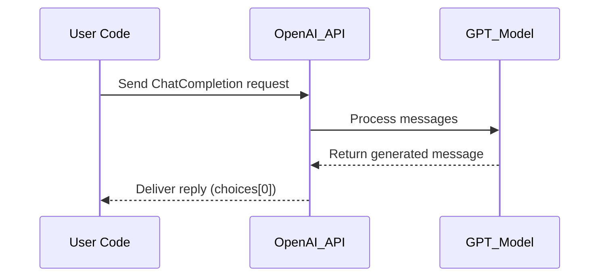
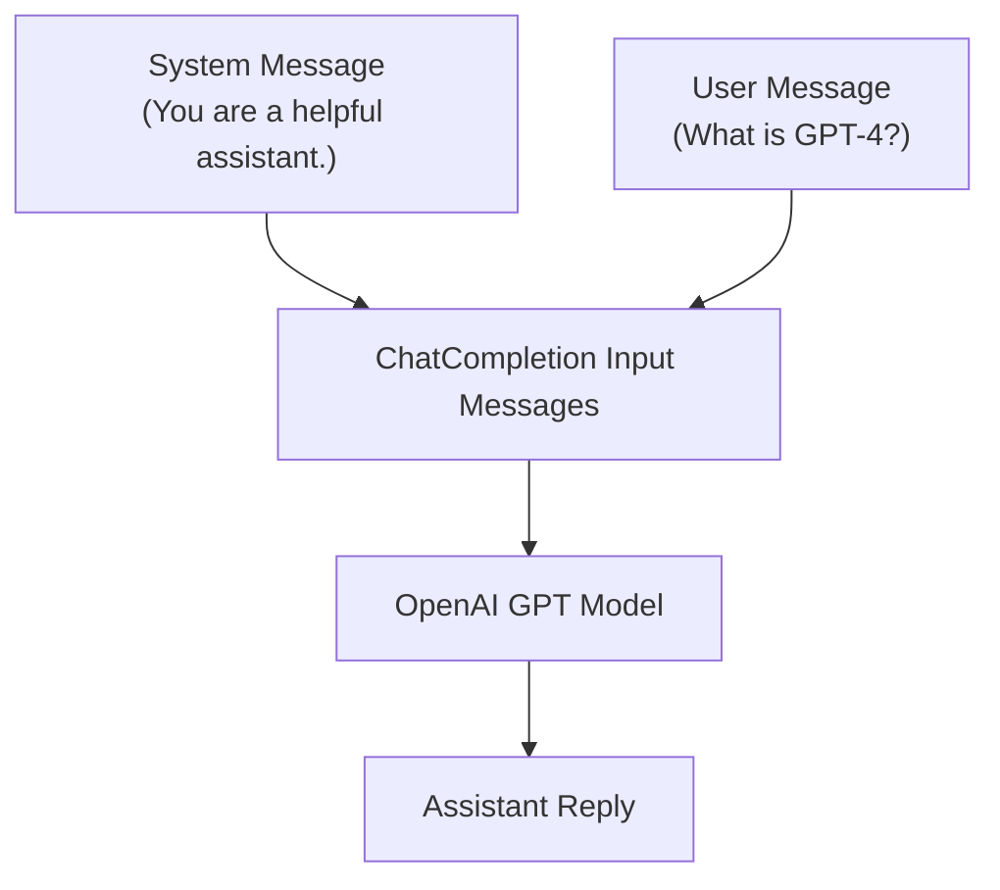

# 🧠 OpenAI API – Basic Completion Call

This code module provides a **minimal reusable function** for sending a prompt to OpenAI's `ChatCompletion` endpoint.

It supports:

- Custom system roles
- Few-shot or single-turn prompts
- Model selection (e.g., GPT-4, GPT-3.5)
- Return parsing for `text-only` output
- 🔁 Can be reused across notebooks and Streamlit apps

---

## 🔐 Requirements

- Python 3.8+
- `openai` SDK: install via

```bash
pip install openai
```

---

## 📦 Function: `ask_openai`

```python
import openai

def ask_openai(prompt, model="gpt-4", api_key=None, system_role="You are a helpful assistant.", temperature=0.7, max_tokens=400):
    """Send a prompt to OpenAI ChatCompletion endpoint and return text reply."""
    if not api_key:
        raise ValueError("❌ Missing OpenAI API key")

    openai.api_key = api_key

    response = openai.ChatCompletion.create(
        model=model,
        messages=[
            {"role": "system", "content": system_role},
            {"role": "user", "content": prompt}
        ],
        temperature=temperature,
        max_tokens=max_tokens
    )

    return response['choices'][0]['message']['content']
```



This shows the internal lifecycle of your ask_openai() call — from the user’s prompt, through the API, to GPT model execution, and back to you with structured output.

---

## ✅ Example Usage

```python
reply = ask_openai(
    prompt="List 3 key trends in AI policy for 2025.",
    model="gpt-4",
    api_key="sk-...",
    temperature=0.5
)

print(reply)
```

---

## 💡 Notes

- This function abstracts prompt formatting + output parsing.
- Wrap with `try/except` if needed for API error handling.
- Can be integrated into loops, form UIs, or research pipelines.

This diagram illustrates how prompts are structured as a sequence of messages. OpenAI’s API expects a system role and a user prompt, which are processed together by the model.


---

## 🔗 Related Modules

| File                                | Purpose                                  |
|-------------------------------------|-------------------------------------------|
| `api_key_setup.md`                  | Securely store and retrieve OpenAI key    |
| `api_inference_quickstart.md`       | Full code demos for Gemini + HF + OpenAI |
| `compare_gemini_vs_hf.md`           | Evaluation matrix for LLM outputs         |

---