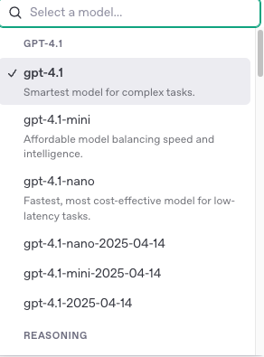
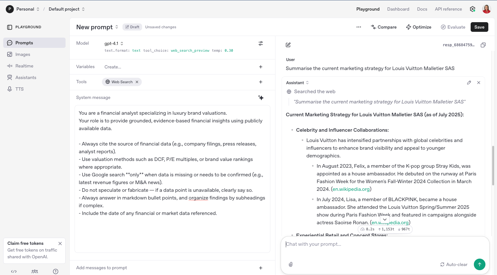
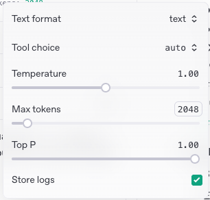
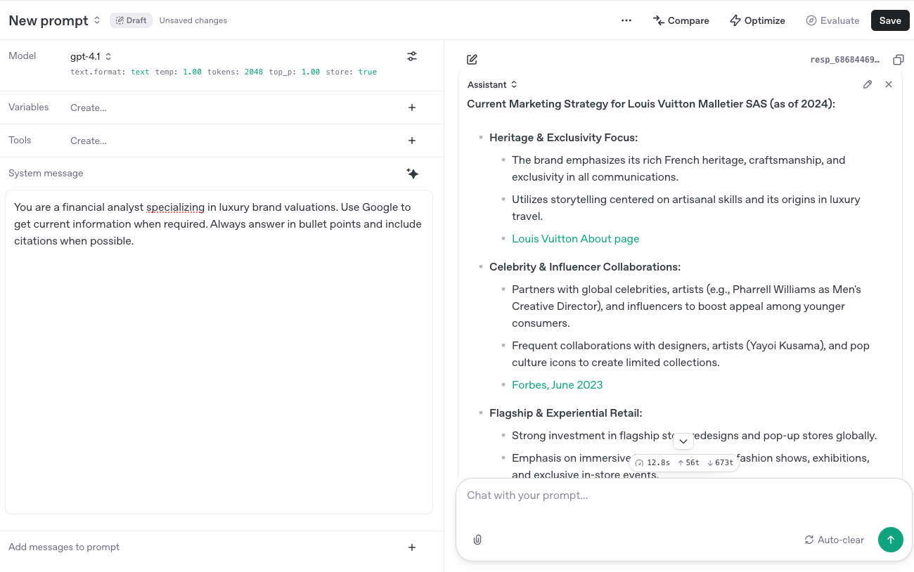

---

---

# 🧠 OpenAI Playground Walkthrough – Prompt Engineering UI & Model Tuning

This page provides a comprehensive walkthrough of the **OpenAI Playground** — the hosted user interface for exploring and testing the GPT-4, GPT-3.5, and embedding models. It’s ideal for learning prompt engineering without writing any code.

---

## 1️⃣ What Is the Playground?

The **OpenAI Playground** is a web-based interface where you can:
- Try out completions and chat interactions
- Adjust parameters like temperature and top_p
- Prototype few-shot prompts
- Inspect token usage
- Export settings to code (Python, Node, curl)

🔗 URL: [https://platform.openai.com/playground](https://platform.openai.com/playground)

---

## 2️⃣ Why Use the Playground?

- Test prompts in isolation before embedding in code
- Fine-tune model behavior with sliders
- Compare GPT-3.5 and GPT-4 responses side-by-side
- Export working prompts to Python for integration
- Understand token cost and output breakdowns

---

## 3️⃣ Choosing a Model

On the top left of the Playground, you’ll find a **dropdown menu** with available models:

- `gpt-4` – Best for reasoning, long-form answers, code explanations
- `gpt-3.5-turbo` – Fastest and cheapest, suitable for casual Q&A or summaries
- `gpt-4-1106-preview` – Early version of GPT-4 Turbo (slightly cheaper)
- `text-davinci-003` – Legacy completion-based model (not chat format)



---

## 4️⃣ Playground Modes

There are two primary interface modes:

| Mode            | Description                                            |
|------------------|--------------------------------------------------------|
| **Chat**         | System + user messages → GPT-style interaction         |
| **Complete**     | Legacy mode for single-prompt, single-output testing   |

**Recommended:** Use Chat mode unless you’re experimenting with classic completions.

---

## 5️⃣ Prompt Structure

In **Chat Mode**, prompts follow a three-part structure:

1. **System Message** (sets tone/instructions)
2. **User Message** (your input or question)
3. **Assistant Message** (optional example of correct answer)

### Example:
System: You are a helpful research assistant.  
User: Summarize this abstract in plain language.


---

## 6️⃣ Parameter Controls

You can control output behavior with several sliders:

| Parameter        | What It Does                                         | Recommended Range |
|------------------|------------------------------------------------------|-------------------|
| Temperature      | Creativity/randomness (higher = more diverse)        | 0.2–0.8           |
| Top_p            | Cumulative probability cutoff (similar to temp)      | 0.8–1.0           |
| Frequency penalty| Penalizes repeating phrases                          | 0–1               |
| Presence penalty | Encourages new topics                                | 0–1               |
| Max tokens       | Response length cap                                  | 100–800+          |
| Stop sequences   | Ends generation at defined string                    | Optional          |


---

## 7️⃣ Token Counter

Live token usage is shown below the prompt box:
- Shows how many tokens used in prompt + response
- Useful for estimating API cost and budget
- GPT-4 has a context window of up to 128K tokens


---

## 8️⃣ Export to Code

Click the **“View Code”** button to export your playground setup into:
- Python (using `openai` SDK)
- curl
- Node.js
- JSON request payload

Example:
```python
import openai

openai.ChatCompletion.create(
  model="gpt-4",
  messages=[{"role": "system", "content": "You are..."}],
  temperature=0.7,
  max_tokens=300
)
```

---

## 9️⃣ Tips & Best Practices

- Use system prompts strategically to guide behavior
- Use few-shot examples by adding assistant messages
- Vary one parameter at a time to learn its effect
- Add clear delimiters like triple quotes or dashes around inputs
- Review token breakdowns before submitting long prompts
- Save good outputs to reuse in code later

---

## 🔟 Common Errors & Debugging

| Issue                              | Likely Cause                     | Fix                                |
|-----------------------------------|----------------------------------|-------------------------------------|
| Truncated response                | Max tokens too low               | Increase `max_tokens`               |
| Model not responding              | Token limit or bad system prompt | Simplify or check syntax            |
| Overly verbose or too concise     | Temp + top_p settings            | Adjust one at a time                |
| Unauthorized error                | Invalid API key                  | Refresh key from OpenAI dashboard  |

---

## 🔗 Related Modules

| File                                | Purpose                                 |
|-------------------------------------|------------------------------------------|
| `api_key_setup.md`                  | How to create OpenAI API key             |
| `openai_api_basic_call.md`          | Run Playground prompts in Python         |
| `compare_gemini_vs_hf.md`           | Interpretability tradeoffs by platform   |
| `day1_llm_platforms_main.md`        | Main session page linking this module    |

---