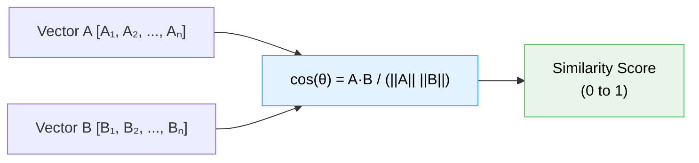
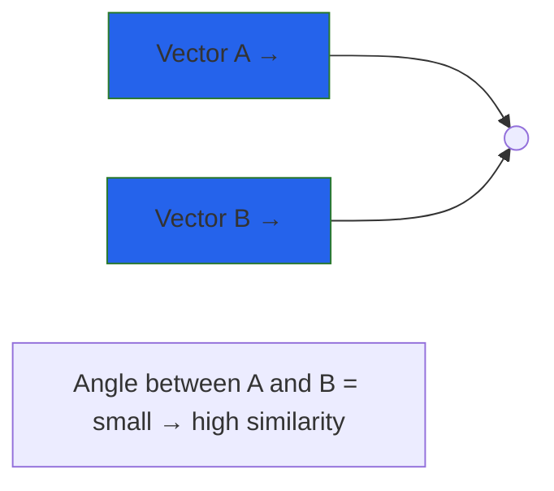

# 📐 Cosine Similarity – Explained

This reference module breaks down how cosine similarity works, why it's used in NLP, and how it compares to other similarity measures like Euclidean distance.

---

## 📚 What’s Covered

- ✅ What cosine similarity measures
- ✅ How the formula works (step-by-step)
- ✅ Why it’s used with embeddings
- ✅ Cosine vs. Euclidean (comparison table)
- ✅ Visual explanation via vector space
- ✅ When cosine similarity may fail

---

## 🔍 What Is Cosine Similarity?

Cosine similarity measures how **aligned two vectors are**, regardless of their length. It calculates the **cosine of the angle between them** in high-dimensional space.

> Cosine Similarity = 1 → vectors point in the same direction  
> Cosine Similarity = 0 → vectors are orthogonal (unrelated)  
> Cosine Similarity = -1 → vectors point in opposite directions

---

## 🧮 Formula


Where **key components**

- **Dot Product (A·B)**
```math
A \cdot B = \sum\limits_{i=1}^n A_i B_i
```
  - Sum of element-wise multiplication**
  - Measures aligned magnitude**

- **Vector Magnitudes**
  
```math
\|A\| = \sqrt{\sum\limits_{i=1}^n A_i^2}
```
- Euclidean length of each vector
- Normalizes the similarity score

**Interpretation Scale**

| Value Range      | Meaning                          |
|------------------|----------------------------------|
| `1.0`            | Identical vectors                |
| `0.7 - 0.99`     | Highly similar                   |
| `0.4 - 0.69`     | Moderately related               |
| `0.0 - 0.39`     | Unrelated                        |
| `-1.0`           | Opposite direction               |

**Example Calculation**
For vectors:  
**A** = [0.4, -0.2], **B** = [0.3, 0.1]

### 📊 Visual: Vector Angle Intuition

This shows that similarity is about direction, not magnitude.

### 🔁 Cosine vs. Euclidean – What's the Difference?
| Metric        | Measures          | Sensitive to Magnitude? | Use Case                             |
| ------------- | ----------------- | ----------------------- | ------------------------------------ |
| **Cosine**    | Angle (direction) | ❌ No                    | Semantic similarity, clustering, NLP |
| **Euclidean** | Distance (length) | ✅ Yes                   | KNN, spatial data, numeric features  |


Use cosine when the shape or meaning matters more than absolute scale.

### 🧠 Why We Use Cosine in Embeddings
- Embeddings are normalized: cosine removes length differences

- Models like sentence-transformers produce vectors where angle ≈ meaning

- Enables ranking, clustering, and filtering based on semantic proximity

### ⚠️ When Cosine Similarity May Mislead
- If vectors are not normalized or preprocessed

- If vectors are near-zero (e.g., empty text, junk tokens)

For numeric data where scale matters (use Euclidean or Manhattan)

### 🔗 Related Modules

| Module                                   | Description                                                   |
| ---------------------------------------- | ------------------------------------------------------------- |
| `embed_compare_cosine.md`                | Code module for generating similarity matrix                  |
| `embeddings-and-similarity-scores.ipynb` | Live notebook demo of cosine similarity                       |
| `embedding_pipeline.md`                  | Pipeline that combines embedding + similarity + visualization |
| `day2_embeddings_basics.md`              | Main session content – this file is linked in 📐 section      |
| `label_by_similarity.md`                 | Classifies input using cosine similarity to labeled examples  |
| `train_logistic_classifier.md`           | Trains logistic regression classifier on top of embeddings    |
| `peft_finetune_demo.md`                  | LoRA fine-tuning walkthrough for more advanced users          |

