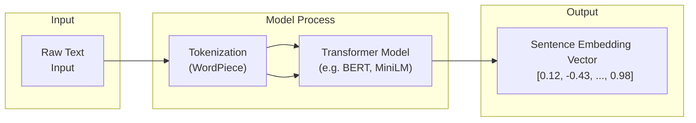
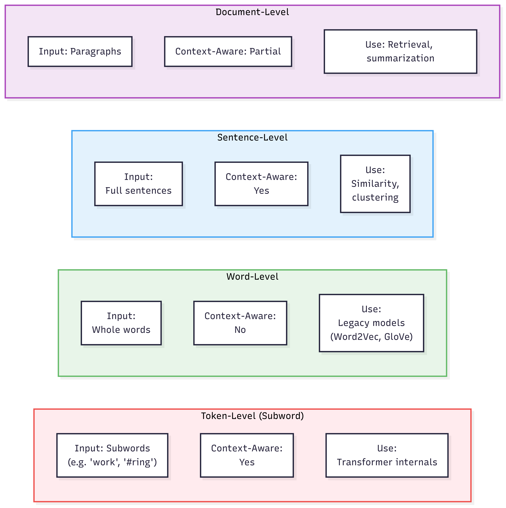

# 🧠 Embedding Intuition: Token, Word, Sentence, Document

Understanding **embeddings** is central to working with modern NLP models. This guide walks through the different levels of embeddings with clear examples and diagrams.

---

## 🧩 What Are Embeddings?

At their core, embeddings are **vectors** — numerical representations of text. They allow models to capture meaning, relationships, and context.

The diagram below shows how raw text is transformed into a dense vector using a transformer-based model.

1. **Raw Input:** Any natural language sentence, e.g., *"Cats are loyal animals."*
2. **Tokenization:** The sentence is split into tokens or subword units (e.g., "cat", "##s", "are", "loyal").
3. **Transformer Encoding:** These tokens pass through a pretrained transformer (e.g., MiniLM, BERT) that captures context and relationships.
4. **Embedding Output:** The model returns a fixed-size vector — the **sentence embedding** — which captures the semantic meaning of the entire sentence.

This final vector can be used for similarity comparison, clustering, search, and other downstream tasks.

> ✅ Unlike word embeddings (which are static), this vector reflects full-sentence context and meaning.





`"Dogs are loyal."` → `[0.12, -0.85, 0.44, ..., 0.21]`

---

## 🪙 1. Token Embeddings

- Based on **subword units** (e.g., "work", "##ing", "##ed")
- Used internally by transformer models like BERT and GPT
- Provide fine-grained positional inputs

```text
Input: "The workers are working."

Tokens:
["[CLS]", "the", "workers", "are", "work", "##ing", "[SEP]"]
```
Each token is embedded separately.

📌 Best for: internal transformer attention, syntactic awareness
⚠️ Not human-interpretable; hard to use directly

```mermaid
flowchart TB
  subgraph Token_Level_Embedding
    A1["[CLS]"] --> A2["the"] --> A3["worker"] --> A4["##s"] --> A5["are"] --> A6["productive"] --> A7["[SEP]"]
    A1:::token; A2:::token; A3:::token; A4:::token; A5:::token; A6:::token; A7:::token
  end

  subgraph Sentence_Level_Embedding
    B["The workers are productive."]:::sentence
  end

  Token_Level_Embedding --> C{{Transformer}} --> D["Token Vectors"]
  B --> C2{{Transformer}} --> E["Single Sentence Embedding Vector"]

  classDef token fill:#cce5ff,stroke:#000,color: #2E2E2E, stroke-width:1px;
  classDef sentence fill:#004E98,stroke:#2b7a2b,color:fff, stroke-width:1.5px;

  ```

 🧠 **What is `[CLS]`?**  
In transformer models like BERT, `[CLS]` is a special token added to the beginning of every input sentence.  
Its final hidden state is often used as the **aggregated sentence representation** for tasks like classification or pooling.  

You can think of it as a virtual "summary token" that captures the meaning of the full sentence — although it's not used in sentence-transformer models that return pooled sentence vector


### 🧱 2. Word Embeddings
Fixed representations for each word, regardless of sentence

Legacy approach (Word2Vec, GloVe)

Meaning is static: "bank" always maps to same vector

```text

"river bank" → same vector as "investment bank"
```

📌 Best for: classic NLP pipelines (pre-BERT)
⚠️ Context-agnostic

🧠 3. Sentence Embeddings
Dynamic representations for whole sentences

Built using context-aware transformer models (e.g., sentence-transformers)

Capture meaning, tone, negation, syntax

```text
Sentence A: "The project was not successful."  
Sentence B: "The project failed."  
→ High similarity score
```

📌 Best for: clustering, semantic search, similarity, alignment

✅ This is the main focus of the course.

📎 **Sentence Embedding Similarity Example**

Although phrased differently, both sentences convey the same idea. Their sentence embeddings are nearly identical in vector space, with a cosine similarity close to 0.94 — demonstrating how embedding models capture underlying semantic meaning beyond surface wording.

```mermaid
flowchart LR
  subgraph SentenceA["Sentence A"]
    A["'The project failed'"] --> AV["Vector A [0.4, -0.2, 0.7]"]
    style AV fill:#2563EB,stroke:#039BE5
  end

  subgraph SentenceB["Sentence B"]
    B["'The project was not successful'"] --> BV["Vector B [0.38, -0.19, 0.72]"]
    style BV fill:#2563EB,stroke:#039BE5
  end

  AV -->|Cosine Similarity: 0.98| BV

  %% Styling
  style SentenceA fill:#E0ECFF,stroke:#374151
  style SentenceB fill:#E0ECFF,stroke:#374151
  style A,B fill:#2563EB,stroke:#BDBDBD

  legend[["Similarity Interpretation:
  • 0.0-0.3: Unrelated
  • 0.4-0.6: Somewhat related
  • 0.7-0.9: Strongly related
  • 1.0: Identical"]]
  style legend fill:#F9FAFB,stroke:#374151, color:#000
  ```

### 📄 4. Document Embeddings
- Represent multi-sentence or full-paragraph inputs

- Typically created by chunking + pooling (e.g., mean of sentence embeddings)

- Used for full-article retrieval, report comparison, etc.

```text
Doc: News article with 12 sentences → split, embed, average
```

📌 Best for: retrieval, full-text classification
⚠️ May dilute nuance or mix unrelated content if not chunked carefully

The diagram below illustrates a common approach to generating **document-level embeddings**:

1. A full document is first split into individual sentences.
2. Each sentence is passed through an embedding model (e.g., MiniLM) to produce its own vector.
3. These sentence-level vectors are then averaged using **mean pooling**.
4. The result is a single embedding that represents the entire document’s semantic content.

This approach balances accuracy and efficiency, especially when models are optimized for sentence-level inputs. Chunking and pooling help preserve meaning without exceeding token limits.

```mermaid
flowchart TD
  A[📄 Full Document] --> B[✂️ Sentence Tokenization]
  B --> C1["Sentence 1"]
  B --> C2["Sentence 2"]
  B --> C3["Sentence 3"]
  C1 --> D1["🔢 Embedding 1"]
  C2 --> D2["🔢 Embedding 2"]
  C3 --> D3["🔢 Embedding 3"]
  D1 --> E[📏 Mean Pooling]
  D2 --> E
  D3 --> E
  E --> F[🧠 Document Embedding Vector]

  style A fill:#2563EB,stroke:#000
  style B fill:#6B7280,stroke:#000
  style C1,C2,C3 fill:#f5f5f5,stroke:#aaa
  style D1,D2,D3 fill:#d4f4dd,stroke:#2b7a2b
  style E fill:#fffacd,stroke:#333
  style F fill:#d0eaff,stroke:#004080,font-weight:bold, color:#000
  ```

📊 Summary Table


| Embedding Type | Scope            | Context-Aware? | Use Case                             |
| -------------- | ---------------- | -------------- | ------------------------------------ |
| Token          | Subword          | Yes            | Model internals (BERT/GPT attention) |
| Word           | One word         | No             | Older pipelines (Word2Vec/GloVe)     |
| Sentence       | Full sentence    | Yes            | Similarity, clustering, agents       |
| Document       | Paragraph or doc | Partially      | Retrieval, summarization             |

<figure>
  
  <figcaption>
    <strong>Token vs Sentence Embeddings</strong><br/>
    Token-level models assign a vector to each subword token (e.g., "worker", "##s"), capturing fine-grained structure. In contrast, sentence-level models generate a single vector representing the full meaning of the sentence. Sentence embeddings are more efficient and interpretable for tasks like clustering and similarity.
  </figcaption>
</figure>

This diagram compares four types of embeddings — token, word, sentence, and document — across key dimensions:

- **Input granularity:** What unit is embedded (subword, word, sentence, paragraph)?
- **Context awareness:** Does the model account for surrounding text?
- **Typical use case:** Where each embedding type is most appropriate.

Understanding these distinctions is critical when choosing the right embedding level for a task — from transformer internals to high-level document analysis.

```mermaid
flowchart LR
  subgraph Token
    T1["📏 Subwords"]
    T2["🧠 Context Aware: ✅"]
    T3["🎯 Use: Transformer internals"]
  end

  subgraph Word
    W1["📏 Whole words"]
    W2["🧠 Context Aware: ❌"]
    W3["🎯 Use: Legacy models (Word2Vec, GloVe)"]
  end

  subgraph Sentence
    S1["📏 Full sentence"]
    S2["🧠 Context Aware: ✅"]
    S3["🎯 Use: Similarity, clustering"]
  end

  subgraph Document
    D1["📏 Paragraph / Multi-sentence"]
    D2["🧠 Context Aware: Partial"]
    D3["🎯 Use: Retrieval, summarization"]
  end

  classDef box fill:#f9f9f9,stroke:#aaa;
  class T1,T2,T3,W1,W2,W3,S1,S2,S3,D1,D2,D3 box;

```

📎 Related Files
| File                             | Description                                     |
| -------------------------------- | ----------------------------------------------- |
| `day2_embeddings_basics.md`      | Main session page on sentence embeddings        |
| `cosine_similarity_explained.md` | Companion explainer on similarity measures      |
| `embed_text_basics.md`           | Code module to generate sentence embeddings     |
| `fig_token_vs_sentence.png`      | Diagram: token vs sentence embedding comparison |


