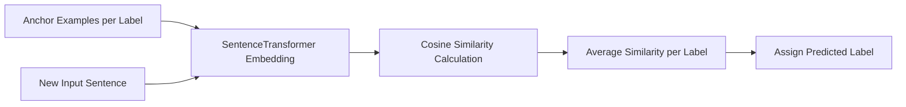

---

---

# 🔍 Label by Similarity (Zero/Few-Shot Classification)

Quick start:
```python
from sentence_transformers import SentenceTransformer
model = SentenceTransformer("all-MiniLM-L6-v2")

text = "This policy makes sense"
anchors = {
    "Support": ["I agree with this", "Good policy"],
    "Oppose": ["I disagree", "This won't work"]
}
label, scores = classify_text(text, anchors, model)
```

## ✅ When to Use
| Scenario              | Recommended Approach      |
|-----------------------|--------------------------|
| No labeled data       | Zero-shot (1 example/class) |
| Small labeled set     | Few-shot (3-5 examples/class) |
| Quick prototyping     | This method              |
| Production system     | Combine with classifier  |



This diagram visually demonstrates the logic of label assignment using cosine similarity to anchor examples. Each sentence is embedded, compared, averaged, and assigned.

---

## 🧱 Enhanced `classify_text()` Function


```python
from sklearn.metrics.pairwise import cosine_similarity
import numpy as np
from typing import Dict, Tuple


def classify_text(
    text: str, 
    anchors: Dict[str, list], 
    model,
    batch_size: int = 32,
    min_confidence: float = 0.3
) -> Tuple[str, Dict[str, float]]:
    """
    Classifies text by comparing to anchor examples.
    
    Args:
        text: Input to classify
        anchors: {label: [example1, example2]} 
        model: SentenceTransformer instance
        batch_size: For encoding efficiency
        min_confidence: Minimum score to return prediction
    
    Returns:
        (predicted_label, {label: score})
        Returns ("Unknown", {}) if no match exceeds min_confidence
    """
    if not text.strip():
        return "Empty", {}
    
    # Batch encode all anchors
    all_examples = [ex for exs in anchors.values() for ex in exs]
    all_embeddings = model.encode(all_examples, batch_size=batch_size)
    
    # Compute similarities
    text_vec = model.encode([text])[0]
    scores = {}
    
    start_idx = 0
    for label, examples in anchors.items():
        end_idx = start_idx + len(examples)
        label_embs = all_embeddings[start_idx:end_idx]
        sims = cosine_similarity([text_vec], label_embs)[0]
        scores[label] = float(np.mean(sims))
        start_idx = end_idx
    
    if not scores:
        return "Unknown", {}
        
    best_label = max(scores, key=scores.get)
    return (best_label, scores) if scores[best_label] >= min_confidence else ("Unknown", scores)
```

Key improvements:
1. **Batch processing** for efficiency
2. **Confidence thresholding**
3. **Input validation**
4. **Type hints** for better IDE support

---

## 📊 Advanced Usage

### Batch Classification
```python
def classify_batch(texts: list, anchors: dict, model):
    """Process multiple texts efficiently"""
    all_vecs = model.encode(texts)
    anchor_vecs = {k: model.encode(v) for k,v in anchors.items()}
    # ... (batch similarity calculation)
```

### Visualizing Decisions
```python
import matplotlib.pyplot as plt

def plot_scores(scores):
    plt.bar(scores.keys(), scores.values())
    plt.axhline(y=0.3, color='r', linestyle='--') 
    plt.title("Classification Confidence")
```

---

## 🚨 Common Pitfalls

1. **Anchor Quality**
   - ❌ "Positive", "Negative" (too abstract)
   - ✅ Real user phrases: "The policy helps my business"

2. **Similarity Thresholds**
   ```python
   # Adjust based on your needs
   classify_text(text, anchors, model, min_confidence=0.4)
   ```

3. **Model Choice**
   | Model                | Best For                  |
   |----------------------|---------------------------|
   | `all-MiniLM-L6-v2`   | General purpose           |
   | `paraphrase-multilingual` | Non-English       |

---

## 🔗 Integration Guide

### With Logistic Regression
```python
# Get embeddings for training data
X = [model.encode(text) for text in texts]
y = labels

# Train classifier
from sklearn.linear_model import LogisticRegression
clf = LogisticRegression().fit(X, y)
```

### With FastAPI
```python
@app.post("/classify")
async def classify(request: Request):
    data = await request.json()
    return classify_text(data["text"], predefined_anchors, model)
```

---

## 📚 Additional Resources
- [Sentence-Transformers Documentation](https://www.sbert.net)
- [Cosine Similarity Explained](https://example.com/cosine-guide)
- [Anchor Selection Toolkit](./anchor_toolkit.md)