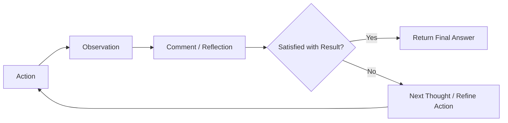

---

---

## ✳️  ACP Agent Template

### 🧠 Purpose

The **ACP Comment Framework** adds an **optional reflection layer** within the agent loop — after the model takes an action and observes the result, but before it proceeds.

This can be used for:

**Model self-reflection** (e.g., “Was that a good answer?”)

**Debugging trace** during development

**Human-in-the-loop oversight**

**Annotation and training** (e.g., identifying weak reasoning)

It’s not required in every agent — but critical in high-stakes, research, or regulated settings.

### 🧩 Position in the ACP Loop
This framework slots after Observe, before the agent decides to continue or exit. It modifies the traditional loop:



This lets the agent pause and reflect on its last step — increasing reliability, auditability, and insight.

### 🔧 Prompt Template (Core Structure)
A standardized prompt format designed for use inside .invoke() or a custom reasoning function.

```text
## Previous Action:
{tool_call_summary}

## Observation:
{tool_output}

## Reflection:
Do you notice any issues, gaps, or ambiguity in the result?

## Optional Comment:
{model_generated_comment or human_input}
```

**Use this for:**

- Logging decisions and edge cases

- Allowing model to critique itself (Chain-of-Thought audit)

- Flagging uncertain results

- Inviting manual input or second-pass review

### 🔍 Use Cases (Expanded)
| Scenario                | Description                                                     | Value                                           |
| ----------------------- | --------------------------------------------------------------- | ----------------------------------------------- |
| **Research Assistants** | Model checks if retrieved info or stance is well-supported      | Prevents shallow summarization or missed nuance |
| **Policy/Legal Agents** | Adds traceability — “why did you classify this as harmful?”     | Critical for defensibility                      |
| **Compliance Tools**    | Flags contradictions or red flags (e.g., low-confidence labels) | Reduces liability                               |
| **Debugging in Dev**    | Every step shows Thought → Action → Observation → *Comment*     | Speeds up debugging and error tracing           |
| **Teaching Agents**     | Commenting mirrors how we teach students to reflect             | Boosts interpretability and insight             |

### 🧪 Example: ZaraGPT Reflection Block
```text
## Tool: classify_stance
## Observation: "neutral"
## Reflection: The text contains sarcasm and ironic praise, which may mislead the classifier.
## Comment: Classification likely inaccurate. Re-checking with fallback model.
```

Here, the agent “knows” it might have misunderstood tone — a common issue with LLMs and shallow classifiers.

### 🧱 Prompt Variants
Depending on your use case, you can adapt the framework:

| Mode                  | Who Provides the Comment?                  | Notes                                        |
| --------------------- | ------------------------------------------ | -------------------------------------------- |
| **Self-commenting**   | LLM itself critiques its own output        | Best for fast dev/debug cycles               |
| **Human-in-the-loop** | Reviewer types response or selects tag     | Best for validation and supervised workflows |
| **Critique model**    | A second model is asked to review the step | Used in multi-agent evaluation loops         |
| **Silenced**          | Comment box suppressed for speed           | Can be turned off for production mode        |


### ⚙️ Implementation Pattern
Code snippet showing how to embed this in a LangChain reasoning loop:

``` python

# After a tool result
comment_prompt = f"""
## Tool Output: {observation}
Do you notice anything wrong, uncertain, or incomplete?
Please provide a short comment.
"""

comment = llm.invoke(comment_prompt)

# Optionally log:
log_step(thought, action, observation, comment)
```

This can be used inline or wrapped in a helper function.

### 🧩 Integration Targets
This framework can be embedded inside:

| Agent Type                   | Integration                                  |
| ---------------------------- | -------------------------------------------- |
| `trigger_agent_lite.md`      | Add comment before returning a prediction    |
| `zaragpt_agent_lite.ipynb`   | Agent reflects on stance or evidence quality |
| `agent_loop_explainer.ipynb` | Show full ACP + comment trace for teaching   |
 
### 🔗 Related Modules
| Module                                                                             | Purpose                                                       |
| ---------------------------------------------------------------------------------- | ------------------------------------------------------------- |
| [`acp_agent_template.md`](../../codebook/templates/acp_agent_template.md)          | Primary agent scaffold that can use this                      |
| [`agent_orchestration_loop.md`](../../codebook/agents/agent_orchestration_loop.md) | Places the comment step in the cognitive loop                 |
| [`trigger_agent_lite.md`](../../codebook/agents/trigger_agent_lite.md)             | Optional enhancement for ambiguous keyword detections         |
| `zaragpt_evidence_rater.md` *(proposed)*                                           | Could use the comment framework for evidence critique scoring |

### 📌 Strategic Role

The ACP Comment Framework:

- Makes agent reasoning visible

- Provides a safe layer of review

- Supports auditable, debuggable agent decisions