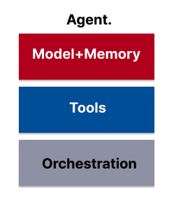

# Agent

## 🧠 What Is an Agent?

An **agent** in the Generative AI context is more than just a language model (LLM). It is a **goal-driven system** that:

* **Observes the world**
* **Reasons about what to do**
* **Acts upon the world** using tools

Agents are autonomous, meaning they can **take action without human prompting**. They’re capable of:

* Acting **proactively** (not just reactively)
* Planning and adjusting actions to reach a goal
* Integrating real-world tools to extend their capabilities

> Think of an agent as a "model + memory + tools + decision logic" all working together toward a user-defined outcome.

---
## 🧭 Why Agents Matter

Agents combine the **text generation ability** of LLMs with **real-world action** capabilities:

* They *reason*
* They *act*
* They *adapt*

Agents aren’t just answering questions — they’re **solving problems** with external resources.

---

## 🧩 Core Architecture: 3 Components of an Agent

Agents operate through a **cognitive architecture** — a pattern of thinking, reasoning, and acting. The core elements are:



### 1. 🧠 The Model

The **language model (LM)** serves as the brain of the agent.

* Capable of logic and reasoning (e.g. ReAct, CoT, ToT)
* Can be general-purpose or fine-tuned for specific tasks
* It is not aware of the full tool setup — but it can learn *how* to use tools via examples

**What it does:** Central decision-maker. It interprets the question, reasons through it, and decides what to do.

#### To optimize for social sciences:

* **Use domain-aligned models:** Choose LLMs fine-tuned or instruction-tuned on research data (e.g. `mistral`, `openchat`, `DeepSeek`, or custom-tuned OpenAI models).

* **Include few-shot examples from real research:** Feed examples like:

  * Coding qualitative interview excerpts
  * Detecting policy stance from parliamentary transcripts
  * Extracting variables from messy PDFs

* **Teach reasoning frameworks:** Embed ReAct or Chain-of-Thought directly into your prompt templates for tasks like:

  * “What themes emerge from this set of responses?”
  * “Based on sentiment and topic, what intervention would you recommend?”

✅ *Goal:* Make the model *social science fluent*, by showing it how you reason as a researcher.

> Read about ReAct in react.md


### 2. 🛠️ Tools

LLMs alone can't interact with the outside world. **Tools bridge this gap.**

* They let agents fetch real-time data (e.g. weather, prices, databases)
* Implemented as APIs (e.g., GET/POST)
* Used for actions like retrieving content, sending emails, updating databases
  
**What they do:** Give the model real-world access — search databases, load transcripts, run classification, analyze survey responses.

#### To optimize for social sciences:

* **Functions**: Build reusable functions like:

  * `extract_citations(text)`
  * `summarize_interview(transcript)`
  * `map_response_to_likert_scale(text)`
* **Extensions** (for agent-side execution):

  * Connect to Zotero, Google Scholar API, Trove, AURIN, or ABS datasets
  * Use Python/Colab tools for NLP (e.g., NLTK, spaCy)
* **Data Stores**:

  * Embed full corpora (policy docs, interview notes) as a vector DB (e.g., Chroma, FAISS)
  * Use RAG to allow the agent to "read" these documents when forming answers

✅ *Goal:* Let your agent *use your data* — not just general world knowledge.


### 3. 🔁 The Orchestration Layer

This is the **reasoning loop** — the agent’s "plan-do-check-act" cycle.

* Manages multi-step workflows
* Tracks session history
* Controls tool selection, logic branching, and when to stop

**What it does:** Handles memory, planning, logic, and sequencing. It’s the loop controller.

#### To optimize for social sciences:

* **Use ReAct or Chain-of-Thought** to handle tasks like:

  * Coding themes over multi-turn conversation
  * Suggesting next steps in a research workflow
* **Memory-aware orchestration**:

  * Track what articles have been summarized
  * Accumulate reasoning over a set of policy documents
* **Reasoning loops across tools**:

  * Example: Ask agent → fetch academic source → summarize findings → extract methods → suggest follow-up questions

✅ *Goal:* Give your agent the ability to think like a researcher — multi-step, iterative, contextual.


---

## 💼 Practical Examples in Social Sciences

| Task                                | Model                                       | Tools                                       | Orchestration                               |
| ----------------------------------- | ------------------------------------------- | ------------------------------------------- | ------------------------------------------- |
| **Interview coding**                | Understands context, recognizes themes      | Codebook function, vector store of examples | Loop through responses, apply ReAct         |
| **Policy stance detection**         | Classifies position using few-shot examples | Loads transcripts, uses classifier function | Tracks arguments, evaluates tone and target |
| **Trend analysis from survey text** | Summarizes sentiments                       | Uses open-ended text parser                 | Groups by pattern over multiple entries     |
| **Literature review agent**         | Extracts methods + findings                 | Scholar API + PDF RAG                       | Tracks and clusters results by theme        |

------


## 🧠 Agents vs. Models: What's the Difference?

| Feature                   | LLM (Model Only)     | Agent                               |
| ------------------------- | -------------------- | ----------------------------------- |
| 🧠 Reasoning              | Stateless            | Has memory and logic                |
| 🌐 Real-World Interaction | No tool use          | Uses APIs, databases, etc.          |
| 🔁 Session                | One-shot prediction  | Multi-turn, stateful                |
| ⚙️ Tools                  | Prompt-only guidance | Native integration                  |
| 🧱 Architecture           | Flat prompt-based    | Cognitive architecture (e.g. ReAct) |


---
## 🔄 ReAct Framework: The Reasoning Engine

The **ReAct Framework** (short for **Reasoning + Acting**) is a  a structured prompt loop used in agents to **break down thinking and decision-making into structured steps** — just like a human would do when solving a task using tools.

In simple terms, ReAct helps the **LLM think out loud**, make decisions step by step, and choose **which tool to use next**, using a loop:

1. **User query** is received
2. **Model thinks** (internal reasoning)
3. **Chooses action/tool** to use
4. **Executes action**
5. **Observes result**
6. **Updates reasoning**
7. **Repeats** or provides final answer

### 🧪 Example Steps:

```text
Thought: I need to check flight info.
Action: Use Flights API
Action Input: "Austin to Zurich, next Friday"
Observation: Found 3 flights
Final Answer: There are 3 options from Austin to Zurich...
```

This cycle builds a **feedback-driven loop** that ensures answers are not hallucinated but grounded in tool outputs.


Next: [react.md]() 
