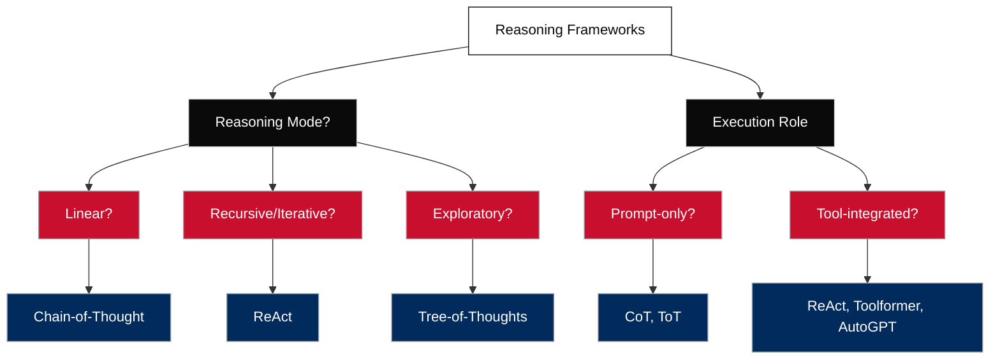

---

# 🧠 Reasoning Frameworks

As language models evolve from passive responders to autonomous agents, their ability to reason — not just generate — becomes critical. 

**Reasoning frameworks** are structured prompting strategies that guide LLMs to think, act, and adapt more like humans. They shape how an agent **plans**, **makes decisions**, and **uses tools** in uncertain or complex environments. Rather than relying on raw outputs, these frameworks inject method into thought — enabling agents to explain themselves, course-correct, and handle real-world social science tasks with clarity and precision.

In this section, we examine three complementary frameworks:

* **Chain-of-Thought (CoT):** structured, interpretable reasoning
* **ReAct:** dynamic reasoning-action loops with tool use
* **Tree-of-Thoughts (ToT):** exploration of multiple reasoning paths

Together, they form the cognitive spine of modern agent design.

---

## 🧠 Classification of Reasoning Frameworks

Large Language Models (LLMs) are incredibly flexible — but that also means **we need structured ways to guide their reasoning** depending on the goal. That’s where reasoning frameworks come in. Each framework is like a **mental scaffold**: it shapes *how* the model thinks, acts, and evaluates.

We have many frameworks not because they're redundant — but because each is optimized for a **different mode of cognition**:

---

We can classify frameworks along **two axes**:

### **1. Reasoning Mode** (How it thinks)

* **Linear**: Break the problem down step by step (e.g., **Chain-of-Thought**)
* **Recursive/Iterative**: Think, act, observe, repeat (e.g., **ReAct**)
* **Exploratory**: Branch into multiple paths, score and select (e.g., **Tree-of-Thoughts**)

### **2. Execution Role** (What it controls)

* **Prompt-only**: Guides the LLM without external tools (e.g., CoT, ToT)
* **Tool-integrated**: Uses external tools and APIs (e.g., ReAct, Toolformer, AutoGPT)



```
                ┌───────────────────────────────┬──────────────────────────────┐
                │        Prompt-Only            │       Tool-Integrated        │
┌───────────────┼───────────────────────────────┼──────────────────────────────┤
│ Linear        │ Chain-of-Thought (CoT)        │ —                            │
│               │                               │                              │
├───────────────┼───────────────────────────────┼──────────────────────────────┤
│ Iterative     │ —                             │ ReAct, AutoGPT               │
│               │                               │                              │
├───────────────┼───────────────────────────────┼──────────────────────────────┤
│ Exploratory   │ Tree-of-Thoughts (ToT)        │ Self-Ask + Search (Hybrid)   │
└───────────────┴───────────────────────────────┴──────────────────────────────┘
```
---

## 💬 Why it matters in social science:

Different research problems require **different mental architectures**:

* Analyzing qualitative survey responses? Use **CoT + ReAct**
* Exploring ambiguous political discourse or ideology drift? Use **ToT**
* Automating literature review pipelines or policy document workflows? Use **ReAct + Tools**

Just like a social scientist switches between grounded theory, thematic analysis, and statistical inference — **you need different reasoning structures for different AI problems**.

---

## 🛠 3 Core Cognitive Architectures

As shown, we can classify reasoning frameworks along two axes: *how they think* and *what they control*. The core trio — **Chain-of-Thought (CoT), ReAct, and Tree-of-Thoughts (ToT)** — represent three distinct reasoning paradigms:

* 🧠 **Linear Logic** (CoT)
* 🔁 **Iterative Feedback** (ReAct)
* 🌲 **Exploratory Branching** (ToT)

> More complex agents like AutoGPT combine these with planning and memory.
> Frameworks like Self-Ask + Search focus on modular tool use.
> But at the heart of every reasoning agent are these **three foundational paradigms**.

---

### 🧠 1. Chain-of-Thought (CoT)

**Reasoning Mode:** Linear
**Tool Use:** ❌ Prompt-only
**Purpose:** Transparent, step-by-step logic

**What it does:**
CoT encourages the model to break down complex tasks into **explicit intermediate steps**, mimicking how a human would “think aloud” through a problem. By prompting the model to *“think step-by-step”*, we unlock more consistent and interpretable outputs.

**Use in agents:**

* Improves logic in classification, deduction, coding
* Essential for social science tasks like coding interviews or evaluating survey responses
* Often embedded into the **“Thought:”** sections of ReAct agents

> Example:
> *“Let’s first identify the topic, then assess the sentiment, then determine alignment with the policy codebook…”*

---

### 🔁 2. ReAct (Reasoning + Acting)

**Reasoning Mode:** Iterative
**Tool Use:** ✅ Yes
**Purpose:** Looping action with tool execution

**What it does:**
ReAct unifies the model’s reasoning and its ability to use tools — it thinks (`Thought:`), acts (`Action:`), observes (`Observation:`), and loops. This allows agents to **interact with the real world**, adapt their strategy mid-task, and avoid hallucination by grounding outputs in real data.

**Use in agents:**

* Core of all **tool-using LLM agents**
* Supports web search, database lookup, PDF summarization, code execution, etc.
* Enables **multi-turn workflows** (e.g. search → summarize → recommend)

> Example:
> *“Thought: I need to know when the law was passed. → Action: search\_policy\_dates() → Observation: It passed in 2014. → Thought: That means it predates current budget cuts.”*

---

### 🌲 3. Tree-of-Thoughts (ToT)

**Reasoning Mode:** Exploratory
**Tool Use:** ❌ (typically prompt-only)
**Purpose:** Generate multiple reasoning paths, then select the best

**What it does:**
ToT allows the agent to **simulate multiple ways to solve a problem** — exploring different ideas in parallel like a brainstorming tree — and then evaluate which is most coherent or effective. This improves performance in **ambiguous, open-ended, or creative tasks**.

**Use in agents:**

* Ideal for planning, hypothesis testing, literature analysis
* Can wrap around ReAct or CoT loops for **meta-reasoning**
* Best for tasks with no single obvious path or multiple plausible interpretations

> Example:
> *“Option 1: Classify this as budget-related… Option 2: Frame it as a political statement… Option 3: See it as public sentiment. → Best: Option 2, based on tone and source.”*

---

## Real-World Usage

The three reasoning frameworks (CoT, ReAct, ToT) are **not equally used in practice. Their adoption varies significantly based on:

* **Task complexity**
* **Tool integration needs**
* **Compute cost**
* **Maturity of deployment frameworks**

Here’s how they differ in **real-world usage**:


| Framework                  | Adoption Level          | Used In Production?                               | Why?                                                         |
| -------------------------- | ----------------------- | ------------------------------------------------- | ------------------------------------------------------------ |
| **Chain-of-Thought (CoT)** | ✅ Widely used           | ✅ Yes (often embedded)                            | Simple to implement, improves accuracy, cheap to run         |
| **ReAct**                  | ⚠️ Emerging but growing | ✅ Increasingly (especially with LangChain/Vertex) | Enables tool use and grounding, harder to orchestrate        |
| **Tree-of-Thoughts (ToT)** | 🚧 Mostly experimental  | ❌ Rare (in production)                            | Computationally expensive, complex to manage branching logic |

---

## 🧠 Details by Framework

### 🧠 **Chain-of-Thought (CoT)**

* ✅ **Most widely used** in both research and industry
* Common in classification, reasoning, and exam-style tasks
* Embedded in nearly every prompt-tuning pipeline (e.g. GPT-4, Claude, Gemini)
* Easy to implement — just change the prompt
* Used in:

  * Customer support workflows
  * Legal and compliance document parsing
  * AI tutors and educational agents

### 🔁 **ReAct**

* 🔄 Growing adoption in **LLM agent frameworks** (LangChain, Agentic Vertex AI, CrewAI)
* Used in real-world agents that:

  * Search the web
  * Call APIs
  * Summarize documents
  * Interact with tools (e.g. Python execution, database lookups)
* Barriers:

  * Needs loop controller, tool registry, memory management
  * Harder to deploy securely at scale
* But it’s foundational for:

  * Retrieval-augmented generation (RAG)
  * Internal copilots
  * Research assistants and workflow agents

### 🌲 **Tree-of-Thoughts (ToT)**

* 🧪 Still mostly **research-stage**
* Great results on planning, puzzles, or creative tasks
* But:

  * Requires running **multiple branches per task**
  * Needs scoring and pruning logic
  * Higher latency and compute cost
* Not yet commonly used in production pipelines

---

## 🔧 Practical Recommendation

| Use Case                          | Recommended Framework          |
| --------------------------------- | ------------------------------ |
| Qual coding / classification      | CoT or ReAct (with CoT inside) |
| Tool-integrated research agent    | ReAct                          |
| Literature synthesis / creativity | ToT (optional, experimental)   |
| Fast inference at scale           | CoT                            |

---

### ⚠️ TL;DR

* **CoT** is *everywhere* — even when it’s not explicitly called CoT
* **ReAct** is *increasingly used* in tool-using, multimodal, or retrieval-integrated agents
* **ToT** is *promising*, but still experimental for real-time or client-facing use

---

---
## 🧱 Related Modules


| Module                   | Description                                                                                          |
| ------------------------ | ---------------------------------------------------------------------------------------------------- |
| `agent.md`    | Overview of LLM-based agents: what they are, how they differ from standalone models, and how reasoning, memory, and tools are orchestrated in modern agent architectures. Includes examples of agent workflows and social science use cases. |
| `agent_frameworks.md`    | Overview and classification of reasoning frameworks (CoT, ReAct, ToT) for agent design               |
| `cot.md`                 | Explanation of Chain-of-Thought (CoT) reasoning with breakdowns, examples, and visuals               |
| `react.md`               | ReAct framework loop explained: Thought → Action → Observation cycle and tool use                    |
| `tot.md`                 | Tree-of-Thoughts logic explained with examples of multi-path reasoning and selection                 |
| `tools.md`               | Agent tool registry and usage pattern (how to define, route, and call external tools)                |
| `extensions.md`          | How to extend agent capabilities with memory, RAG, chaining, or planning mechanisms                  |
| `function_call.md`       | OpenAI-style function calling interface: how LLMs call structured functions in agent workflows       |
| `targeted_learning.md`   | Prompt engineering strategies for social science use cases: guided logic, labels, and intent control |
| `langchain_basics.ipynb` | Jupyter notebook demo of basic agent setup using LangChain (tools, prompt templates, loop)           |
| `cot_vs_react_comparison.ipynb` | Side-by-side notebook comparing CoT-only vs ReAct-based workflows on social science tasks (e.g. coding, classification, search + reasoning). Includes performance notes, structure differences, and when to use which. |
| `cot_finetune.ipynb)` |  Notebook demo showing how to fine-tune a language model (e.g. Mistral, Phi-2) on Chain-of-Thought (CoT) reasoning patterns using instruction-style datasets. Includes PEFT-based LoRA setup, custom training examples for social science tasks, and explanation of when fine-tuning is necessary versus prompt-only CoT.|

---

## 🔮 What’s Next?

Next: [cot.md]()

➡️ Now that you’ve mapped the core agent architectures, we begin with the most foundational reasoning paradigm: **Chain-of-Thought (CoT)**.
You’ll learn how to guide LLMs through **step-by-step logic**, build transparent reasoning flows, and apply CoT to real-world social science tasks like classification, coding, and thematic analysis — all without using external tools.

This will lay the cognitive groundwork before we move into dynamic agent loops like ReAct and exploratory planners like ToT.


