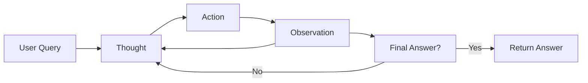

# 🧠 Agent Orchestration Loop

## ❓ Why ACP Exists — The Problem It Solves

As LLM agents get more capable, they start mimicking human workflows:
- Taking in open-ended instructions
- Searching, filtering, or classifying data
- Iterating on decisions using external tools

But without a defined loop, this becomes:
- Untraceable
- Hard to debug
- Inflexible and non-reusable

That’s why the **Agent Cognition Protocol (ACP)** was introduced.

> ACP gives us a clear, auditable orchestration structure for how an agent thinks, acts, and decides — step by step.

---

## 🎯 Purpose

This module explains the **agent orchestration layer** — the structural logic loop that governs how agents:
- Receive input
- Choose actions
- Use tools
- Observe results
- Decide to continue or stop

It combines:
- 🧠 **ACP (Agent Cognition Protocol)** – the outer loop structure
- 🔁 **ReAct (Reason + Act)** – the inner reasoning pattern used by the model

---

## 🧬 The ACP Loop

The ACP loop mirrors human cognitive behavior in research or decision-making:

1. **Perceive** – Take in the problem or question  
2. **Reason** – Reflect on what step is needed  
3. **Act** – Choose a tool or function to invoke  
4. **Observe** – Evaluate the result  
5. **Repeat or Exit** – Continue reasoning or return a final answer  


📎 See: acp_agent_template.md

🔄 ACP vs ReAct — What's the Difference?
Framework	Level	Role	Core Steps
ReAct	Reasoning	Logic used inside the model's output	Thought → Action → Observation
ACP	Orchestration	System-level execution logic	Perceive → Reason → Act → Observe → Repeat/Exit

ACP wraps ReAct.

ReAct tells the model how to reason step-by-step.

ACP tells the system when to call the model, what tool to invoke, and how to decide if the task is complete.

In your agents (e.g. trigger_agent_lite.md), ReAct runs inside ACP.

🛠 LangChain: Running the ACP Loop
When using LangChain, ACP orchestration is handled automatically if you:

Use a ReAct-style agent template

Define tools with @tool or Tool(...)

Connect a model like OpenAI or Gemini

Example
```python
from langgraph.prebuilt import create_react_agent
from langchain_core.tools import tool
from langchain.chat_models import ChatVertexAI

@tool
def search(query: str) -> str:
    """Search the web."""
    ...

llm = ChatVertexAI(model="gemini-1.5-flash")
agent = create_react_agent(llm, tools=[search])

agent.invoke({"input": "What is the latest LLM from Meta?"})
```
LangChain:

- Streams ReAct reasoning steps

- Loops until the agent reaches a stopping condition

- Provides visibility into each decision

🧪 Demos Using ACP Loop

🧾 Notebook (step-by-step run):

- [`trigger_detector_demo.ipynb`](trigger_detector_demo.ipynb)  

🔎 Lightweight code module:

- [`trigger_agent_lite.md`](trigger_agent_lite.md)  


🔗 Related Modules
acp_agent_template.md
- [`acp_agent_template.md`](acp_agent_template.md)


- [`acp_comment_framework.md`](acp_comment_framework.md)

- [`trigger_agent_lite.md`](trigger_agent_lite.md)
