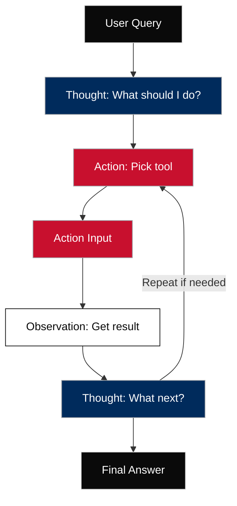
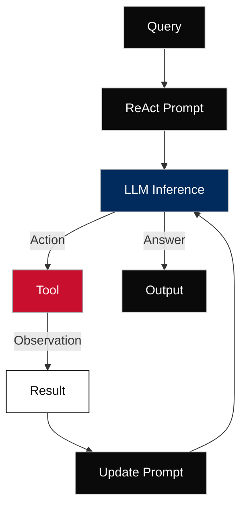

# 🧠 ReAct Framework: What It Is

At its core, ReAct enables agents to:

1. **Reason** through a problem step-by-step
2. **Take Action** (e.g., call a tool or API)
3. **Observe** the result of that action
4. **Repeat** until the final answer is formed


This loop makes agents **interactive**, **grounded**, and **less likely to hallucinate**, especially when connected to tools like search, database queries, or code execution.

---

## 🔁 ReAct Loop: Step-by-Step Breakdown

Here’s how a **ReAct loop** typically works inside an agent:

| Step                | Description                                  |
| ------------------- | -------------------------------------------- |
| 1. **Question**     | The user query                               |
| 2. **Thought**      | The model reflects: “What should I do next?” |
| 3. **Action**       | The model chooses a tool to use              |
| 4. **Action Input** | The model provides input to the tool         |
| 5. **Observation**  | The tool gives back a result                 |
| 6. **(Repeat)**     | The model reasons again using the new info   |
| 7. **Final Answer** | The model summarizes everything for the user |



---

## 🧪 Example of ReAct in Action

### **User:**

> “What’s the weather in Paris, and what time is sunset?”

### **Agent:**

```
Question: What’s the weather in Paris, and what time is sunset?

Thought: I need to look up the current weather and sunset time in Paris.

Action: WeatherAPI
Action Input: "Paris"

Observation: It's 25°C, partly cloudy. Sunset is at 9:24 PM.

Thought: I now have the information I need.

Final Answer: The weather in Paris is 25°C and partly cloudy. Sunset is at 9:24 PM.
```

---

## 🛠 How to Implement ReAct (as a Developer)

If you're coding an agent (e.g., using LangChain, LangGraph, or Vertex AI), here's what to do:

### 1. **Design Your Prompt Template**

Include ReAct steps explicitly:

```text
Question: {user_input}

Thought: {model's reasoning}

Action: {tool name or None}

Action Input: {parameters}

Observation: {result from tool}

... repeat ...

Final Answer: {model's conclusion}
```

### 2. **Feed This to the LLM**

Give the LLM the ReAct scaffold as a prompt template and let it fill in the steps.

### 3. **Tool Execution Middleware**

Build a Python loop that:

* Detects when the model says `Action: X`
* Executes tool `X` with `Action Input`
* Injects `Observation` back into the prompt
* Feeds it back to the model for the next step

This is often called a **controller** or **agent loop** (see `agent_loop_rag.md` in your architecture).

---

## 🔄 How ReAct Flips Traditional AI Design

### 1. 🧠 **Unifying Reasoning and Acting via the Same LLM Prompt**

#### What this means:

Instead of separating logic (rules) from execution (scripts or tool calls), ReAct lets the **LLM handle both in one structured prompt**.

#### How:

Each prompt cycle includes:

* `Thought:` → the model reasons internally
* `Action:` → the model picks what to do (e.g. call a tool)
* `Action Input:` → the parameters for the tool
* `Observation:` → the result returned to the model
* Back to `Thought:` with updated context

#### Why it matters:

This allows **emergent logic** from the model, not rigid code paths. It makes the system **adaptive and fluid**, like human decision-making.

#### In social science:

> Coding 100 open-ended responses about climate attitudes?
> Instead of writing a separate classification model and decision logic, a ReAct agent can dynamically reason about the tone, pick a sentiment analysis tool, and update its understanding based on feedback — all in one loop.

---

### 2. 🛠 **Dynamically Choosing Tools and Adjusting Plans**

#### What this means:

Agents don’t follow a pre-wired flow. They **choose which tools to use** based on the current task, user input, and past results.

#### How:

LLM "decides" which function, API, or database to use:

* If it sees “Can you summarize this report?” → it picks `summarize_pdf()`
* If it sees “What’s the sentiment over time?” → it picks `chart_sentiment_trend()`

This is **not hardcoded** — it’s pattern-matched from context.

#### Why it matters:

You can add or update tools (e.g. add ABS Census or Trove integration), and the agent will **learn to use them naturally** if given examples.

#### In social science:

> One prompt could route:

* Short tweets → use `simple_sentiment()`
* Long Reddit posts → use `topic_model()`
* PDFs of interviews → use `chunk_and_embed()`

---

### 3. 🔁 **Learning and Iterating Over Time Using Observations and Memory**

#### What this means:

ReAct agents can **observe results**, reflect, and **revise their plan**, just like a researcher reading sources or refining a lit review.

#### How:

* Each round includes an `Observation:` field (e.g. “No relevant result found”)
* The next `Thought:` incorporates that (“Maybe I should try a different search term”)
* Session memory stores past interactions (optional), helping it avoid repetition

#### Why it matters:

It supports **multi-turn logic**, fallback strategies, and **self-correction**. This is impossible in classic LLM prompt → output setups.

#### In social science:

> When an agent summarizes a 100-page report:

* It reads a chunk, finds no methods section → revises the plan to search for "Methodology"
* Doesn’t find it → adjusts again to look for tables or footnotes

---

### 💡 Net Result: Grounded Flexibility

This combo — reasoning + action + dynamic planning — gives ReAct agents the power to:

| 🔍 Real-world Task                    | ReAct Capability                                   |
| ------------------------------------- | -------------------------------------------------- |
| Thematic analysis of messy interviews | Adjusts codebook on the fly                        |
| Multi-source literature summary       | Chooses which PDF to extract from, based on prompt |
| Crisis classification in social media | Switches tools for speed or clarity                |
| Interactive qualitative dashboards    | Explains reasoning, offers next-step suggestions   |

---

## 🔧 Key Components of ReAct's Dynamic Implementation

Technically, the **dynamic behavior** in the ReAct framework — where an LLM **selects tools, plans actions, and updates based on results** — is implemented through a structured orchestration loop that combines:

### 1. **Structured Prompt Format (ReAct Schema)**

You use a consistent structure in your prompt to the LLM, typically something like:

```plaintext
Question: {user query}

Thought: {model thinks about the next step}

Action: {tool name or None}

Action Input: {input parameters for tool}

Observation: {result from tool}

...repeat loop...

Final Answer: {summary or conclusion}
```

This format **guides the model** into acting like a reasoner + planner. You pass this to the model and parse the output programmatically.

---

### 2. **Tool Invocation Layer (Middleware Controller)**

Once the model outputs:

```plaintext
Action: get_flights
Action Input: from=Melbourne, to=Zurich
```

Your code (in Python or LangChain, etc.) intercepts this:

```python
if action == "get_flights":
    result = get_flights_tool(**parsed_input)
    append_to_prompt(f"Observation: {result}")
```

This **middleware** does:

* Parse model output
* Call the right tool
* Capture the output
* Feed it back into the next prompt

Think of it as the **agent orchestrator or loop controller**.

---

### 3. **Memory and History**

You can append previous steps into the ongoing prompt to create **contextual memory**:

```plaintext
History:
Q: What's the GDP of France?
T: I should use the economic database tool.
A: econ_api
AI: GDP is $3.0T

Q: How does that compare to Italy?
...
```

Alternatively, you can use:

* LangChain memory modules
* Custom session objects in Python
* Vertex AgentBuilder memory layers (Google ecosystem)

This lets the model **"remember" previous observations and refine the strategy**.

---

### 4. **Tool Registry or Routing System**

In a real implementation, tools are often registered dynamically:

```python
TOOL_REGISTRY = {
    "search_web": web_search_tool,
    "summarize_pdf": summarize_tool,
    "code": code_execution_tool,
    ...
}

def call_tool(tool_name, args):
    return TOOL_REGISTRY[tool_name](**args)
```

This allows the agent to **choose from a growing set of capabilities** without hardcoding logic.

---

### 5. **Stopping Criteria & Loop Control**

You usually wrap this in a loop with safeguards:

```python
for step in range(max_steps):
    response = model.generate(prompt)
    
    if "Final Answer:" in response:
        break
    
    tool = parse_action(response)
    input = parse_action_input(response)
    result = call_tool(tool, input)
    prompt += f"\nObservation: {result}"
```

This loop stops when:

* Model says "Final Answer"
* Step count exceeds threshold
* Tool fails or fallback is triggered

---

## 🧪 Toolkits That Support This

You don’t have to write all of this from scratch. These platforms abstract much of it:

| Platform                                  | What It Does                                            |
| ----------------------------------------- | ------------------------------------------------------- |
| **LangChain + LangGraph**                 | Tool routing, ReAct-style agent loop, memory, history   |
| **OpenAI Functions**                      | Structured function call response with argument parsing |
| **Google Vertex AgentBuilder**            | Extension and tool invocation via predefined schemas    |
| **Autogen / CrewAI / Transformers-Agent** | Orchestrated multi-agent frameworks                     |
| **Custom Python with Prompt Templates**   | Full control, minimal abstraction                       |

---

## 🧠 Technical Recap: ReAct Agent Control Loop



---

## Related Modules

| Module                   | Description                                                                                          |
| ------------------------ | ---------------------------------------------------------------------------------------------------- |
| `agent.md`    | Overview of LLM-based agents: what they are, how they differ from standalone models, and how reasoning, memory, and tools are orchestrated in modern agent architectures. Includes examples of agent workflows and social science use cases. |
| `agent_frameworks.md`    | Overview and classification of reasoning frameworks (CoT, ReAct, ToT) for agent design               |
| `cot.md`                 | Explanation of Chain-of-Thought (CoT) reasoning with breakdowns, examples, and visuals               |
| `react.md`               | ReAct framework loop explained: Thought → Action → Observation cycle and tool use                    |
| `tot.md`                 | Tree-of-Thoughts logic explained with examples of multi-path reasoning and selection                 |
| `tools.md`               | Agent tool registry and usage pattern (how to define, route, and call external tools)                |
| `extensions.md`          | How to extend agent capabilities with memory, RAG, chaining, or planning mechanisms                  |
| `function_call.md`       | OpenAI-style function calling interface: how LLMs call structured functions in agent workflows       |
| `targeted_learning.md`   | Prompt engineering strategies for social science use cases: guided logic, labels, and intent control |
| `langchain_basics.ipynb` | Jupyter notebook demo of basic agent setup using LangChain (tools, prompt templates, loop)           |
| `cot_vs_react_comparison.ipynb` | Side-by-side notebook comparing CoT-only vs ReAct-based workflows on social science tasks (e.g. coding, classification, search + reasoning). Includes performance notes, structure differences, and when to use which. |
| `cot_finetune.ipynb)` |  Notebook demo showing how to fine-tune a language model (e.g. Mistral, Phi-2) on Chain-of-Thought (CoT) reasoning patterns using instruction-style datasets. Includes PEFT-based LoRA setup, custom training examples for social science tasks, and explanation of when fine-tuning is necessary versus prompt-only CoT.|

----

## 🔮 What’s Next?

Next: [tot.md]()

➡️ You’ve learned how agents think and act using ReAct — now we explore how they can **reason across multiple paths** with **Tree-of-Thoughts (ToT)**.
In this module, you’ll see how agents can simulate different lines of thinking, evaluate alternatives, and choose the most coherent outcome.
ToT is especially powerful in **ambiguous, exploratory, or creative social science tasks** — such as interpreting complex narratives, clustering themes, or generating competing hypotheses.


