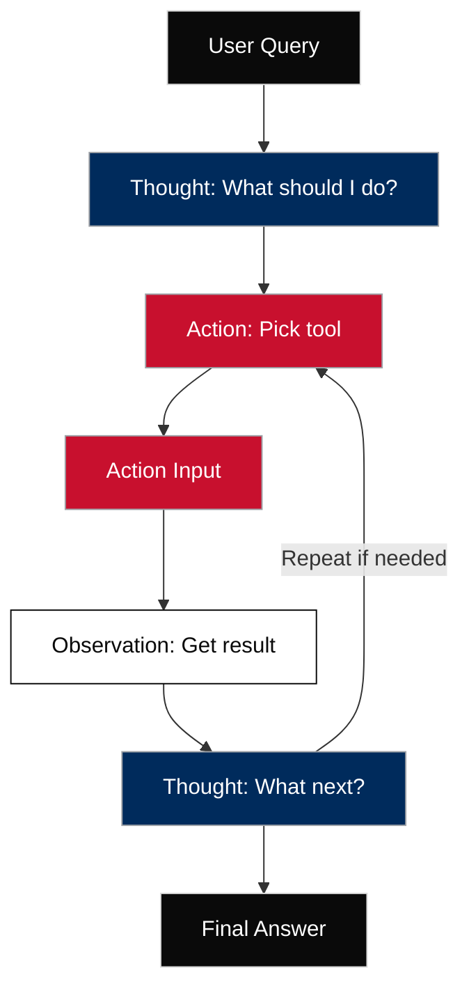
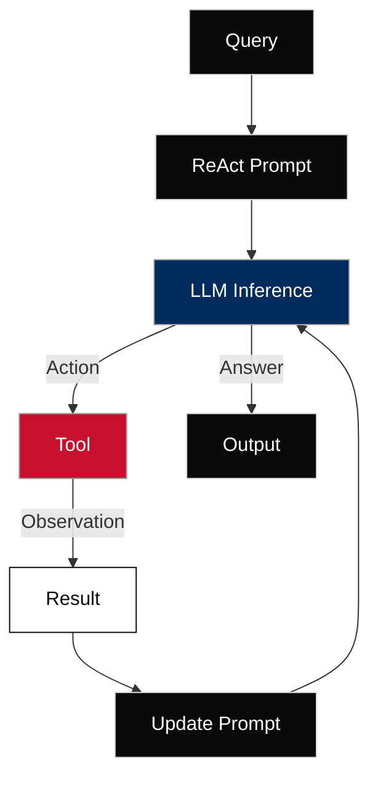

---

# 🧠 ReAct Framework: What It Is

At its core, ReAct enables agents to:

1. **Reason** through a problem step-by-step
2. **Take Action** (e.g., call a tool or API)
3. **Observe** the result of that action
4. **Repeat** until the final answer is formed


This loop makes agents **interactive**, **grounded**, and **less likely to hallucinate**, especially when connected to tools like search, database queries, or code execution.

---

## 🔁 ReAct Loop: Step-by-Step Breakdown

Here’s how a **ReAct loop** typically works inside an agent:

| Step                | Description                                  |
| ------------------- | -------------------------------------------- |
| 1. **Question**     | The user query                               |
| 2. **Thought**      | The model reflects: “What should I do next?” |
| 3. **Action**       | The model chooses a tool to use              |
| 4. **Action Input** | The model provides input to the tool         |
| 5. **Observation**  | The tool gives back a result                 |
| 6. **(Repeat)**     | The model reasons again using the new info   |
| 7. **Final Answer** | The model summarizes everything for the user |



---

## 🧪 Example of ReAct in Action

### **User:**

> “What’s the weather in Paris, and what time is sunset?”

### **Agent:**

```
Question: What’s the weather in Paris, and what time is sunset?

Thought: I need to look up the current weather and sunset time in Paris.

Action: WeatherAPI
Action Input: "Paris"

Observation: It's 25°C, partly cloudy. Sunset is at 9:24 PM.

Thought: I now have the information I need.

Final Answer: The weather in Paris is 25°C and partly cloudy. Sunset is at 9:24 PM.
```

---

## 🛠 How to Implement ReAct (as a Developer)

If you're coding an agent (e.g., using LangChain, LangGraph, or Vertex AI), here's what to do:

### 1. **Design Your Prompt Template**

Include ReAct steps explicitly:

```text
Question: {user_input}

Thought: {model's reasoning}

Action: {tool name or None}

Action Input: {parameters}

Observation: {result from tool}

... repeat ...

Final Answer: {model's conclusion}
```

### 2. **Feed This to the LLM**

Give the LLM the ReAct scaffold as a prompt template and let it fill in the steps.

### 3. **Tool Execution Middleware**

Build a Python loop that:

* Detects when the model says `Action: X`
* Executes tool `X` with `Action Input`
* Injects `Observation` back into the prompt
* Feeds it back to the model for the next step

This is often called a **controller** or **agent loop** (see `agent_loop_rag.md` in your architecture).

---

## 🔄 How ReAct Flips Traditional AI Design

### 1. 🧠 **Unifying Reasoning and Acting via the Same LLM Prompt**

#### What this means:

Instead of separating logic (rules) from execution (scripts or tool calls), ReAct lets the **LLM handle both in one structured prompt**.

#### How:

Each prompt cycle includes:

* `Thought:` → the model reasons internally
* `Action:` → the model picks what to do (e.g. call a tool)
* `Action Input:` → the parameters for the tool
* `Observation:` → the result returned to the model
* Back to `Thought:` with updated context

#### Why it matters:

This allows **emergent logic** from the model, not rigid code paths. It makes the system **adaptive and fluid**, like human decision-making.

#### In social science:

> Coding 100 open-ended responses about climate attitudes?
> Instead of writing a separate classification model and decision logic, a ReAct agent can dynamically reason about the tone, pick a sentiment analysis tool, and update its understanding based on feedback — all in one loop.

---

### 2. 🛠 **Dynamically Choosing Tools and Adjusting Plans**

#### What this means:

Agents don’t follow a pre-wired flow. They **choose which tools to use** based on the current task, user input, and past results.

#### How:

LLM "decides" which function, API, or database to use:

* If it sees “Can you summarize this report?” → it picks `summarize_pdf()`
* If it sees “What’s the sentiment over time?” → it picks `chart_sentiment_trend()`

This is **not hardcoded** — it’s pattern-matched from context.

#### Why it matters:

You can add or update tools (e.g. add ABS Census or Trove integration), and the agent will **learn to use them naturally** if given examples.

#### In social science:

> One prompt could route:

* Short tweets → use `simple_sentiment()`
* Long Reddit posts → use `topic_model()`
* PDFs of interviews → use `chunk_and_embed()`

---

### 3. 🔁 **Learning and Iterating Over Time Using Observations and Memory**

#### What this means:

ReAct agents can **observe results**, reflect, and **revise their plan**, just like a researcher reading sources or refining a lit review.

#### How:

* Each round includes an `Observation:` field (e.g. “No relevant result found”)
* The next `Thought:` incorporates that (“Maybe I should try a different search term”)
* Session memory stores past interactions (optional), helping it avoid repetition

#### Why it matters:

It supports **multi-turn logic**, fallback strategies, and **self-correction**. This is impossible in classic LLM prompt → output setups.

#### In social science:

> When an agent summarizes a 100-page report:

* It reads a chunk, finds no methods section → revises the plan to search for "Methodology"
* Doesn’t find it → adjusts again to look for tables or footnotes

---

### 💡 Net Result: Grounded Flexibility

This combo — reasoning + action + dynamic planning — gives ReAct agents the power to:

| 🔍 Real-world Task                    | ReAct Capability                                   |
| ------------------------------------- | -------------------------------------------------- |
| Thematic analysis of messy interviews | Adjusts codebook on the fly                        |
| Multi-source literature summary       | Chooses which PDF to extract from, based on prompt |
| Crisis classification in social media | Switches tools for speed or clarity                |
| Interactive qualitative dashboards    | Explains reasoning, offers next-step suggestions   |

---

## 🔧 Key Components of ReAct's Dynamic Implementation

Technically, the **dynamic behavior** in the ReAct framework — where an LLM **selects tools, plans actions, and updates based on results** — is implemented through a structured orchestration loop that combines:

### 1. **Structured Prompt Format (ReAct Schema)**

You use a consistent structure in your prompt to the LLM, typically something like:

```plaintext
Question: {user query}

Thought: {model thinks about the next step}

Action: {tool name or None}

Action Input: {input parameters for tool}

Observation: {result from tool}

...repeat loop...

Final Answer: {summary or conclusion}
```

This format **guides the model** into acting like a reasoner + planner. You pass this to the model and parse the output programmatically.

---

### 2. **Tool Invocation Layer (Middleware Controller)**

Once the model outputs:

```plaintext
Action: get_flights
Action Input: from=Melbourne, to=Zurich
```

Your code (in Python or LangChain, etc.) intercepts this:

```python
if action == "get_flights":
    result = get_flights_tool(**parsed_input)
    append_to_prompt(f"Observation: {result}")
```

This **middleware** does:

* Parse model output
* Call the right tool
* Capture the output
* Feed it back into the next prompt

Think of it as the **agent orchestrator or loop controller**.

---

### 3. **Memory and History**

You can append previous steps into the ongoing prompt to create **contextual memory**:

```plaintext
History:
Q: What's the GDP of France?
T: I should use the economic database tool.
A: econ_api
AI: GDP is $3.0T

Q: How does that compare to Italy?
...
```

Alternatively, you can use:

* LangChain memory modules
* Custom session objects in Python
* Vertex AgentBuilder memory layers (Google ecosystem)

This lets the model **"remember" previous observations and refine the strategy**.

---

### 4. **Tool Registry or Routing System**

In a real implementation, tools are often registered dynamically:

```python
TOOL_REGISTRY = {
    "search_web": web_search_tool,
    "summarize_pdf": summarize_tool,
    "code": code_execution_tool,
    ...
}

def call_tool(tool_name, args):
    return TOOL_REGISTRY[tool_name](**args)
```

This allows the agent to **choose from a growing set of capabilities** without hardcoding logic.

---

### 5. **Stopping Criteria & Loop Control**

You usually wrap this in a loop with safeguards:

```python
for step in range(max_steps):
    response = model.generate(prompt)
    
    if "Final Answer:" in response:
        break
    
    tool = parse_action(response)
    input = parse_action_input(response)
    result = call_tool(tool, input)
    prompt += f"\nObservation: {result}"
```

This loop stops when:

* Model says "Final Answer"
* Step count exceeds threshold
* Tool fails or fallback is triggered

---

## 🧪 Toolkits That Support This

You don’t have to write all of this from scratch. These platforms abstract much of it:

| Platform                                  | What It Does                                            |
| ----------------------------------------- | ------------------------------------------------------- |
| **LangChain + LangGraph**                 | Tool routing, ReAct-style agent loop, memory, history   |
| **OpenAI Functions**                      | Structured function call response with argument parsing |
| **Google Vertex AgentBuilder**            | Extension and tool invocation via predefined schemas    |
| **Autogen / CrewAI / Transformers-Agent** | Orchestrated multi-agent frameworks                     |
| **Custom Python with Prompt Templates**   | Full control, minimal abstraction                       |

---

## 🧠 Technical Recap: ReAct Agent Control Loop



---

Let me know if you want:

* A **Colab demo notebook**
* A **GitBook `.md` module** describing this pattern
* A **LangChain-specific implementation**

I can scaffold any of these in your style.
