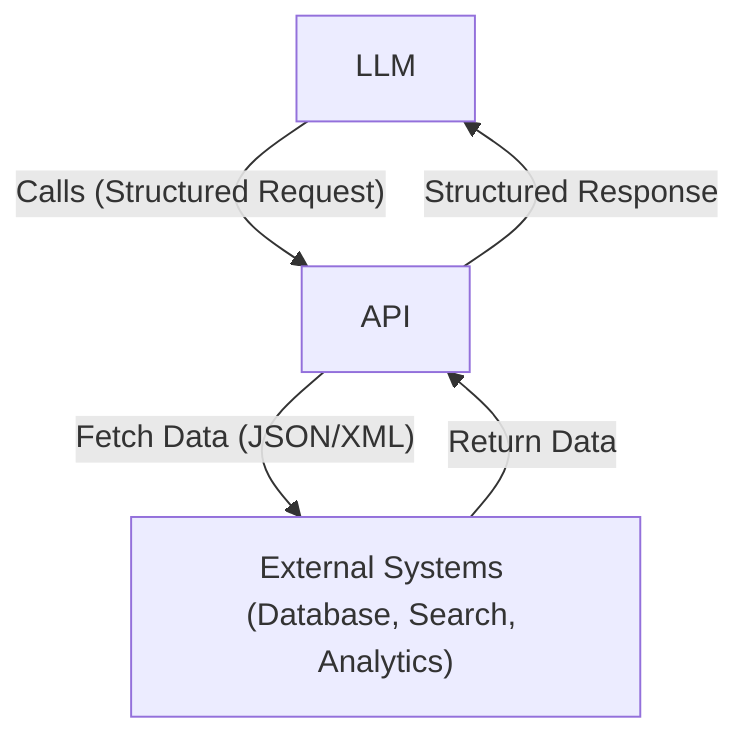

# Tools

## 🧰 What Are Tools?

In the context of LLM-based agents, **tools** are external functions or services that the model can call to extend its capabilities beyond pure text generation.

A **tool** might:

* Search a document
* Query a database
* Call a government policy API
* Summarize a PDF
* Run a sentiment classifier

Tools allow the model to **act in the real world**, not just generate language.

Here’s a clean, accurate breakdown of the **main types of tools** used in LLM agent systems, starting with your framing:

Most tools in LLM-based agent architectures fall into three main categories:

* **API-based tools** – These connect to external systems (e.g. search engines, databases, policy APIs) over HTTP. They require structured input (e.g. JSON) and return machine-readable responses. These are the most common in production agents because they give access to real-time data, automation systems, or third-party services.

* **Function-based tools** – These are internal, local functions exposed to the model through structured schemas. They don’t make external network calls but instead trigger logic inside the runtime (e.g. `summarise_text()`, `calculate_budget_allocation()`). This is the pattern used by OpenAI’s `function_call`, LangChain tools, or LangGraph nodes.

* **Data store tools** – These connect the model to **information retrieval systems**, like vector databases (e.g. Chroma, FAISS) or traditional databases. They’re used to perform similarity search, retrieve stored embeddings, or pull context from document collections — a key pattern in **Retrieval-Augmented Generation (RAG)**.

Each type plays a different role in giving the agent access to external knowledge, memory, or action capabilities — transforming it from a text generator into an intelligent system.

---

## What is API?

An **API (Application Programming Interface)** is a structured way for software systems to exchange information. It defines **what data can be requested**, **what inputs are required**, and **how responses are returned** — typically in a machine-readable format like JSON. APIs allow agents to access external services such as databases, search engines, policy repositories, or analytical tools without needing to understand the internal logic of those systems. In the context of LLM-based agents, APIs serve as the foundation for tools: when wrapped correctly, they become callable components the model can use to extend its capabilities beyond language generation.

## 🔄 Tools vs APIs

A tool is usually a **wrapper around an API** — but not all APIs are usable by a model directly.

| Concept  | Definition                                                                                                                     |
| -------- | ------------------------------------------------------------------------------------------------------------------------------ |
| **API**  | A technical interface for retrieving or sending data from a service (e.g. `GET /surveys?date=2023`)                            |
| **Tool** | A structured, model-friendly way to use that API within an agent — includes usage rules, argument formats, and safety controls |

🧠 **Key Point:** A tool is what the model sees and uses. The API is what runs underneath.

---

## 🧩 Main Types of Tools

LLM agents typically interact with **three major categories** of tools:

| Tool Type          | Description                                                                                                       | GitBook Module     |
| ------------------ | ----------------------------------------------------------------------------------------------------------------- | ------------------ |
| **Extensions**     | Smart connectors that let agents dynamically use external APIs with example-based guidance                        | `extensions.md`    |
| **Function Calls** | Declarative tools exposed to models (e.g. OpenAI “functions”) where the model chooses the tool + fills parameters | `function_call.md` |
| **Data Stores**    | Tools that help agents retrieve information from document or vector databases (e.g. semantic search or RAG)       | `data_stores.md`   |

These tool types are **modular and combinable** — agents can switch between them depending on the task.

---

## 📘 Social Science Use Cases

In applied research and government workflows, tools can:

* 🔍 Search large policy documents or submissions (via `data_store`)
* 📄 Extract structured data from unstructured text (e.g. extract postcode + topic from a complaint)
* 📈 Summarize reports or consultations using RAG + summarizer tools
* 🧠 Code qualitative responses via classifiers or prompt-based decision logic
* 🔁 Call external datasets (e.g. census, health records, legal databases) via `extensions`

These tools bring **actionability** and **automation** to agent workflows — ideal for analysts, researchers, and evaluators.

---

## 🧠 Why Tools Matter

Without tools, LLMs are limited to what they’ve seen in pretraining.
With tools, agents can:

* Retrieve real-time data
* Interact with live systems
* Execute logic
* Ground their answers in evidence

This is what transforms a **language model** into a **cognitive agent**.

---

Let me know if you'd like:

* A visual diagram: *Model ↔ Tool Router ↔ API*
* Slide version of this section
* Mermaid flowchart for use in GitBook or GitHub README

---

## Related modules

| Module                   | Description                                                                                          |
| ------------------------ | ---------------------------------------------------------------------------------------------------- |
| `agent.md`    | Overview of LLM-based agents: what they are, how they differ from standalone models, and how reasoning, memory, and tools are orchestrated in modern agent architectures. Includes examples of agent workflows and social science use cases. |
| `agent_frameworks.md`    | Overview and classification of reasoning frameworks (CoT, ReAct, ToT) for agent design               |
| `cot.md`                 | Explanation of Chain-of-Thought (CoT) reasoning with breakdowns, examples, and visuals               |
| `react.md`               | ReAct framework loop explained: Thought → Action → Observation cycle and tool use                    |
| `tot.md`                 | Tree-of-Thoughts logic explained with examples of multi-path reasoning and selection                 |
| `tools.md`               | Agent tool registry and usage pattern (how to define, route, and call external tools)                |
| `extensions.md`          | How to extend agent capabilities with memory, RAG, chaining, or planning mechanisms                  |
| `function_call.md`       | OpenAI-style function calling interface: how LLMs call structured functions in agent workflows       |
| `targeted_learning.md`   | Prompt engineering strategies for social science use cases: guided logic, labels, and intent control |
| `langchain_basics.ipynb` | Jupyter notebook demo of basic agent setup using LangChain (tools, prompt templates, loop)           |
| `cot_vs_react_comparison.ipynb` | Side-by-side notebook comparing CoT-only vs ReAct-based workflows on social science tasks (e.g. coding, classification, search + reasoning). Includes performance notes, structure differences, and when to use which. |
| `cot_finetune.ipynb)` |  Notebook demo showing how to fine-tune a language model (e.g. Mistral, Phi-2) on Chain-of-Thought (CoT) reasoning patterns using instruction-style datasets. Includes PEFT-based LoRA setup, custom training examples for social science tasks, and explanation of when fine-tuning is necessary versus prompt-only CoT.|
