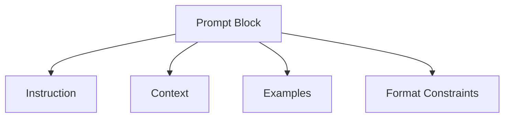

---

---

# 🧠 Prompt Anatomy and Design Patterns

> “A prompt is structured logic for the model to interpret, not just an input to complete.”
> 

## What Is a Prompt?

A **prompt** is the input you give to a large language model (LLM), but unlike a simple question or query, a well-designed prompt is a *modular instruction set* that guides the model's reasoning, behavior, tone, and output format.

Think of it as programming — but in natural language. You're not just asking for information. You're:

- Setting boundaries
- Specifying structure
- Guiding the model to behave a certain way

A poor prompt yields vague, rambling, or misleading outputs. A strong prompt can mimic expert reasoning, emulate domain-specific language, or generate structured data.

---

## 🧱 Core Components of a Prompt 

Let’s break a prompt into its modular parts. Each component adds structure, clarity, and control. While not every prompt needs all of them, **awareness of these layers makes your prompting intentional and reusable.**

| Component       | Purpose                  | Detailed Explanation & Example                                                                                                                                                                                |
| --------------- | ------------------------ | ------------------------------------------------------------------------------------------------------------------------------------------------------------------------------------------------------------- |
| **Instruction** | Directs what to do       | Tell the model *what* to do. Be specific and use active verbs. ➡ Example: *"Summarise the key findings from the following policy paper."*                                                                     |
| **Context**     | Provides background      | Include relevant information to help the model reason better. Can be documents, excerpts, or role framing. ➡ Example: *"You are an academic writing an article abstract. The following is the full paper..."* |
| **Examples**    | Shows how to do it       | Provide 1–3 examples of what good output looks like. Use input-output pairs. ➡ Example: *Input: '...', Output: '...'.* This is the basis of few-shot prompting.                                               |
| **Constraints** | Limits or formats output | Specify length, format, tone, or data structure. ➡ Example: *"Return in YAML format. Max 50 words. Use formal tone."*                                                                                         |

---

## 🧭 Prompt Structure Map



---

## ♻️ Prompt Modularity and Reuse Patterns

Prompts are not disposable — they’re logic blocks.

- Write once, test in notebooks
- Store in versioned `.md` or `.yaml` files
- Reuse in GitBook, MVP UI, client tools

### Research Assistant: your research on steroids

**The Problem**

Researchers waste months:

- Manually screening thousands of papers

- Applying inconsistent criteria

- Struggling to document their methods

**The Solution**

Pre-built prompt "kits" for each research task:

| **Task**               | **Prompt Components**                                                           |
| ---------------------- | ------------------------------------------------------------------------------- |
| **Literature Review**  | • Study type filters  <br> • Quality assessment rules  <br> • Summary templates |
| **Data Extraction**    | • Table parsers  <br> • Unit converters  <br> • Statistical checks              |
| **Manuscript Writing** | • Abstract formulas  <br> • Citation stylers  <br> • Jargon simplifiers         |

**How It Works**

- Choose pre-tested prompts for your discipline

Example: "Clinical trial inclusion criteria v3.1"

- Run them through AI tools like:

  - ChatGPT (manual testing)

  - Hugging Face (automated pipelines)

- Get structured outputs:

``` text
- [ ] Paper Title: "COVID-19 vaccine study"  
  ✓ Meets criteria: RCT, >100 participants  
  ✗ Excluded: No control group  
```

**Real-Life Examples**

**A. Medical Researcher**

- Uses:

 - cancer_study_filter.md (to find relevant papers)

 - adverse_effects_extractor.yaml (to pull side-effect data)

- Saves: 3 months of manual work per review

**B. Social Scientist**

- Uses:

  - survey_analysis_template.md (to code open-ended responses)

  -bias_checklist.json (to flag problematic questions)

- Achieves: 92% consistency across research assistants

**C. Lab Manager**

- Uses:

 - protocol_writer.md (to generate SOPs)

 - inventory_updater.yaml (to track reagents)

- Reduces: 50% protocol errors

**Key Benefits**

✅ Faster - Screen 100+ papers/hour vs. 15 manually

✅ Consistent - Same criteria applied to every paper

✅ Trackable - Like lab protocols, with version numbers

✅ Collaborative - Share prompts across labs

**Getting Started**

- Identify repetitive tasks in your workflow

- Find existing prompts (GitHub/Hugging Face)

- Test with 10-20 samples

- Refine for your specific needs

**Think of it like:**

🧪 Lab protocols → But for AI-assisted research

📋 Structured forms → That automatically process text/data

No coding needed – just copy-paste prompts into tools you already use.

---

## 💡 Prompt Archetypes with Detailed Examples

Below are foundational prompting patterns that combine the components above. These are templates you can adapt across platforms.

### 📌 Zero-shot Instruction

Use when the task is familiar and no ambiguity is expected.

**Prompt:**

```
You are a tax policy advisor. Summarise the main issues in this draft proposal.
```

**Why this works:** The instruction is strong. The task is familiar. The model can act on prior training.

✅ Best for: Known formats (e.g., summarisation, classification)

⚠️ Watch for: Vagueness or hallucination without constraints.

---

### 📌 Few-shot Prompt with Structured Output

Includes 2–3 examples to guide the model with consistent patterning.

**Prompt:**

```
Classify the following policy statements as "support", "oppose", or "neutral".

Examples:
- "This change is long overdue and will benefit many." → support
- "We have serious reservations about this approach." → oppose

Statement: "It is unclear how this will be implemented."
Answer:
```

✅ Best for: Tasks with nuance or edge cases (e.g., tone detection, sentiment)

🧠 Tip: Use a consistent label set and example structure.

---

### 📌 ReAct Reasoning Pattern

Combine internal "Thought" steps with observable actions. Use for tasks requiring reasoning, chaining, or external tools.

**Prompt:**

```
You are an assistant solving a problem step by step.

Question: What is the capital of the country where the 2022 FIFA World Cup was held?

Thought: The 2022 FIFA World Cup was held in Qatar.

Action: Lookup("Capital of Qatar")

Observation: Doha

Final Answer: Doha
```

✅ Best for: Retrieval tasks, multi-step reasoning, integrations with tools (via LangChain, function calls)

---

### 📌 Structured Output Prompt

Guide the model to return a predictable schema (JSON, XML, YAML, etc.).

**Prompt:**

```
Extract the following information and return in JSON:

{
  "topic": "...",
  "entities": ["...", "..."],
  "summary": "..."
}

Text: Australia and China signed a trade agreement in 2023 to boost agricultural exports.
```

✅ Best for: Integrations with downstream apps, forms, research extraction

⚠️ Watch for: Inconsistent field formatting — use examples if needed.

---

### 📌 Multimodal Prompt (e.g. Gemini, GPT-4o)

Used when the input includes **image + text**.

**Prompt:**

```
Caption this image in under 10 words.
```

🖼️ *[Insert protest image]*

✅ Best for: Visual interpretation, captioning, content moderation

⚠️ Only supported in models like Gemini Pro, GPT-4o (with vision)

---

## 🔍 Prompt Component Checklist (Expanded)

Use this as a **debug and design reference** when your prompt is underperforming.

- ✅ **Instruction** is clearly scoped: avoid vague verbs like "analyze"
- ✅ **Context** is relevant and minimal (remove clutter)
- ✅ **Examples** are realistic and directly related to the task
- ✅ **Output format** is constrained with length or schema rules
- ✅ **Tone/role** matches your target audience or product voice

---

## 🧠 Prompt Design Heuristics

| Scenario                | What to do                                       |
| ----------------------- | ------------------------------------------------ |
| Output is too verbose   | Add "Respond in 3 bullet points" or "< 40 words" |
| LLM misunderstands role | Start with: "You are a financial regulator..."   |
| Repeats input or drifts | Use stronger formatting examples                 |
| Fails to follow format  | Add a complete demo output (few-shot)            |

These heuristics are built into the MVP prompt evaluation module and taught in class.

---

## 🔁 Reusability in Practice

Your prompts are not throwaway lines. They are **versioned, indexed logic units**:

- **In GitBook** → They become documented examples for students, collaborators
- **In Colab notebooks** → They’re tested live
- **In Streamlit** → They power your UI prompt forms
- **In client work** → They serve as internal playbooks and templates

Make your prompts modular. Use `.yaml` headers. Track what works. This is systemized prompting.

---

## 📌 Related Modules

- [Prompt Frameworks →](prompt_frameworks.md)
- [Prompt Failures →](prompt_failures.md)
- [Mini Project Templates →](mini_project_templates.md)

