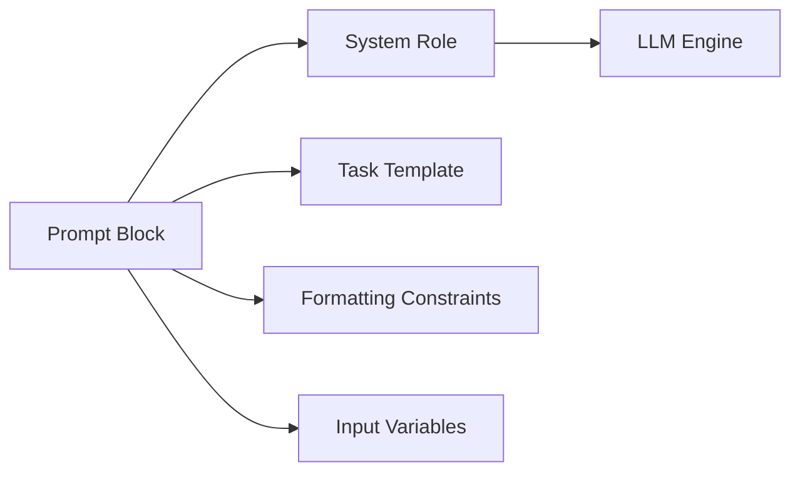

---

---


# ♻️ Prompt Modularity and Reuse Patterns

> “Write once, reuse everywhere.”

This section introduces the foundational principle behind prompt reuse: **modularity**. Rather than treating prompts as one-off inputs, you can structure them as reusable components — just like code.

This approach is useful whether you're:

- Writing prompts in ChatGPT or Gemini
- Using LLMs inside a notebook
- Building a product or research tool

---

## 🔹 What Is a Modular Prompt?

A **modular prompt** is split into distinct reusable blocks:

- `system_prompt`: defines the assistant's role and tone
- `task_prompt`: defines the specific task and formatting
- `context_input`: provides user content or external documents
- `output_constraint`: defines how the answer should look

Example:

```yaml
# system_prompt.yaml
role: "You are a senior health policy advisor."
constraints:
  - "Respond in under 100 words"
  - "Use structured bullet points"
```

```markdown
## Task Prompt
Summarise the key risks from the document below. 
Include one example per risk.
```

This structure allows you to:

- Swap roles (e.g., legal vs health)
- Reuse the same task with different inputs
- Apply consistent formatting across platforms

---

## 🧠 Why Use Modular Prompts?

| Benefit       | Impact                                          |
| ------------- | ----------------------------------------------- |
| Clarity       | Each block has a single responsibility          |
| Reusability   | One prompt serves multiple use cases            |
| Traceability  | You can track which version was used in outputs |
| Collaboration | Experts can edit their own domain prompt blocks |
| Debuggability | Easy to test parts in isolation                 |

This becomes even more important in regulated or audited contexts (e.g. health, law).

---

## 🧱 Visual: Modular Prompt Flow



---

## 🛠 Examples in Practice (No Git Required)

### 1. In Notebooks:

```python
system = "You are a financial analyst."
task = "Summarise the risks in under 100 words."
user_input = load_text("report.txt")
prompt = f"{system}\n\n{task}\n\n{user_input}"
```

### 2. In Streamlit UI:

- Each dropdown selects a `system` and a `task`
- User pastes content in text box
- Output displayed below (downloadable)

### 3. In GitBook:

```markdown

```

Even participants without GitHub experience can:

- Edit Markdown/YAML prompt files
- Use Colab/Streamlit interfaces to load them
- Apply structured prompting in real work

---

## 🧭 Where This Is Used

| Context           | Use                           |
| ----------------- | ----------------------------- |
| GitBook           | Teaching, documentation       |
| Jupyter Notebooks | Testing, experimentation      |
| Streamlit App     | User interface for non-coders |
| GitHub (Optional) | Versioning for developers     |
| Client Workflows  | Playbooks and logic handoff   |

---

## 🔁 Summary

Modular prompts:

- Help you design with intention
- Allow reuse across platforms
- Prepare your prompts for audit, scaling, or automation

You don't need to learn GitHub to benefit from modularity. You only need to start thinking of prompts as **components, not strings**.

➡️ Next: [Prompt Modularity (Advanced) →](prompt_modularity_advanced.md)

