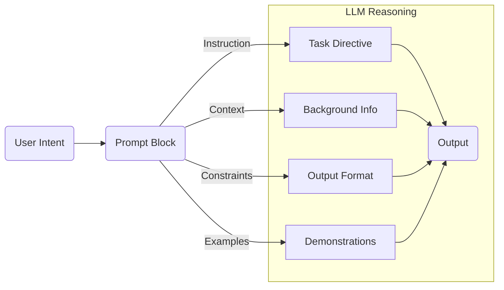
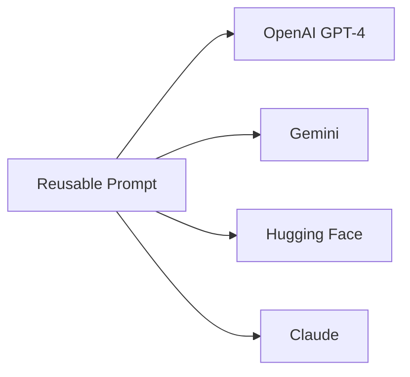
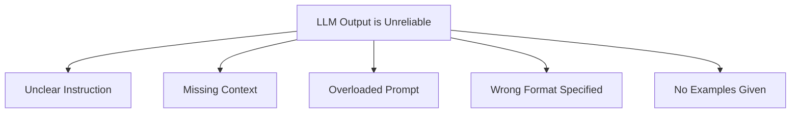

---

---

# 🧠 Prompting as Interface Logic

> “A prompt is not a message — it’s an instruction set, a contract, a lens.”

---

## Why This Session Matters

Modern LLMs like GPT-4, Gemini, Claude, and Mistral are not search engines or passive responders.  
They are **interfaces for reasoning** — and prompting is how we control them.

Prompting is the *language of alignment* between human and model:
- Not just how to ask a question, but how to structure thought.
- Not just what to say, but how to constrain the output.
- Not just input → output, but a programmable interface.

---

## What You’ll Learn

This session is designed to shift your mental model of prompting.  
You’ll walk away with:

- A clear framework for building structured prompts
- Understanding of when and why different strategies work (zero-shot, CoT, ReAct, etc.)
- Hands-on experience running prompts in Gemini, OpenAI Playground, and Hugging Face
- A domain-specific prompt scaffold for your own work (e.g., policy, health, research)
- A reusable evaluation method for testing prompt quality

---

## What Prompting *Actually* Is

Prompting = instructing the model how to act.  
It’s not magic. It’s engineering.

Core components:
- **Instruction** – what you want the model to do
- **Context** – background information or input data
- **Examples** – few-shot demonstrations, or ReAct-style
- **Constraints** – output format, tone, word count, rules

These are not random tweaks. They are **deliberate design elements**.

Below is a conceptual map of what a prompt *really* is — not a message, but a control interface:



---

## Prompting Across Providers

The same prompt block can be run across multiple LLM platforms — with different behavior depending on how the system interprets roles, context, and format:



| Platform | Characteristics |
|----------|------------------|
| **OpenAI Playground** | Role-based, supports JSON output, functions |
| **Gemini AI Studio** | Multimodal support (image+text), native tools |
| **Hugging Face** | Code-first, flexible but raw |
| **Claude** | Long context + instruction-sensitive |

In this session, we’ll test how the same logic behaves across these systems.

---

## Prompting Is Modular

A prompt isn’t a message — it’s a **logic block**.

You can:
- Version it (`prompt_v2.yaml`)
- Port it across tools (from Gemini to Streamlit)
- Store it in a codebase
- Plug it into a research pipeline or app

That’s why we treat prompts as reusable components — not throwaways.

Once written, a prompt block can be reused across products and tools. 

```mermaid
graph TD
  A[Prompt Block (.md/.yaml)] --> B(GitBook: Theory & Docs)
  A --> C(Jupyter Notebook: Testing)
  A --> D(Streamlit MVP: UI)
  A --> E(Client Tools)

```
For more prompting, we will use [Prompt modularity](prompt_modularity.md)
---

## Reusability Beyond the Session

Everything you build today fits into a broader system:

- GitBook: for structured explanation + versioning
- Notebooks: for experimentation
- Streamlit: for UI + testing
- GitHub: for storage + traceability

This isn’t “play with AI.” This is **build your system of reasoning** — and own it.

## Prompt Failure Modes

If you're getting unpredictable or weak outputs, trace the failure back to one of these root causes:



---

## 🧭 Next → [Prompt Anatomy](prompt_anatomy.md)

We now break down what makes a prompt *work* — and how to structure one that survives contact with the model.
