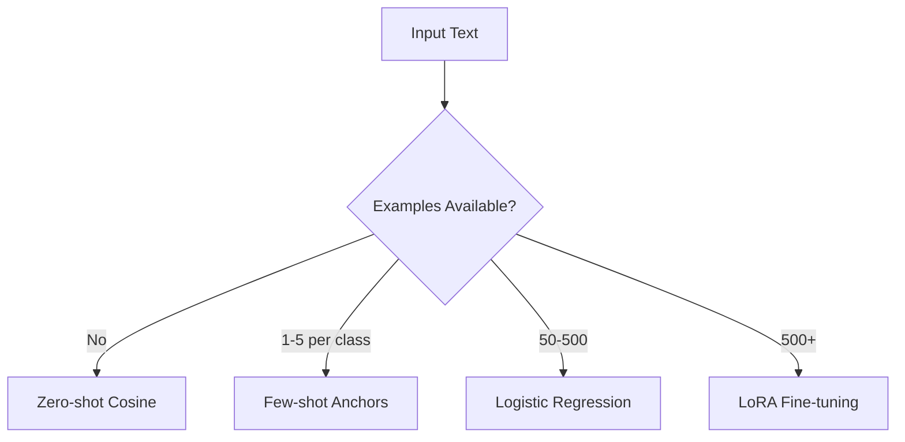
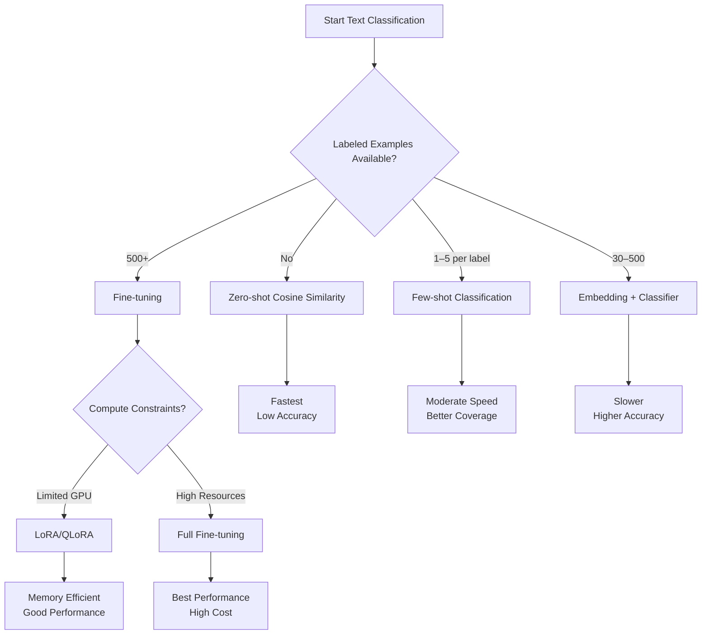

---

---

# 🧠 Classification Using Embeddings

## 🎯 Learning Objectives
By the end of this session, you'll be able to:
1. Implement zero-shot classification using cosine similarity
2. Train a logistic regression model on embeddings
3. Decide when to use PEFT/LoRA fine-tuning
4. Diagnose and improve classification performance




Use this decision tree to choose the right text classification method based on how many labeled examples you have — and whether speed, interpretability, or performance is most important.



---

## 🧭 1. Introduction

Text classification is a core task in social science research:
- Tagging responses to surveys or interviews
- Detecting support or opposition in public comments
- Harmonizing qualitative data for statistical analysis

Instead of manually tagging thousands of examples or training a full transformer model, you can use **embeddings** to compare inputs to a small set of examples. You’ll learn three levels of classification:

| Level | Description | Accuracy | When to Use |
|-------|-------------|----------|-------------|
| Level 1 | Zero-shot (Cosine similarity) | Basic | Exploratory tagging |
| Level 2 | Embeddings + Classifier | Stronger | 50–500 labeled examples |
| Level 3 | Fine-tuning (LoRA) | Highest | Domain-specific, 500+ samples |

**Core Concepts**
The Embedding Classification Pipeline
- Encode: Convert text to vector representation

- Compare: Measure similarity or train classifier

- Decide: Assign label based on thresholds

**Accuracy Expectations**

| Method               | Typical Accuracy* | Speed       |
|----------------------|------------------:|------------:|
| **Zero-shot Cosine** |           55-70%  | ⚡⚡⚡⚡⚡    |
| **Few-shot (5 ex)**  |           65-75%  | ⚡⚡⚡⚡      |
| **Logistic Regression** |       75-85%  | ⚡⚡⚡        |
| **LoRA Fine-tuned**  |           80-90%  | ⚡⚡          |

<small>*Accuracy ranges vary by data quality and domain specificity</small>

---

## 🔹 2. Zero-Shot Classification (Cosine Similarity)

In zero-shot classification, we use cosine similarity to **compare a sentence to labeled examples (called anchors)**.

You don’t need a classifier — just:
- A list of anchor examples for each label (e.g. "Supportive", "Neutral", "Opposed")
- A sentence to classify

The label with the **highest average similarity** wins.


📘 **Code module**: [`label_by_similarity.md`](../../codebook/day2/label_by_similarity.md)  
📓 **Notebook**: [`classify_policy_stance.ipynb`](../../codebook/day2/classify_policy_stance.ipynb)

### 🔍 How it Works

1. Embed the input sentence
2. Embed each anchor example
3. Compute cosine similarity between the input and each anchor
4. Average the similarity scores per label
5. Choose the label with the highest average score

> ✅ This is easy to use and doesn’t require training.

```python
# Try changing this text!
test_text = "The policy has some good points but needs work"
label, scores = classify_text(test_text, anchors, model)
print(f"Predicted: {label}\\nScores: {scores}")
```

**Common Issues & Fixes**

| 🚨 Problem            | 🛠️ Solution                      | 🛡️ Prevention                     |
|-----------------------|----------------------------------|------------------------------------|
| **All scores <0.3**   | ▶ Add diverse anchors<br>▶ Check embedding model | Test anchors before deployment |
| **Class imbalance**   | ▶ Equalize examples<br>▶ Adjust similarity threshold | Monitor prediction distribution |
| **Low variance**      | ▶ Refine label definitions<br>▶ Add sub-categories | Pilot test with edge cases |


---

## 🔸 3. Few-Shot Expansion: Improving Zero-Shot

Zero-shot classification becomes much more powerful when you provide **several real-world examples per label**.

Instead of 1 anchor per class, aim for 3–5 diverse examples.

### 🔧 Tips for Few-Shot Anchors

- Use language taken from real responses, not made-up phrases
- Include edge cases (e.g., mild disagreement, strong disagreement)
- Normalize text: lowercase, remove punctuation (optional)

This makes your anchor embeddings more representative and improves classification accuracy.

See updated examples in:  
📓 [`classify_policy_stance.ipynb`](../../codebook/day2/classify_policy_stance.ipynb)

---

## 🔁 4. Supervised Classifier on Embeddings

When you have **50–500 labeled samples**, you can train a simple classifier (like logistic regression) on top of the sentence embeddings.

This is more accurate and flexible than cosine similarity, and easy to implement.

📘 **Code module**: [`train_logistic_classifier.md`](../../codebook/day2/train_logistic_classifier.md)

### 🔧 Steps:

1. Embed all labeled sentences using `sentence-transformers`
2. Train a classifier (logistic regression or SVM)
3. Predict new labels using the classifier

### ✅ Advantages

- Faster and easier than deep learning
- Works well with small datasets
- Interpretability: you can inspect the learned weights


**Mini-Exercise: Train Your First Classifier**

Compare accuracy before/after

```python
# Pro tip: Visualize your embeddings
import umap
embeddings_2d = umap.UMAP().fit_transform(X)
plt.scatter(embeddings_2d[:,0], embeddings_2d[:,1], c=labels)
```


---

## 🧬 5. Optional: Fine-Tuning Using PEFT (LoRA)

For advanced use cases, or when you have **hundreds or thousands of labeled examples**, you can fine-tune the model itself using PEFT — Parameter-Efficient Fine-Tuning.

We recommend using **LoRA**, which injects small trainable weights into a frozen model. This makes training faster, cheaper, and more memory-efficient.

📘 **Guide**: [`peft_finetune_demo.md`](../codebook/classification/peft_finetune_demo.md)  
📓 **Notebook**: [`peft_finetune_demo.ipynb`](../codebook/classification/peft_finetune_demo.ipynb)

### 🧠 When to Use

- Your data is highly domain-specific (e.g., niche policy, cultural language)
- You want to improve performance beyond cosine or classifiers
- You’re building reusable components (e.g., for RAG)

## When Does LoRA Shine?


## 🖥️ Hardware Requirements

| Method               | GPU VRAM  | Example Cards      |
|----------------------|----------:|--------------------|
| 🟢 Base Inference    | 4GB       | RTX 3050           |
| 🟠 LoRA Training     | 8GB       | RTX 3070           |
| 🔵 QLoRA             | 6GB       | RTX 3060           |
---

## ⚖️ 6. Choosing the Right Approach

| Scenario | Recommended Method |
|----------|---------------------|
| <10 examples per label | Zero-shot (cosine similarity) |
| 30–500 labeled samples | Logistic regression on embeddings |
| >500 domain-specific samples | LoRA fine-tuning |
| Need speed or interpretability | Cosine or regression |
| Need highest performance | LoRA or adapter-based fine-tuning |


## ⏱️ Workflow Planning

| Task Scope           | Approach                | Time          |
|----------------------|-------------------------|--------------:|
| 🔥 Quick analysis    | Zero-shot               | <30 min       |
| 📚 Research project  | Few-shot + Logistic     | 2-4 hours     |
| 🏛️ Peer-reviewed     | Full fine-tuning        | 1-2 days      |

---

## 🧠 7. Summary

| Method | Code Module | Use Case |
|--------|-------------|----------|
| Cosine Similarity | `label_by_similarity.md` | Fast zero/few-shot |
| Logistic Classifier | `train_logistic_classifier.md` | Medium-scale datasets |
| PEFT (LoRA) | `peft_finetune_demo.md` | Advanced fine-tuning |

---

## 🔗 8. Links & Assets

- [`classify_policy_stance.ipynb`](../codebook/classification/classify_policy_stance.ipynb) – full live notebook
- [`label_by_similarity.md`](./label_by_similarity.md) – similarity-based classifier
- [`train_logistic_classifier.md`]((../../codebook/day2/train_logistic_classifier.md) – supervised classifier
- [`peft_finetune_demo.md`](../codebook/classification/peft_finetune_demo.md) – LoRA fine-tuning walkthrough

> These modules are modular: you can copy them into your own pipelines, research code, or dashboards.

---

## 📘 What’s Next?

Tomorrow we’ll cover how to **combine embeddings with retrieval systems** — using RAG agents to build interactive tools and dashboards.

## 🔗 Related Modules
| Module                           | Description                                                         |
| -------------------------------- | ------------------------------------------------------------------- |
| `label_by_similarity.md`         | Classifies input using cosine similarity to labeled anchor examples |
| `train_logistic_classifier.md`   | Trains logistic regression on top of sentence embeddings            |
| `peft_finetune_demo.md`          | Walkthrough for fine-tuning using LoRA (parameter-efficient)        |
| `classify_policy_stance.ipynb`   | Main notebook used in Session 3 (zero-shot + classifier)            |
| `peft_finetune_demo.ipynb`       | Full fine-tuning notebook with metrics, confidence, saving/loading  |
| `embedding_pipeline.md`          | Embedding-to-similarity pipeline for visualization                  |
| `embedding_cluster_visual.ipynb` | Visualizer for PCA projection of sentence embeddings                |
| `peft_lora_setup.md`              | LoRA + PEFT setup boilerplate with full trainer config          |
| `day2_embeddings_basics.md`       | Main session file covering embedding generation and similarity  |
