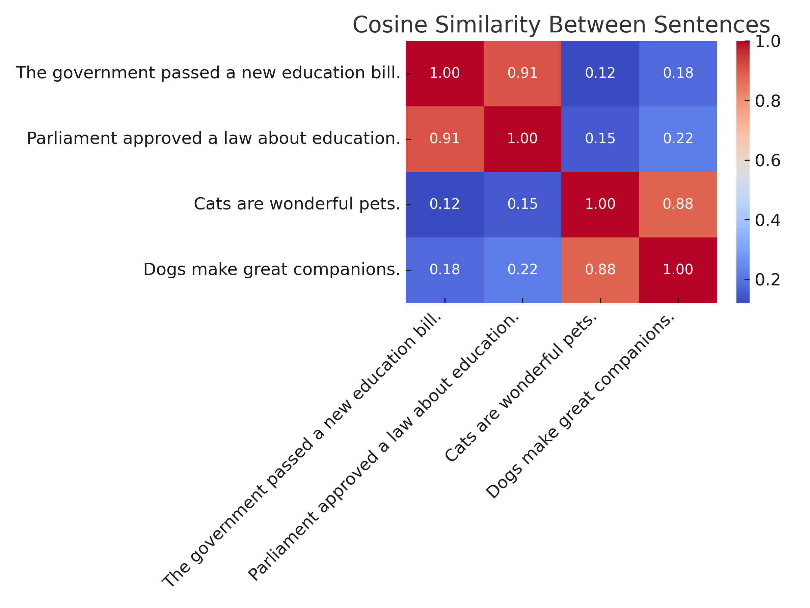
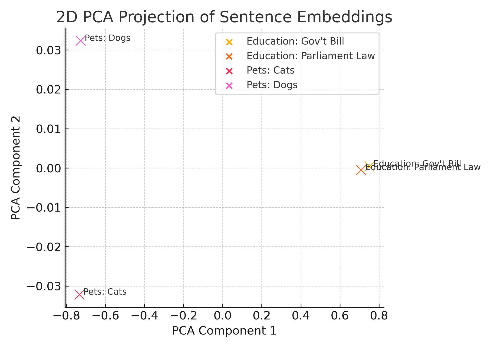
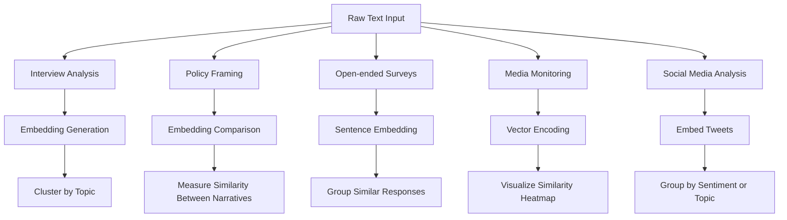

---

---

# 📌 Day 2 – Embeddings & Semantic Similarity

## 🧭 Objectives

- Understand how **sentence embeddings** are generated by LLMs
- Learn how text is represented in **high-dimensional vector space**
- Measure semantic similarity using **cosine similarity**
- Apply embeddings to real-world **qualitative and quantitative tasks** in social sciences

---

## 🧩 What Are Embeddings?

In NLP, **embeddings** are numerical representations of text data. Rather than handling raw words or characters, models convert them into dense vectors — arrays of real numbers — that capture semantic meaning, relationships, and context.

These embeddings allow machines to **“understand” similarity, intent, and structure**.

> 📘 Want a visual breakdown of how embeddings work at different levels?
See: [`embedding_intuition.md`](./embedding_intuition.md) – includes diagrams comparing token, sentence, and document embeddings.

---

### 📚 Types of Text Embeddings

| Type                | What It Represents                          | Examples & Usage                                |
|---------------------|---------------------------------------------|--------------------------------------------------|
| **Word Embeddings** | Meaning of individual words                 | `word2vec`, `GloVe`, FastText                    |
| **Token Embeddings**| Sub-word units (used internally in LLMs)    | “tokenized” parts of words (e.g., "re-", "-ing")|
| **Character Embeddings** | Individual characters (less common)         | Used in low-resource or noisy text scenarios     |
| **Sentence Embeddings** | Full sentences or paragraphs as units     | `sentence-transformers`, `Universal Sentence Encoder` |
| **Document Embeddings** | Multi-sentence or document-level vectors | Often built by pooling or averaging sentence vectors |

## 📄 Document Embeddings

While sentence embeddings are ideal for short, self-contained thoughts, some tasks require representing longer texts — such as full interviews, articles, or policy briefs. This is where **document embeddings** come in.

---

### 🔍 Why Not Use Document Embeddings by Default?

Although it's tempting to embed an entire document in one step, this often reduces accuracy. Here's why sentence embeddings are usually preferred:

- **More precise:** Long documents may mix topics or tones; sentence embeddings isolate individual ideas.
- **Less truncation risk:** Most transformer models have token limits (e.g., 512 or 1024), making full documents vulnerable to cutoff.
- **Greater control:** Working sentence-by-sentence allows selective comparison, filtering, or labeling.
- **Better for retrieval/classification:** Many downstream tools (e.g., RAG, clustering) expect smaller, consistent-length inputs.

---

### 🧭 Strategies for Document Embeddings

| Approach                 | Description                                                                 |
|--------------------------|-----------------------------------------------------------------------------|
| **Mean Pooling**         | Break into sentences → embed → average vectors                              |
| **Chunking + Pooling**   | Divide into fixed-length chunks → embed → average or concatenate            |
| **Specialized Models**   | Use transformers designed for long inputs (e.g., Longformer, BigBird)       |

---

### 🧪 Example (Mean Pooling)

```python
def embed_document(doc_text, model):
    from nltk.tokenize import sent_tokenize
    sentences = sent_tokenize(doc_text)
    sentence_vectors = model.encode(sentences)
    return sentence_vectors.mean(axis=0)
```

> In this session, we focus on **sentence embeddings**, which are best suited for representing responses, quotes, or headlines — common in social sciences.

---

## ✳ Why Sentence Embeddings?

Sentence embeddings emerged as a solution to a key NLP limitation: **word-level models could not capture sentence-level meaning or word order**.

For example:

- "I did not like the movie."  
- "I liked the movie."  

Word embeddings for "like" or "movie" might be similar — but sentence meaning is opposite. Sentence embeddings aim to **represent the full thought**, capturing negation, context, and tone.

---

### 🔍 How Sentence Embeddings Work

Sentence transformers (like `all-MiniLM-L6-v2`) use pretrained transformer models (e.g. BERT) and then fine-tune them for **similarity tasks** using training pairs:

- Paraphrase pairs (positive)  
- Contradiction pairs (negative)  
- Neutral pairs

They are optimized using objectives like **triplet loss** or **contrastive loss**, encouraging vectors of similar sentences to be close, and dissimilar ones to be distant.

---

### 🧠 Applications of Sentence Embeddings

- Clustering interview responses by topic or tone  
- Matching similar complaints, articles, or legal opinions  
- Mapping narratives across media ecosystems  
- Detecting stance or bias in public communications

---

## 🧪 Similarity Scores with Embeddings

Once we have embeddings, we can **compare** them using mathematical similarity functions.

This gives us a **numerical score** — typically between 0 and 1 — reflecting **semantic similarity** between two texts.

| Sentence A                               | Sentence B                               | Similarity Score |
|------------------------------------------|------------------------------------------|------------------|
| "The law was passed last year."          | "A bill was approved by parliament."     | 0.91             |
| "I enjoy hiking in nature."              | "The weather is cold and rainy."         | 0.11             |
| "COVID-19 restrictions were lifted."     | "Lockdown ended across the region."      | 0.88             |

These scores help automate matching, clustering, deduplication, or search.

---

## 📐 What is Cosine Similarity?

Cosine similarity is the most common method for comparing vector embeddings.

It calculates the **cosine of the angle** between two vectors in high-dimensional space. It focuses on **direction**, not magnitude — meaning it compares **what the sentences mean**, not how long they are.

### 🧮 Formula:

```math
\text{cosine\_similarity}(A, B) = \frac{A \cdot B}{\|A\| \|B\|} = \frac{\sum\limits_{i=1}^n A_i B_i}{\sqrt{\sum\limits_{i=1}^n A_i^2} \sqrt{\sum\limits_{i=1}^n B_i^2}}
```

- **1.0** → perfect match (same direction)
- **0.0** → no similarity (orthogonal)
- **–1.0** → completely opposite (rare in text)

> 📘 For a detailed walkthrough of cosine similarity (with formula and comparisons), see:  
[`cosine_similarity_explained.md`](../../code/day2/cosine_similarity_explained.md)
---

### 🔸 Visual Example

<figure>
  

  <figcaption>
    <strong>Cosine Similarity Heatmap of Sentence Embeddings</strong><br/>
    This heatmap shows pairwise cosine similarity scores between four example sentences. Higher values (red) indicate greater semantic similarity. For instance, sentences about education policies are closely aligned (0.91), while unrelated pairs like a government bill and pet descriptions score lower (~0.12). This visual demonstrates how sentence embeddings can detect meaning-based relationships even when surface wording differs.
  </figcaption>
</figure>

You’ll see this heatmap in the notebook walkthrough below.

This type of projection is useful for **interpreting model behavior**, spotting outliers, and communicating semantic structure in a way that’s intuitive for non-technical audiences.

> 📘 Want to try it yourself?  
Use the optional notebook [`embedding_cluster_visual.ipynb`](../../codebook/day2/embedding_cluster_visual.ipynb) to:
- Generate embeddings using `sentence-transformers`
- Project them into 2D space using **PCA**
- Visually inspect how sentence meaning maps into clusters

The notebook is helpful for exploring topics like:
- Interview theme clustering
- Narrative divergence across political texts
- Similarity patterns in survey responses

By reducing the high-dimensional vectors to two principal components, we can visualize how semantically related sentences cluster together in space. Education-related sentences (red/orange) appear close to one another, while pet-related sentences (blue/purple) form a separate grouping.

This type of projection is useful for **interpreting model behavior**, spotting outliers, and communicating semantic structure in a way that’s intuitive for non-technical audiences.


<figure>
  
  <figcaption>
    <strong>2D PCA Projection of Sentence Embeddings</strong><br/>
    This plot shows how embeddings of semantically similar sentences cluster in a reduced 2D space. Education-related sentences (red/orange) appear near each other, while pet-related sentences (blue/purple) form a separate cluster. Although the original embeddings are high-dimensional (384+), PCA enables intuitive visualization of their semantic grouping.
  </figcaption>
</figure>

---

## 🔬 Try It Yourself

📓 [`embeddings-and-similarity-scores.ipynb`](../../codebook/day2/embeddings-and-similarity-scores.ipynb)  
This interactive notebook demonstrates how to:
- Generate sentence embeddings
- Compute cosine similarity
- Visualize relationships in 2D space (PCA)

> ⚙️ Powered by: [`embed_demo_pipeline.md`](./../codebook/day2//embed_demo_pipeline.md)  
This modular function wraps the full pipeline — encoding + comparison — and is ideal for reuse across demos, notebooks, or dashboards.


---

## 🧠 Use Cases in Social Sciences

| Use Case                             | Description                                                                 |
|--------------------------------------|-----------------------------------------------------------------------------|
| **Interview analysis**               | Cluster participants by viewpoint or concern                               |
| **Policy narrative comparison**      | Track framing shifts between political parties                              |
| **Open-ended survey harmonization**  | Group diverse answers for quantitative coding                              |
| **Media monitoring**                 | Detect recurring themes across outlets                                     |
| **Online harassment**                | Flag similar insults, threats, or fake content in large corpora            |



---

## 🔧 Code Modules You Can Reuse

This session’s logic is implemented using modular code blocks from the codebook. These are version-controlled and documented, so you can reuse them in:

- 💻 GitBook tutorials (like this one)
- 📊 Streamlit dashboards
- 🧪 Research pipelines
- 📁 Client-facing tools

| Module Path                                         | Description                                     |
|-----------------------------------------------------|-------------------------------------------------|
| `codebook/embeddings/embed_text_basics.md`          | Load model and embed sentence list              |
| `codebook/embeddings/embed_compare_cosine.md`       | Compute cosine similarity matrix                |
| `embedding_cluster_visual.ipynb`                    | Optional: Visualize sentence clusters in 2D     |

Each module is standalone and can be integrated into your own workflows — no rewrite required.

These modules are:

- **Version-controlled** → Updated via GitHub (not ad hoc)  
- **Reused in GitBook** → Embedded in handouts and documentation  
- **Pulled into Streamlit UIs** → For interactive apps or dashboards  
- **Used in client tools** → Can support brand audits, research reports, and case studies

This system is core to my approach: **write once, reuse everywhere**.

---

## ✅ Best Practices & Tips

- **Normalize Text**  
  Strip unnecessary punctuation, lowercase, and remove noise. Embeddings perform better on clean, consistent input.

- **Use Sentence Units**  
  Break long text into sentences. Embeddings assume a complete thought per input — not paragraphs or fragments.

- **Visualize Similarity**  
  Use heatmaps or dimensionality reduction (t-SNE, PCA) to understand how your texts relate. Surprising patterns often emerge.

- **Combine With Metadata**  
  Always store source info (speaker, date, question, etc.). This allows you to filter, sort, and interpret results more effectively.

- **Benchmark Across Models**  
  Try multiple embedding models (e.g., `all-MiniLM`, `multi-qa-MiniLM`, OpenAI `text-embedding-3-small`) to see which fits your use case best.

- **Start with Pretrained**  
  Fine-tuning is powerful but expensive. Pretrained models often work remarkably well out of the box.

---

## 🧭 What's Next?

Now that you understand **semantic similarity**, we’ll build on this to classify and label text data — using embeddings as features.

## 🔗 Related Modules

| Module                                   | Description                                                  |
|------------------------------------------|--------------------------------------------------------------|
| `embed_text_basics.md`                   | Embeds a list of sentences using `sentence-transformers`     |
| `embed_compare_cosine.md`                | Computes cosine similarity between sentence embeddings       |
| `embedding_pipeline.md`                  | (Optional) Full workflow: embed → compare → visualize        |
| `embeddings-and-similarity-scores.ipynb` | Demo notebook used live in Session 1                         |
| `embedding_cluster_visual.ipynb`         | Optional PCA visualizer to inspect embedding clusters        |
| `embed_demo_pipeline.md`                    | Wrapper function that encodes + compares in one step        |

