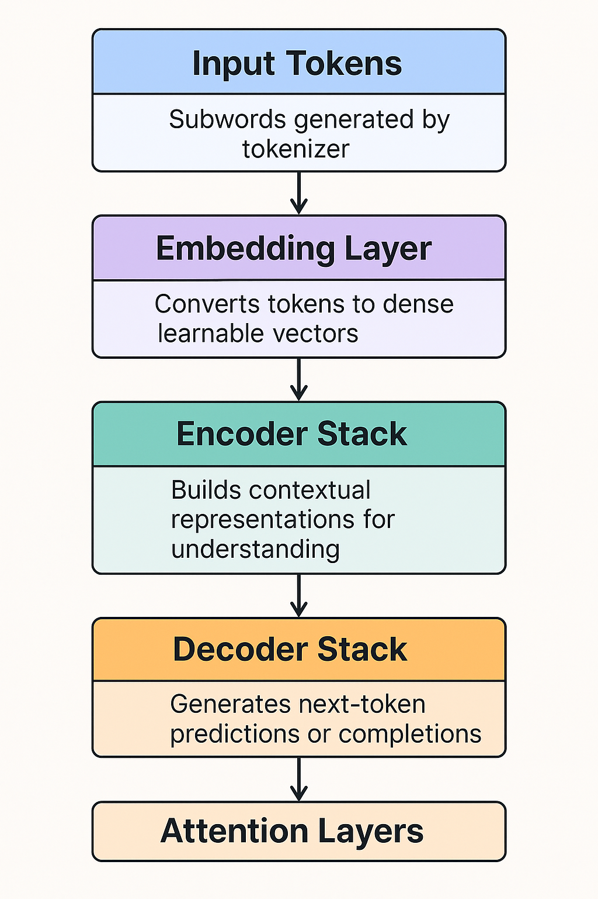
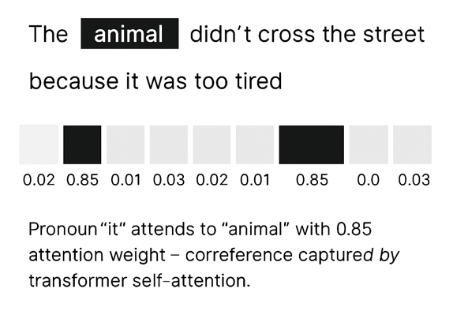
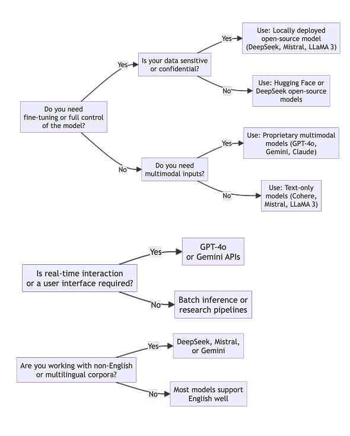

---

---

# 🧠 Day 2 – Session 1: How LLMs Measure Meaning

## 🔍 Overview

This session bridges the gap between prompting (Day 1) and advanced semantic operations (Sessions 2 & 3).  
We explore **how transformers encode meaning**, and how tools like **Gemini** (qualitative) and **Hugging Face** (quantitative) interpret sentence-level semantics.

---

## 🎯 Learning Objectives

- Understand how transformer models represent meaning
- Compare Gemini (language-based) vs Hugging Face (vector-based) reasoning
- Compute and visualize sentence similarity using embeddings
- Detect subtle semantic shifts in language framing
- Prepare for downstream tasks like classification and clustering

---

## 📚 Topics Covered

- Foundations of transformer-based NLP (tokens → embeddings → attention)
- Anatomy of transformer architecture: encoder, decoder, attention layers
- Encoder-only vs decoder-only vs encoder-decoder models
- Evolution of LLMs: from Word2Vec to Gemini and GPT-4o
- Comparing Hugging Face, OpenAI, and Gemini APIs
- Choosing the right model for your research or business task
- Sentence embeddings and vector-based text comparison
- Measuring semantic similarity using cosine distance
- Detecting semantic drift and narrative framing in open text
- Using Gemini for interpretive comparison and tone analysis
- Simulating annotator disagreement using embedding distance

---

## 💻 Hands-On Notebook

The entire session is driven from one notebook:

👉 | `day2_llm_meaning_instruments.ipynb` | Meaning in NLP tasks | [Run in Colab](https://colab.research.google.com/github/MariaAise/test/blob/main/day2_llm_meaning_instruments.ipynb) |

It includes:

- Gemini meaning probes
- Sentence embedding with `all-MiniLM-L6-v2`
- Cosine similarity matrix + heatmap
- PCA projection of sentence clusters
- Semantic drift analysis (e.g., “protest” vs “riot”)
- Optional coder disagreement simulation

---

## 🧠 Why This Matters

This session is not just technical. It's **foundational for real-world research** and **MVP product logic**:

| Use Case | How This Session Helps |
|----------|------------------------|
| Survey/sentence analysis | Quantify similarity, bias, stance |
| Brand tone auditing | Detect framing shifts |
| RAG input prep | Normalize and compare sources |
| Trigger detection | Establish vector-based conditions for agent logic |
| Qualitative coding | Replace inter-annotator disagreement with vector metrics |


## 🧠 Key Concepts: From Tokens to Meaning

Before diving into architecture, it's essential to understand **why transformers changed everything** in NLP.

- **Tokenization** breaks text into smaller units like words, subwords, or characters.
- **Embedding** transforms tokens into numerical vectors that capture semantic meaning.
- **Attention** enables the model to decide which parts of the input are relevant for a given task.
- **Context Windows** define how far back the model can "remember".
- **Parameters** are the learned weights—transformers have billions of them.

These stages form the **LLM input pipeline**, which governs all language understanding and generation.

---

## 🧠 Transformer Architecture: The Game Changer

Introduced by Vaswani et al. in 2017 (“Attention Is All You Need”), the transformer is built around **self-attention** and **positional encoding**.




## 🔁 Self-Attention — Seeing Everything, All at Once

### 💡 Imagine This:
You’re reading a sentence like:
> “Despite the rain, the concert went ahead.”

To understand “went ahead,” you need to recall “Despite the rain” — which came earlier.

### 🧠 What Self-Attention Does:
In transformer models, **each word looks at every other word in the sentence** — not just those that came before or after. This means:

- The word *“concert”* can learn that *“rain”* is relevant to its context.
- The model can **connect concepts** over long distances — even across paragraphs.

This is unlike traditional models like RNNs and LSTMs, which only remember earlier words and tend to forget long-term dependencies.

---

### 🔬 How Self-Attention Works (Mechanically)

For each token, the model generates:

| Vector | Purpose                         |
|--------|----------------------------------|
| **Query (Q)**   | What is this token looking for? |
| **Key (K)**     | What does this token offer?     |
| **Value (V)**   | What information will it pass on? |

#### 👉 Attention Score

To determine how much **attention** one word should pay to another, it calculates a **dot product** between Q and K vectors.

Then applies:

```math
Attention = softmax(QKᵀ / √dₖ) × V
```

- **softmax** turns scores into probabilities (attention weights).
- These weights are then used to combine the **Value vectors** into a new, context-aware representation.

---

### 📈 Result:

Each word gets a **blended representation** — one that mixes in information from relevant surrounding words.

---

### 🎯 Multi-Head Attention

A single attention mechanism may focus only on one aspect (e.g., grammatical subject).  
Transformers use **multi-head attention**, where each head learns:

| Head | What It Might Learn                |
|------|------------------------------------|
| 1    | Subject–verb alignment             |
| 2    | Negation and contrastive logic     |
| 3    | Temporal structure (before/after)  |
| 4    | Semantic roles (who does what)     |

These heads are **combined and re-projected**, preserving different perspectives.

---

### 📘 In Social Science:

Self-attention allows your model to:

- Connect **policy references** across clauses  
- Detect **stance** in ambiguous survey answers  
- Weigh **tone drift** across media sources  
- Pick up on **implicit framing** (e.g., *“protesters disrupted order”* vs *“citizens gathered”*)

It’s the foundation for **meaning-sensitive NLP**.

---

## 🔒 Positional Encoding — Giving Language a Timeline

### 🚨 Problem

Transformers treat words like **unordered sets** — they see all tokens simultaneously, but don’t know:

- Which came first?
- What order the sentence was in?
- Whether a clause is subordinate or dominant?

That’s a problem, because:

> *“I only ate after the test.”*  
> vs  
> *“Only I ate after the test.”*

These differ **entirely by order**.

---

### 🧭 Why Transformers Need Positional Info

Unlike RNNs, which read text step-by-step (and implicitly know order), transformers don’t.  
So we need to **inject order into the data** via **Positional Encoding**.

---

### 🔧 Two Main Approaches

#### 1. 📉 Sinusoidal Encoding (original Transformer paper)

- Each token’s position is encoded using a combination of **sine and cosine waves** of different frequencies.
- This allows the model to detect **relative distances** between tokens (e.g., "5 tokens apart").
- These are **fixed**, so models can extrapolate to longer sequences at inference time.

#### 2. 📚 Learned Positional Embeddings (used in BERT, GPT, Gemini)

- The model learns a **position vector** for each token index during training (e.g., 0, 1, 2, ..., 512).
- These are added to the token embeddings.
- They allow the model to learn complex patterns like:
  - Topic shifts at sentence 3
  - Chronological causality
  - Sentence closings

---

### 🧪 What Happens Without Positional Encoding?

> *"The dog bit the man."*  
> *"The man bit the dog."*

Both have the same tokens.  
Without positional encoding, the model may assign the **same meaning vector** to both — and completely fail at **understanding structure**.

---

### 📘 In Research and Practice:

Positional encoding is crucial for:

- **Survey interpretation**: Knowing if *“but”* reverses sentiment  
- **Policy alignment**: Matching timelines across documents  
- **Argument detection**: Identifying when reasoning builds or counters previous statements  
- **Sequence-to-sequence**: Translation, summarization, rewriting

---

## 🧠 Summary: The Magic Combo

| Mechanism             | What It Enables                                |
|------------------------|------------------------------------------------|
| **Self-Attention**     | Rich, context-aware representations             |
| **Positional Encoding**| Word-order awareness, grammatical structure     |
| **Combined**           | The ability to model language **meaningfully** and **intelligently** without explicit rules


---
## 🧠 Transformer Stack Walkthrough 

```mermaid
flowchart TD
    classDef token fill:#2563EB,stroke:#f9844a
    classDef embed fill:#374151,stroke:#6B7280
    classDef encoder fill:#E0ECFF,stroke:#277da1, color: #000
    classDef decoder fill:#9F1239,stroke:#9F1239
    classDef attention fill:#0B2B56,stroke:#93B4E5

    A[Input Tokens\Subwords generated by tokenizer]:::token
    B[Embedding Layer\Converts tokens to dense vectors]:::embed
    
    subgraph EncoderStack[Encoder Stack - Builds Context]
        direction TB
        E1[Encoder Layer 1]:::encoder
        E2[Encoder Layer 2]:::encoder
        EN[Encoder Layer N]:::encoder
        
        subgraph E1
            SA1[Self-Attention]:::attention
            FFN1[Feed Forward]:::encoder
        end
    end
    
    subgraph DecoderStack[Decoder Stack - Generates Predictions]
        direction TB
        D1[Decoder Layer 1]:::decoder
        D2[Decoder Layer 2]:::decoder
        DN[Decoder Layer N]:::decoder
        
        subgraph D1
            MSA1[Masked Self-Attention]:::attention
            CA1[Cross-Attention]:::attention
            FFND1[Feed Forward]:::decoder
        end
    end
    
    O[Output Prediction]:::token

    A --> B
    B --> EncoderStack
    EncoderStack --> DecoderStack
    DecoderStack --> O
    
    %% Attention connections
    E1 -- Context --> CA1
    EN -- Context --> CA1
    
    %% Layer connections
    E1 --> E2 --> EN
    D1 --> D2 --> DN
    
    %% Component legend
    legend[Key Components]
    legend --> Token
    legend --> Embed
    legend --> Encoder
    legend --> Decoder
    legend --> Attention
```



## 1️⃣ Input Tokens

### 🔍 What Are They?

Tokens are the model’s **unit of understanding**.  
They are typically **subword units** produced by a tokenizer (e.g. WordPiece, SentencePiece, BPE).

### 🧠 Why Subwords?

- Handle out-of-vocabulary terms ("neurodiversity" → "neuro", "##diversity")
- Reduce vocabulary size
- Enable cross-lingual generalization

### ⚙️ How It Works

Input:  
> “The parliament passed the bill.”  

Tokenized as:  
`["The", "par", "##liament", "passed", "the", "bill", "."]`

These tokens are then **mapped to unique integer IDs** that feed into the model’s embedding layer.

---

## 2️⃣ Embedding Layer

### 📌 Purpose

Transform tokens (IDs) into **dense vector representations** that capture **semantic meaning** and **syntax**.

### 🔢 What It Looks Like

Each token becomes a vector in **N-dimensional space** (typically 768, 1024, or 4096 dimensions):

```python
[0.42, -1.02, 0.78, ..., 0.03]  # ← 768-dim embedding for "passed"
```

These embeddings are:
- Learned during pretraining
- Combined with **positional encodings**
- Passed into the encoder/decoder stack

### 🧠 Why It Matters

Embeddings let the model:
- Understand word meaning
- Generalize across similar tokens
- Serve as the **foundation** of context-aware computation

---

## 3️⃣ Encoder Stack (BERT-style)

### 🏗️ What It Does

Encoders **read** and **understand** input sequences.  
They generate **contextualized embeddings** — each token is re-represented as a function of its neighbors.

> “The **court** ruled...” vs “Basketball **court** was crowded”

The word "court" will have **different final embeddings** depending on its context.

### 🧩 Inside Each Encoder Block

- **Multi-head self-attention**  
- **Feed-forward network (FFN)**  
- **Layer normalization + residual connection**

This stack is **repeated L times** (e.g. 12 in BERT-base, 24 in BERT-large).

---

## 4️⃣ Decoder Stack (GPT-style)

### 🧭 Purpose

Decoders **generate output** — token by token — using **masked self-attention** and **auto-regressive decoding**.

Used in:  
- GPT, Gemini, Claude, LLaMA  
- Encoder–decoder models like T5 (decoder attends to encoder output)

### 🧠 What’s Unique?

- **Masked self-attention** ensures each token can’t "see" future tokens
- Ideal for **text generation, completion, continuation**
- Often used in **dialogue agents, creative writing, search**

---

## 5️⃣ Attention Mechanism

### 🎯 Core Idea

Every token attends to **every other token**, scoring how **relevant** each one is.  

Example: Attention weights help resolve coreference (‘animal’ ↔ ‘it’)”



The model **blends information** across the sequence using these scores.

```math
Attention = softmax(QKᵀ / √dₖ) × V
```

Where:
- Q = Query (what I’m looking for)
- K = Key (what I contain)
- V = Value (what I pass on)

### 🔬 Self vs Cross-Attention

| Type            | Used In     | Function                                    |
|-----------------|-------------|---------------------------------------------|
| **Self-Attention** | Encoder/Decoder | Understand internal relationships         |
| **Cross-Attention**| Decoder      | Relate output tokens to encoder input       |

---

## 🔁 Encoder-Decoder Models (e.g. T5, BART)

These combine:
- **Encoder** to read full input
- **Decoder** to generate structured output (summaries, translations)

Examples:
- Input: *Long policy paragraph*
- Output: *3-sentence summary*

Useful for:
- Summarization
- Translation
- Controlled generation

---

## 🧠 Layer-by-Layer Flow Summary

1. Text → tokenized into IDs  
2. IDs → embedded vectors  
3. Embeddings → encoded for meaning  
4. (Optional) cross-attended with input  
5. Decoder → generates tokens  
6. Each token → projected into vocabulary → selects next word

---

## 📊 Recap Table

| Component        | Description                                                                        |
|------------------|------------------------------------------------------------------------------------|
| Input Tokens     | Subwords generated by tokenizer                                                    |
| Embedding Layer  | Converts tokens to dense, learnable vectors                                        |
| Encoder Stack    | Builds contextual representations for understanding                                |
| Decoder Stack    | Generates next-token predictions or completions                                    |
| Attention Layers | Core of context-awareness; learns which tokens relate and how                     |

---

## 🔀 Encoder vs Decoder vs Encoder-Decoder Models

| Model Type        | Examples          | Best For                             |
|------------------|------------------|--------------------------------------|
| **Encoder-only** | BERT, RoBERTa     | Classification, NER, semantic search |
| **Decoder-only** | GPT, LLaMA        | Text generation, Q&A, dialogue       |
| **Seq2Seq**      | T5, BART          | Translation, summarization, rewriting|

---

## 📈 Evolution Timeline of LLMs

- **2013** – Word2Vec: foundational vector space representations
- **2017** – Transformer introduced
- **2018–2020** – BERT, GPT-2, GPT-3
- **2022** – ChatGPT
- **2023+** – Gemini, Claude, Mistral, LLaMA 3, DeepSeek V3, RAG, Agents

---

## 🧠 Hugging Face vs Gemini vs OpenAI

| Model Type      | Access       | Strengths                          | Limitations                        |
|-----------------|--------------|------------------------------------|------------------------------------|
| Hugging Face    | Open-source  | Transparent, customizable, local   | Requires infra, setup              |
| OpenAI / GPT    | API-based    | Fluent, few-shot, large context    | Black-box, cost                    |
| Gemini          | API-based    | Multimodal, Google integration     | Limited fine-tuning, API cost      |

> Choose Hugging Face for transparent research. Use Gemini/OpenAI for convenience and fluency.

---

## 🧭 Choosing the Right Model

| Scenario                       | Recommended Approach                  |
|--------------------------------|----------------------------------------|
| Survey theme clustering        | Hugging Face + sentence-transformers   |
| Rapid prototyping              | Gemini 1.5 Pro or GPT-4o               |
| Policy summarization           | Encoder-decoder models (T5, BART)      |
| Brand tone auditing            | Gemini + interpretability prompts      |
| Local + private data analysis  | HF with LoRA or PEFT tuning            |



🧭 Choosing the Right Model – Strategic Guide
Selecting an LLM architecture isn’t just a technical decision — it’s a strategic match between your task, resources, data sensitivity, and end user.

🔍 Key Factors to Consider
| Factor                        | Why It Matters                                                                 |
| ----------------------------- | ------------------------------------------------------------------------------ |
| **Use Case Type**             | Generation? Classification? Retrieval? Explanation? Each needs different logic |
| **Data Sensitivity**          | Can data go through an API? Or must it remain local and private?               |
| **Speed vs Interpretability** | Do you need transparency for audits, or speed for client demos?                |
| **Customizability**           | Do you want to fine-tune the model on your domain-specific data?               |
| **Multimodal Support**        | Will you analyze text only, or also images, charts, or web content?            |
| **Compute Access**            | Can you run models locally (e.g. via Colab or GPU), or only via cloud API?     |
| **Cost**                      | API tokens, open-source infrastructure, or hybrid?                             |


❓ Questions to Ask
- 🔧 What type of output do I need?

    - Text classification → Encoder (BERT)

    - Text generation → Decoder (GPT, Gemini)

    - Summarization/translation → Encoder-Decoder (T5, BART)

- 🔐 Can my data leave my environment?

    - Yes → API (OpenAI, Gemini)

    - No → Hugging Face local inference

- 🧪 Do I need transparency for validation or auditing?

    - Yes → Hugging Face + interpretable components

    - No → Gemini/GPT fast prototyping

- 💰 Do I have budget constraints for scale?

    - Yes → Open-source inference + LoRA tuning

    - No → Gemini Pro, GPT-4o for ease of use

- 🧠 How domain-specific is my task?

    - Very → Fine-tune Hugging Face model

    - Generic → Use foundation model as-is

✅ Expanded Model Strategy Table
| Scenario                           | Why This Model?                                                                           | Recommended Setup                                                       |
| ---------------------------------- | ----------------------------------------------------------------------------------------- | ----------------------------------------------------------------------- |
| **Survey Theme Clustering**        | Sentence-transformers are trained for semantic similarity; interpretable and tunable      | `all-MiniLM-L6-v2` via Hugging Face                                     |
| **Rapid Prototyping**              | Gemini 1.5 Pro and GPT-4o offer fluent generation, summarization, Q\&A with minimal setup | Use Gemini API (Google AI Studio or Colab)                              |
| **Policy Summarization**           | Requires structured input → output. Encoder-decoder models excel at this pattern          | T5, BART via Hugging Face or OpenAI fine-tune                           |
| **Brand Tone Auditing**            | Requires interpretability, contextual nuance, qualitative analysis                        | Gemini API + interpretive prompts (e.g. "How does this differ from...") |
| **Local or Private Data Analysis** | Data privacy critical, or model needs to be embedded in secure/air-gapped system          | Hugging Face model + LoRA/PEFT for light tuning                         |


🔗 Bonus Tip: Use Hybrids When Needed
- Some of the most powerful pipelines use a hybrid approach:
- Sentence-transformers for clustering or retrieval
- Gemini for interpretive generation
- GPT-4o for zero-shot analysis
- PEFT-tuned BERT for classification

---

# 🧠 Semantic Drift, Framing & Social Science – In Depth

Transformers enable us to analyze **how meaning shifts subtly across time, contexts, or ideologies** — and to do so **quantitatively**.

---

## 🔍 What is Semantic Drift?

**Semantic drift** refers to **contextual or temporal changes in word meaning**.

Examples:
- *"Reform"*: once aligned with *“improvement”*, later drifts toward *“austerity”*
- *"Protest"* vs *"Riot"*: framing of the same event
- *"Freedom fighter"* vs *"Insurgent"*: reveals ideological lens

Drift is especially important in long-term studies of policy, news, or public sentiment.

---

## 🧠 What is Framing?

**Framing** is how language shapes perception. It’s not just what is said — but **how**.

Examples:
- *"Tax relief"* vs *"tax cut"*
- *"Critics argue"* vs *"experts say"*
- *"Crisis"* vs *"challenge"*

Framing reveals **bias, tone, intention, and stance** — crucial for:
- Media analysis
- Political science
- Public health and social change

---

## 🔬 Why Transformers Help

Before transformers, this analysis was:
- Manual or keyword-based
- Prone to bias
- Lacked scalability

Now, using **sentence embeddings**:
- Text is converted to **vectors**
- Meaning becomes **quantifiable**
- You can track **semantic change**, not just word count

---

## 🧪 Drift Detection Example

Embedding *“budget reform”* across time:

| Year       | Nearest Neighbors (Semantic)              |
|------------|-------------------------------------------|
| 2012       | "efficiency", "transparency", "modernize" |
| 2020       | "cuts", "privatization", "austerity"      |

This drift signals a **change in framing** over time.

---

## 💡 Use Cases in Social Science

| Application                      | Use of Drift or Framing                                         |
|----------------------------------|------------------------------------------------------------------|
| **Policy Analysis**              | Track how key terms evolve across administrations               |
| **Media Bias Studies**           | Compare framing of same event across outlets                    |
| **Survey Harmonization**         | Align open responses across regions or time periods             |
| **Historical Discourse Studies** | Detect how concepts like "freedom" shift over generations        |
| **NGO Impact Reports**           | Show how language changed post-campaign                         |

---

## 📊 Metrics & Tools

- **Cosine similarity** to measure meaning distance
- **Clustering** to detect narrative groups
- **Heatmaps** to visualize overlap or change
- **PCA/t-SNE** to map semantic shifts
- **Gemini prompts** to interpret drift (e.g., "How does this differ?")

---

## ⚙️ Workflow Example

1. Collect documents by time or source
2. Embed them using `sentence-transformers`
3. Compare embeddings using cosine similarity
4. Visualize with heatmaps or PCA
5. Optionally: Use Gemini to interpret shifts

---

## 📌 Next Steps

In Sessions 2 and 3, we build on these embeddings to:
- Classify sentence-level intent
- Cluster survey responses
- Build LoRA-classifiers and RAG systems

---