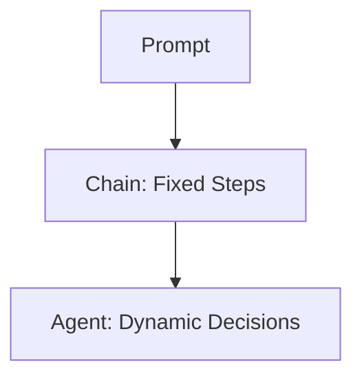
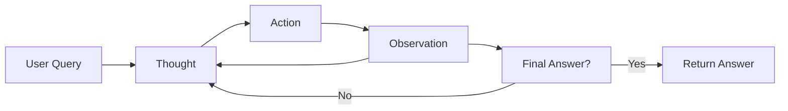

## 🎯 Learning Objectives

* Understand the difference between prompts, chains, and agents
* Explore the ReAct reasoning framework (Thought → Action → Observation)
* Build a basic agent using LangChain and external tools
* Visualize the ACP (Agent Cognition Protocol) orchestration loop
* Reference agent setup with Gemini or OpenAI LLMs (from Day 1)

---

## 🔁 Prompt → Chain → Agent

> Think of agents as "chains that can think and choose tools on their own."

This is the fundamental leap: from giving a model a fixed instruction (prompt), to letting it navigate its own logic and actions based on real-world observations and intermediate decisions.

**Prompt**: A single call to a language model, stateless and isolated. You provide a question or task, and it responds based on its training. Prompts are one-off — they don’t adapt based on what happens next.

**Chain**: A predetermined sequence of prompts or logic steps. A chain lets you define a workflow with multiple steps (e.g., input → clean → summarize). But once defined, the steps are fixed.

**Agent**: A dynamic system that can observe the results of prior actions and decide what to do next. It can choose tools, retry steps, or exit based on evolving context. Think of it as an AI that can make decisions in real time, like a researcher or assistant solving a task from scratch.



Agents are powerful because they simulate cognitive processes: thinking, acting, observing, and adapting. This is where true reasoning begins.

See also: `agent_vs_chain_frameworks.md`

---

## 🔄 ReAct Reasoning Framework

ReAct = **Reason + Act** → Loop through **Thought → Action → Observation**

This is a cognitive loop. Instead of predicting a full answer at once, the model behaves like a human researcher: pause, reflect, act, observe, repeat.

**Each step in ReAct:**

* **Thought**: What should I do next?
* **Action**: Which tool should I use?
* **Observation**: What did the tool return?

The model uses this loop to gather information step-by-step. This approach is especially powerful when the task involves external knowledge (e.g., search, lookup, calculation).

By modeling the reasoning process explicitly, ReAct increases transparency, reduces hallucination, and gives you control over how an answer is derived.

Example sequence:

```
User: "Who did the Texas Longhorns play last week? What's their stadium address?"
→ Thought: I should search their schedule.
→ Action: Use Search tool
→ Observation: They played Georgia Bulldogs
→ Thought: I need the opponent's stadium address.
→ Action: Use Places tool
→ Observation: 100 Sanford Dr, Athens, GA
→ Final Answer: They played Georgia; their stadium is at 100 Sanford Dr.
```

See: `llm_thought_action_observe.md`

---

## 🛠️ Tool Definition in LangChain

Agents need tools to interact with the outside world — to search, access databases, run code, or perform tasks beyond language generation.

LangChain exposes a simple way to define tools: you write Python functions and annotate them with `@tool` so the agent can access them.

Each tool should include:

* A clear name
* A helpful description (so the model knows when to use it)
* Input and output types

```python
@tool
def search(query: str) -> str:
    """Search the web for answers."""
    return SerpAPIWrapper().run(query)
```

Think of tools as the agent’s hands and eyes. They allow it to reach into the world, get data, and bring it back to reason on. You define what the agent can do by choosing which tools it has access to.

Well-defined tools = better decisions.

See: `tool_definition_schema.md`

---

## 📦 What Is LangChain?

LangChain is a Python framework that helps you build intelligent agents by chaining together models, tools, memory, and logic.

Instead of manually writing scripts that prompt a model or call an API, LangChain provides structure and building blocks. It manages:

* Communication with the model (LLM)
* Tool selection and invocation
* Memory and intermediate reasoning
* Output formatting and flow control

LangChain is like the conductor of an orchestra — it makes sure all parts (model, tools, data, logic) work in harmony.

With LangChain, you don’t just call a model — you build systems that reason, decide, and act.

---

## 🤖 Building a ReAct Agent in LangChain

You can run this agent in: [`agent_loop_rag.ipynb`](../../codebook/day3/agent_loop_rag.ipynb)  
Or view the full code module: [`agent_loop_rag.md`](../../codebook/day3/agent_loop_rag.md)

This agent uses Gemini (default) or OpenAI to reason through questions and pick tools as needed. The notebook includes a toggle:

```python
# Toggle between Gemini (default) and OpenAI
USE_GEMINI = True
```

Setup:

```python
from langgraph.prebuilt import create_react_agent
from langchain_core.tools import tool
from langchain.chat_models import ChatVertexAI

if USE_GEMINI:
    llm = ChatVertexAI(model="gemini-1.5-flash")
else:
    from langchain.chat_models import ChatOpenAI
    llm = ChatOpenAI(model="gpt-4")

# Define tools and agent
agent = create_react_agent(llm, tools=[search, places])
```

Run a test:

```python
agent.invoke({"input": "Who did the Texas Longhorns play last week..."})
```

LangChain handles the ReAct loop internally. You define the tools and the LLM — it manages the reasoning, tool choice, and result handling.

This structure can be extended with memory, conditional logic, retries, or user input interfaces.

---

## 🧠 ACP Loop: Agent Cognition Protocol

The **Agent Cognition Protocol (ACP)** is a framework to understand the internal mechanics of reasoning agents.

This framework mirrors human-like problem-solving:

1. **Perceive** – Take input from the user or environment.
2. **Reason** – Reflect on what’s needed.
3. **Act** – Choose a tool or path.
4. **Observe** – Look at what came back.
5. **Repeat or Exit** – Loop if needed or return the answer.

The key value of ACP is that it makes the agent’s decisions transparent and explainable. You can trace every thought and action — this is critical in research and policy settings where accountability matters.



LangChain's orchestration layer runs this loop for you. You define the tools, reasoning style (e.g., ReAct), and model — LangChain manages the rest.

See: `acp_protocol_diagram.md`

---

## 🔗 LLM Setup (Reference Only)

LLMs are configured in **Day 1 Setup**. This notebook supports:

* ✅ **Gemini (default)** – via `langchain-google-vertexai`
* 🔁 **OpenAI (optional)** – via `ChatOpenAI`

Notebook includes a `USE_GEMINI` flag to switch between providers.

See: [Day 1 LLM Setup ➝](day1_foundations.md#🔧-llm-setup)

---

## 📎 Files and References

* `agent_vs_chain_frameworks.md`
* `llm_thought_action_observe.md`
* `tool_definition_schema.md`
* `agent_react_colab.ipynb`
* `acp_protocol_diagram.md`

---


Next: In Session 3, we explore more advanced agent types (LangChain Research Agent and RAG agents).
