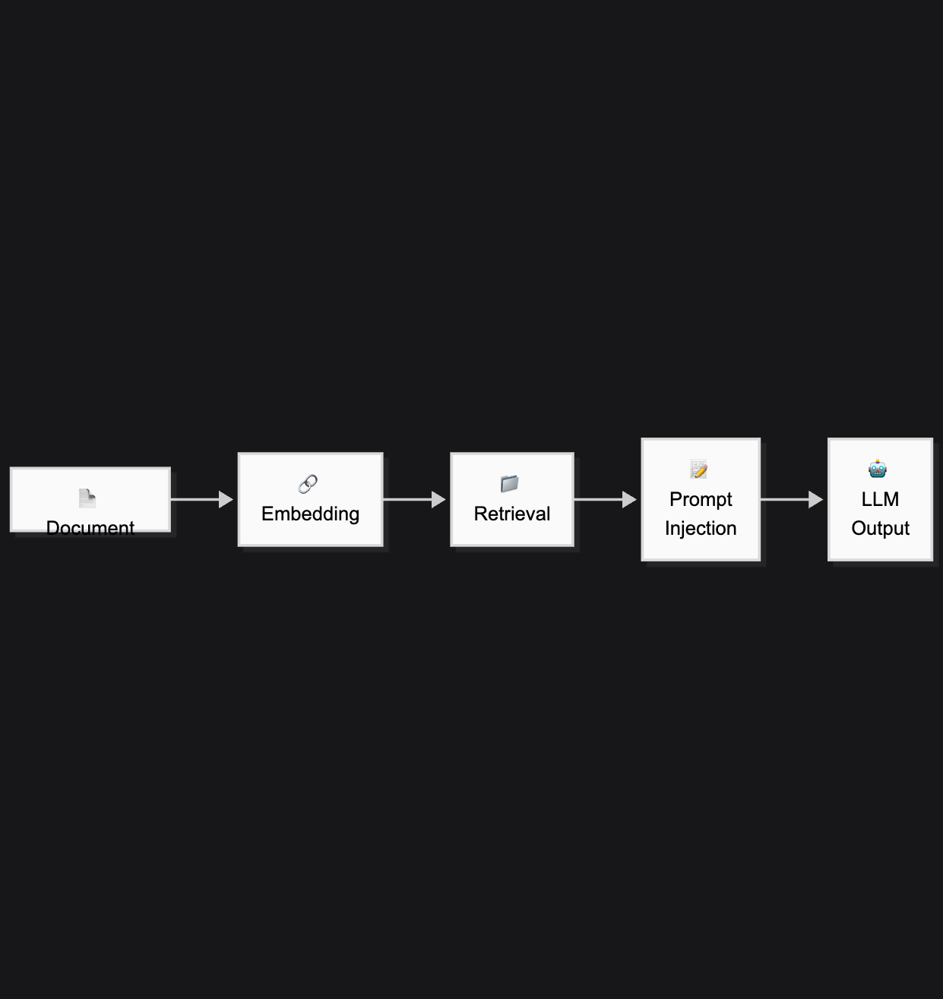
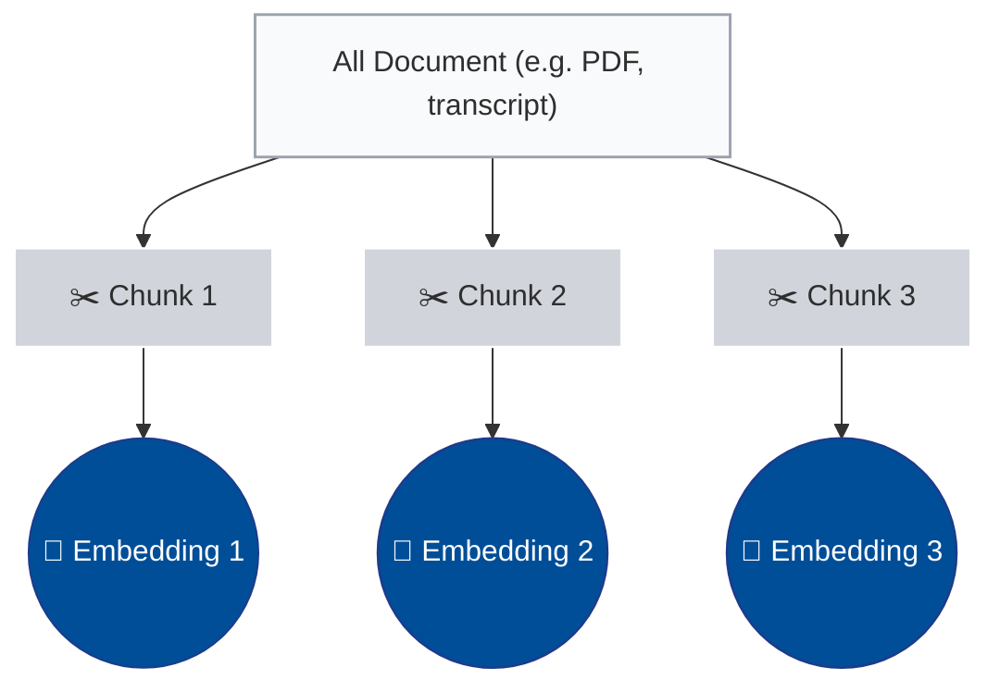
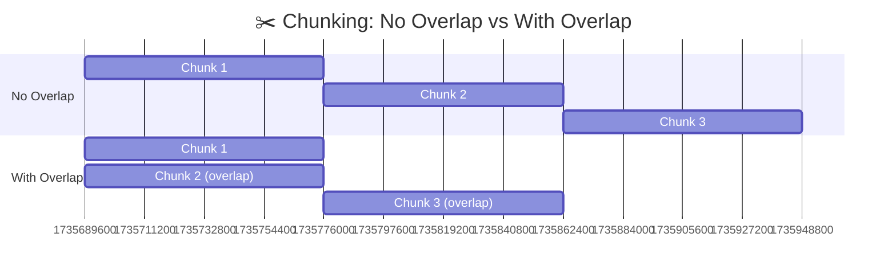

---

---

🎯 **Learning Objectives**

- Understand how Retrieval-Augmented Generation (RAG) works and why it matters
- Compare RAG to LLM-only responses in terms of accuracy and hallucination risk
- Build a basic RAG pipeline using Chroma for document search and Gemini for response generation
- Execute similarity search over embedded documents using vector databases
- Generate citation-aware responses using Gemini Pro and compare to HuggingFace transformers
- Apply RAG to real-world research use cases (e.g., literature reviews, interview analysis)
- Run the full pipeline via Colab or Streamlit with your own documents

## What is Retrieval-Augmented Generation?

RAG combines a language model with a search system. Instead of generating text based solely on internal training, the model first **retrieves relevant information from external sources** — then uses that to generate responses.

This is how modern research assistants, document analysis tools, and private GPTs are built.

---

## Why Use RAG?

Traditional LLMs hallucinate facts. RAG helps you:

- Ground outputs in your own research corpus
- Avoid hallucinations in sensitive domains
- Add citations and traceable sources
- Work with custom/private documents

Example use cases:
- Social science literature reviews
- Interview transcript analysis
- Real-time policy briefs
- News monitoring for public opinion

---

## RAG Architecture 



1. Embed documents into a vector store (Chroma)
2. Retrieve top-k chunks based on query similarity
3. Generate text using LLM, grounded in retrieved facts

---

## 🔍 Key Concepts

| Term              | What it Means                                 |
|-------------------|------------------------------------------------|
| **Chunking**      | Splitting documents into semantic text blocks |
| **Embeddings**    | Numeric representation of text for comparison |
| **Vector DB**     | Stores embeddings for retrieval                |
| **Retriever**     | Returns relevant chunks given a query          |
| **Context window**| What the LLM sees when answering               |

---

## 🧱 Embedding & Indexing

📁 [`embed_chroma.md`](../embeddings/embed_chroma.md)

This module covers:
- Chunking documents
- Creating SentenceTransformer embeddings
- Storing in ChromaDB for reuse

---

## ✂️ Chunking Strategy

Chunking is one of the most important design decisions in any RAG system.

Instead of feeding entire documents to a model, we split them into small, semantically meaningful units. This allows:

- More precise matching during retrieval
- Better use of the model's context window
- Cleaner source attribution

### 📐 Common Parameters

| Parameter        | Typical Value | Notes                                       |
|------------------|----------------|---------------------------------------------|
| **Chunk Size**   | 300–500 tokens | Shorter chunks increase retrieval granularity |
| **Overlap**      | 20–100 tokens  | Prevents context drop at chunk boundaries   |
| **Splitter**     | RecursiveCharacterTextSplitter | Hierarchical fallback logic (paragraph → sentence → word) |


This diagram illustrates how a source document is split into smaller semantic units (“chunks”), and how each chunk is independently embedded into vector space.

This chunking-then-embedding process forms the foundation of any Retrieval-Augmented Generation (RAG) pipeline. Instead of embedding entire documents, we break them into manageable blocks—typically 300–500 tokens—so that we can retrieve only the most relevant pieces later.

Each chunk is transformed into a high-dimensional vector using a sentence embedding model (e.g. all-MiniLM-L6-v2). These vectors are stored in a vector database (e.g. Chroma), ready for semantic retrieval.

**Use when you need**:

- Fine-grained retrieval

- Context-controlled generation

- Source tracking per segment


This diagram compares two chunking strategies: with and without overlap.

In the non-overlapping approach, chunks are created sequentially with no shared content. This risks cutting across sentences or omitting transitional meaning.

In the overlapping approach, each chunk shares 20–30% of its content with the previous one. This helps preserve context, especially in long paragraphs, interviews, or legal documents where information spans across boundaries.

Overlapping is particularly helpful when answers depend on surrounding context (e.g. “he said” → who said?). Most RAG pipelines default to overlapping chunks using tools like RecursiveCharacterTextSplitter.

**Use when**:

- Working with dense, narrative-heavy text

- Avoiding information loss at chunk boundaries

- Preparing content for citation or exact attribution


### ✨ Good Practice

- Tune chunk size based on the structure of your documents (e.g. reports vs. interviews)
- Use overlapping chunks for smoother context flow
- Track source file + position using metadata for later citation

📁 See code: [`embed_chroma.md`](../embeddings/embed_chroma.md)
---

## 🔍 Semantic Similarity Retrieval

📁 [`similarity_query_chroma.md`](../retrieval/similarity_query_chroma.md)

Covers:
- Running `similarity_search()` or `with_score`
- Viewing which chunks were retrieved and why

---

## 🧠 Generation: Gemini vs HuggingFace

Two options for generating grounded responses:

| Model          | API Required | Inline Citations | Context Length | Reasoning | Cost     |
|----------------|--------------|------------------|----------------|-----------|----------|
| **Gemini Pro** | ✅ Yes       | ✅ Yes            | ✅ Long        | ✅ Strong | 💰 Paid  |
| **HF (Flan-T5)**| ❌ No        | ❌ No             | ❌ Short       | ⚠️ Basic  | ✅ Free  |

---

### 🧪 HuggingFace Transformers (Local)

```python
from transformers import pipeline
qa = pipeline("text2text-generation", model="google/flan-t5-xl")
qa("Answer the question: What are the winter fashion trends?")
```

- Lightweight, no API needed
- Not reliable for long context or citations

---

### 🔥 Gemini Pro with Inline Citations

📁 [`gemini_rag_generation.md`](../generation/gemini_rag_generation.md)

```python
prompt = f"""Answer using the content below.
Include [source_n] markers.

{referenced_chunks}

Question: {query}
"""
response = model.generate_content(prompt)
print(response.text)
```

- Strong for long documents
- Supports inline source tracking
- Excellent for reports, audits, policy briefs

---

## 🧪 RAG vs LLM-Only (Example)

**Query:** *What does the 2024 ACIC report say about youth diversion programs?*

| Approach           | Output Example                                                                    |
|--------------------|------------------------------------------------------------------------------------|
| **LLM Only**       | “The ACIC report emphasizes youth-focused strategies…” ❌ Hallucinated              |
| **RAG + Gemini**   | “According to p.17 of the ACIC report: ‘Diversion should be embedded early...’” ✅ |

---

## 🧪 Full Hands-On Options

- [📓 `day3_rag_colab.ipynb`](../notebooks/day3_rag_colab.ipynb): full pipeline
- [▶️ `day3_rag_streamlit.py`](../apps/day3_rag_streamlit.py): query UI

---

## 📊 Performance Comparison: Gemini vs HuggingFace

| Metric                    | Gemini Pro                      | HuggingFace Transformers (e.g. Flan-T5) |
|---------------------------|----------------------------------|------------------------------------------|
| **Accuracy**              | ✅ High                         | ⚠️ Medium                                |
| **Context Length**        | ✅ 30k+ tokens                  | ❌ Short (~2k)                            |
| **Citation Support**      | ✅ Built-in                    | ❌ Manual only                           |
| **Reasoning Quality**     | ✅ Strong                     | ⚠️ Limited                               |
| **Local Execution**       | ❌ API only                    | ✅ Full local control                    |
| **Cost**                  | 💰 Token billed                | ✅ Free                                  |

---

## 🎓 Advanced Use Patterns

- Chunk re-ranking (MMR, BM25)
- Source enrichment with metadata (authors, URLs)
- Multimodal input (vision, OCR, etc)
- RAG + Agents for multi-step workflows

---

## ✅ Recap

You now have:
- A persistent vector database (Chroma)
- Modular components for embedding, retrieval, and generation
- Dual generation options for different use cases
- Colab and Streamlit workflows for deployment

---

## Related Modules

- [`embed_chroma.md`](../embeddings/embed_chroma.md)
- [`similarity_query_chroma.md`](../retrieval/similarity_query_chroma.md)
- [`gemini_rag_generation.md`](../generation/gemini_rag_generation.md)
- [`agent_loop_rag.md`](../agents/agent_loop_rag.md)
- [`classify_policy_stance.md`](../classification/classify_policy_stance.md)
