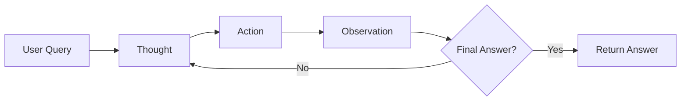
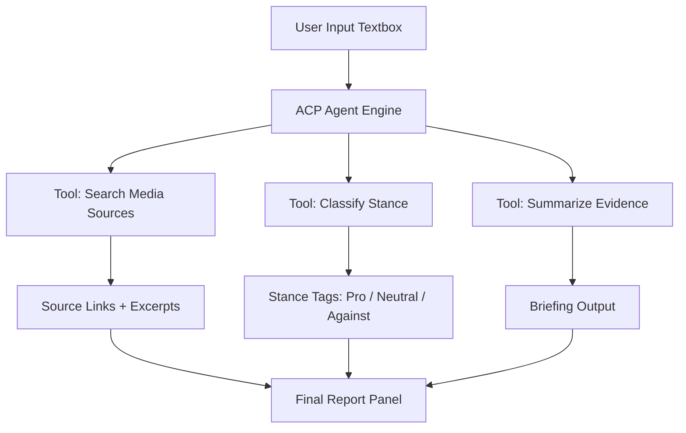

---

---

## 🧭 Session Overview

In this final session, we bring together everything you’ve learned about LLMs, chains, and agents to build a functioning LangChain-based prototype. You'll walk through how the reasoning loop works in practice, explore how agents are structured in real applications, and begin imagining how this architecture can power your own workflows.

---

## ✅ Objectives

* Build a lightweight LangChain agent using the ReAct framework  
* Annotate each ACP step: Thought → Action → Observation  
* Visualize the agent orchestration loop  
* Explore application options (Trigger Detector, ZaraGPT)  
* Reflect on where agents can add value in your domain  

---

## 🌀 Agent Orchestration: The ACP Loop

See: [`agent_orchestration_loop.md`](../../codebook/agents/agent_orchestration_loop.md)

The orchestration layer governs how agents plan, decide, act, and observe. Here’s the full loop in action:

---

## ⚙️ Agent Templates & Reasoning Skeletons

Use these to scaffold new agents or clarify how yours works:

- [`acp_agent_template.md`](../../codebook/templates/acp_agent_template.md)  
- [`acp_comment_framework.md`](../../codebook/templates/acp_comment_framework.md)

These files define reusable ACP reasoning blocks and human-in-the-loop commenting logic.

---

## 🔬 Live Build: Trigger Detector Agent (Demo)

We will step through this notebook live:

📓 [`trigger_detector_demo.ipynb`](../../notebooks/trigger_detector_demo.ipynb)

This agent:
- Uses the ReAct framework
- Leverages basic tools like keyword matcher or text classifier
- Returns visible Thought → Action → Observation logs
- (Optional) Can be wrapped in a simple Streamlit UI

Stripped-down version here: [`trigger_agent_lite.md`](../../codebook/agents/trigger_agent_lite.md)

---

## 🧪 Alternate Build: ZaraGPT Research Assistant

You can also explore a research-focused agent:

📓 [`zaragpt_agent_lite.ipynb`](../../notebooks/zaragpt_agent_lite.ipynb)

This agent:
- Searches and retrieves sources  
- Classifies arguments using stance detection  
- Outputs a clean research summary  

Useful for academic, legal, and public-sector work.

---

## 🧱 Visual Integration (Optional UI Layer)

A lightweight UI mockup for ZaraGPT:

This interface is built by combining:

- a simple web app front-end (e.g. using a tool like Streamlit),

- a reasoning agent built with LangChain (your logic layer),

- and the core functionality you just saw in the notebook above (e.g., classify, search, summarize).

You don’t need to code a website — tools like **Streamlit** let you turn a notebook like this into a working interface with just a few lines of Python.

---

## 💭 Your Turn: Agent Ideation Exercise

### Prompt

> What is one repetitive or document-based task in your work that could be delegated to an intelligent agent?

Try sketching your own agent based on the ACP framework:

- **Perceive** – What does it receive?
- **Reason** – What decisions must it make?
- **Act** – What tools should it use?
- **Observe** – What does it output?

Optional helper: [`acp_comment_framework.md`](../../codebook/templates/acp_comment_framework.md)

---

## 🎓 Wrap-Up & Next Steps

You’ve now seen the full lifecycle of LLM applications:
- Prompting  
- Chaining  
- Reasoning agents  
- Tool invocation  
- Full orchestration loop

The modular assets in this course can now become part of:
- Your MVP
- Internal automations
- Research pipelines
- White-label solutions

---

